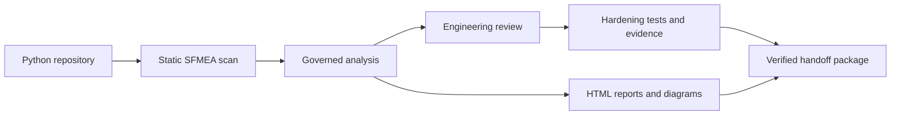
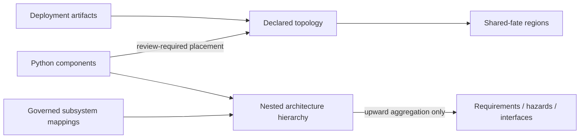
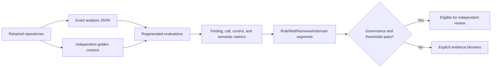

# PySFMEA

[](https://github.com/willtran87/project-py-sfmea/actions/workflows/ci.yml)
[](https://www.python.org/downloads/)
[](LICENSE)

PySFMEA scans a Python repository and creates a local, reviewable Software Failure Modes and Effects Analysis starter. It inventories functions and methods, recognizes risk-relevant code signals, proposes software-specific failure modes, and opens a browser workspace for engineering review.

It is designed to help begin and maintain an SFMEA. It does not claim that static analysis can determine system consequences or replace a cross-functional review.



## Documentation map

- [Visual guide](docs/VISUAL_GUIDE.md) — workflows, failure cascades, trust boundaries, and outputs
- [Operator workflow](docs/WORKFLOW.md) — the concise scan-to-handoff path
- [Complete command guide](#quick-start)
- [Methodology and assurance boundaries](docs/METHODOLOGY.md)
- [Canonical diagram model](docs/DIAGRAMS.md)
- [Public interchange schemas](docs/SCHEMAS.md)
- [Organizational guidance packs](docs/GUIDANCE_PACKS.md)
- [Requirements traceability](docs/REQUIREMENTS_TRACEABILITY.md)
- [NASA/FAA guidance coverage audit](docs/GAP_AUDIT.md)
- [Product enhancement resolution](docs/ENHANCEMENT_RESOLUTION.md)
- [Platform support and qualification evidence](docs/PLATFORM_SUPPORT.md)
- [Service threat model and residual-risk register](docs/THREAT_MODEL.md)
- [Advanced review workflows](docs/ADVANCED_REVIEW.md) — saved views, accessibility,
  LLM synthesis, PR analysis, and the plugin SDK
- [Contributing](CONTRIBUTING.md), [security](SECURITY.md), and the
  [release checklist](docs/RELEASE.md)

## What it produces

- Stable components linked to file and line locations
- A hashed system-context manifest covering mission, modes, states, must-work and
  prohibited functions, safe/degraded states, humans, timing/resources, deployment,
  criticality, assumptions, and exclusions—with unresolved questions kept explicit
- A bounded repository artifact inventory that distinguishes analyzed, indexed,
  excluded, unresolved, and opaque files/regions without executing repository code
- Candidate software failure modes derived from public NASA and FAA guidance
- Versioned, applicability-profiled guidance-to-finding citations with typed relationship
  metadata, source/artifact integrity hashes, and separate direct/supporting/contextual
  mapping-coverage measures; locator-summary and mapping-record digests plus explicit
  maintainer-review and independent-approval state make the governance boundary machine readable
- Governed organizational guidance packs for licensed/internal source metadata,
  exact locators, quote policies, applicability, tailoring, and rule mappings
- Separate scanner-priority and engineering-risk fields
- Editable functions, requirements, modes/states, causes, local/next-higher/end
  effects, safe/degraded/recovery behavior, and residual risk
- Optional severity, occurrence, detection, and RPN fields
- Prevention controls, detection controls, actions, owners, verification evidence, and status
- Persistent decisions across rescans, including removed-source traceability
- Source fingerprints, changed-function flags, and explicit review revalidation
- Generator name, PySFMEA version, and analysis-schema provenance
- Project hazards, critical-function mappings, and domain-specific failure rules
- Optional coverage.py line evidence and more precise internal-caller evidence
- Optional Graphify code-only AST graph reconciliation: typed static call edges map by
  source/line to PySFMEA components, compare with native call evidence, bind to the run
  manifest, and appear in architecture exports. Graphify-only calls are review leads.
- A deterministic cross-reference evidence fabric that fuses native AST, Graphify, and
  imported runtime relationships by directed component pair, then connects components to
  findings, guidance citations, requirements, hazards, SFTA events, verification obligations,
  executions, evidence artifacts, bounded caller cascades, timing budgets, retry amplification,
  transaction/resource semantics, circuit-breaker models, data/alias flow, concurrency,
  exception propagation, state transitions, authorization scope, contracts, deployment,
  shared fate, and architecture hierarchy. Each component receives a semantic-exposure profile;
  compound model intersections become prioritized review leads. Each finding also receives a
  verification-readiness profile that keeps candidate test links, coverage observations,
  registered implementations, executions, independent reviews, evidence, assignments, lifecycle
  state, and next action distinct. Disagreement and accepted-finding readiness gaps become
  prioritized review leads; each channel retains its original authority and the output never
  claims completeness, compliance, or verification success.
  Review-governance profiles add the exact quality-gate diagnostics, source-change state,
  revalidation flag, disposition, and resulting review next action for every finding. Global
  analysis diagnostics remain separate from finding-local blockers, and neither is represented as
  evidence that the candidate failure is credible.
  Adapter-provenance links bind normalized contributions to the exact run ledger and manifest.
  Governed machine suggestions and generated summaries are also projected as explicitly
  non-authoritative entities. Their allowlisted evidence, proposed citations, materialized
  findings, and deterministic duplicate/contradiction/divergence relationships remain navigable,
  independently verifiable review leads; unresolved references and stale summaries stay visible.
  Resolved system-context fields and values are first-class governed entities. Finding mode,
  state, safe-state, degraded-behavior, and recovery claims remain separate reviewer records and
  receive only declared-field plus exact case-folded/whitespace-normalized links; mismatches and
  uncataloged claims become review leads rather than inferred errors. Analysis and finding-review
  history is projected as ordered, digest-bound lifecycle events with exact typed subject links and
  explicitly unauthenticated actor labels.
  Recorded methodology, versioned NASA/FAA/NIST/CWE or organizational guidance sources, and exact
  citation locators are also first-class digest-bound entities. Finding chains expose complete or
  unresolved document-to-citation lineage, while source presence remains traceability rather than
  proof of applicability, authenticity, compliance, or approval.
  An analysis-output projection ledger then binds every top-level scanner section by SHA-256 and
  classifies it as semantically projected, provenance-only, empty, registered without a material
  projection, or unmapped. Declared entity-kind and relationship-channel sets are independently
  reconciled; newly introduced or disconnected outputs become review leads instead of silently
  disappearing from the evidence fabric. A second bounded ledger enumerates each projectable
  nested record, binds its locator and canonical digest, extracts conservative identity tokens,
  and independently reconciles its semantic entity/relationship witnesses. Unresolved records and
  bound omissions become high-priority leads. Graphify relations, runtime imports/spans/edges, and
  scanner warnings are first-class evidence nodes so non-call or diagnostic tool output is not
  hidden behind a section aggregate. Identity correlation proves traceability, not correctness.
  The HTML report, Markdown, CLI verifier, public schema, and canonical diagram expose the same
  section- and record-level coverage state.
  Source-provenance links then connect components and findings to content-addressed inventory
  entries, dependency/contract declarations, the run-manifest-bound configuration input, and
  excluded regions. Opaque artifacts and missing
  source links become explicit review leads; inventory accounting does not imply semantic coverage.
- Actual actions, residual/post-action ratings, approvals, and audit timestamps
- Configurable completeness gates with CLI, browser, CSV, and Markdown findings
- Functional propagation and system/component inventory worksheets
- Static/observed Mermaid exports plus canonical renderer-neutral architecture,
  interface, traceability, failure-propagation, control, circuit-breaker state,
  sequence, state, and custom diagrams
- Bounded failure-cascade paths that trace potential caller exposure, distinguish
  conservative static links from runtime-observed relations, and place timing and
  uncredited circuit-breaker containment boundaries in the propagation view;
  repeated finding paths and breaker infrastructure are shared by component/control
  scope while every failure mode retains an independent trace edge. Bounded views
  select one priority-ordered finding per component before using remaining capacity,
  preventing a few finding-heavy components from crowding out the system overview.
  Scanner and report metadata disclose path-count and depth limits, omitted paths and
  segments, and whether the underlying static caller-path inventory was itself truncated
- Bounded path-insensitive interprocedural value flow that maps caller expressions to callee
  parameters and callee returns to assignment, argument, attribute, container, or return contexts,
  plus order-aware local alias/object-flow provenance and lightweight annotation-, import-, and
  constructor-assignment-aware call resolution with
  explicit provenance, plus Python evaluation-order preservation for nested calls. This improves
  receiver and interface identification without claiming whole-program type inference
- A bounded static concurrency model that records task spawn, join/wait, cancellation/timeout,
  synchronization, and awaited-completion operations; relates them through lexical order,
  await-before-next-operation, and conservative spawn-to-later-join candidates; and indexes the
  exact embedded records from each component. It deliberately does not claim scheduler behavior,
  task identity, deadlock/race freedom, or a complete path-sensitive happens-before graph
- Typed exception-flow records for explicit raises, lexical handlers, rethrows, translations,
  suppression/control-flow exits, terminal `finally` behavior, and bounded propagation across
  resolved internal calls. Handler
  selection follows nearest-`try` and first-match order, resolves built-in and statically declared
  project inheritance, preserves the `Exception`/`BaseException` boundary, and emits explicit
  indeterminate matches instead of silently crediting dynamic types. Handler analysis preserves
  sequential reachability and merges bounded `if`, `match`, loop, `with`, and nested-`try` outcomes,
  distinguishing unconditional and conditional rethrow, translation, replacement, fallthrough,
  and control exit. Bare `raise` and `raise <active catch binding>` retain the original exception;
  explicit new exceptions propagate independently rather than being credited as the original.
  Findings inherit exact typed
  exposure and injection-test guidance. Bounded branch-aware `finally` outcomes merge sequential
  `if`, `match`, loop, `with`, and nested-`try` alternatives. A uniform bare/literal `return`,
  explicit `raise`, `break`, or `continue` suppresses or replaces propagated exceptions with
  explicit outcome certainty and terminal-basis provenance; a uniform bare `raise` preserves the
  original exception. Evaluated returns and mixed/fallthrough/indeterminate finalizer paths remain
  conservative. Implicit exceptions during predicate/context evaluation, dynamic aliases,
  `ExceptionGroup` splitting, runtime reachability, and complete path feasibility remain explicit
  limitations
- Safe static control-flow pruning evaluates only non-executing literal truth/comparisons,
  bounded exact-built-in arithmetic, sequence composition, literal indexing/slicing, boolean
  operand values, selected conditional-expression values, deterministic collection unpacking,
  dictionary union, and set algebra,
  boolean composition/short-circuiting, resolved `TYPE_CHECKING` guards, empty literal iteration,
  guaranteed-nonempty literal iteration with a terminal first-iteration body,
  bounded literal/singleton/OR/sequence/mapping/capture `match` patterns and static case guards, direct
  exits, constant-true and nonempty-literal loop reachability, selected terminal blocks, terminal `finally` blocks, and
  exhaustive `if/else`, `match`, or `try` alternatives that all terminate. It
  removes provably unreachable calls, raises, sequences, exception cascades, and failure-mode
  evidence before downstream analysis, including function, class, and module-initialization
  statement tails. Every decision is retained in the bounded, count-reconciled
  `static_control_flow_model`, linked to its component and source coordinates, validated, cached,
  and navigable in the evidence fabric and HTML report. Class patterns, dynamic mapping keys,
  user-defined mappings, dynamic indices or unpacking, unordered set-to-sequence expansion,
  missing keys, invalid slices, dynamic values, oversized or exceptional constant expressions, and other
  unsupported patterns—as well as dynamic predicates,
  complex `try`/`except*` flows, and loops—remain
  conservative; evaluated predicate/iterator effects remain scanned, and the model does not claim
  runtime reachability, termination, or general symbolic execution
- A bounded guarded-state model that turns assignments to state/status/phase/mode variables into
  component-linked transition candidates, connects lexical `if`/`while` predicates, and retains
  stable target-state nodes. It supports review and test design without claiming formal
  reachability, exclusivity, liveness, or state-machine completeness
- Integrated resilience semantics covering transaction begin/commit/rollback/savepoint and
  compensation flows, interprocedural side-effect summaries, idempotency controls, literal timing
  budget constraints, nested retry amplification, class-scoped circuit-breaker completeness, and
  bounded/unresolved resource-growth candidates. Every projection is count-reconciled and retains
  its static, path-insensitive authority boundary
- Bounded authorization-context flow that traces identity, tenant, role/permission, scope/claim,
  and credential-bearing arguments across resolved calls, correlates decorator/call guards, and
  highlights unguarded boundary, tenant-side-effect, and credential-verification candidates without
  claiming access-control correctness or dominance
- Cross-language contract semantics for OpenAPI, AsyncAPI, protobuf, GraphQL, JSON Schema, and
  Avro, including request parameters/bodies, response and error status families, message/RPC/type
  shapes, Python route reconciliation, conflicting definitions, and bounded version-pair breaking-
  change candidates
- SFMEA linkage and review-coverage reports with reconciled repository artifact accounting
- Self-contained interactive HTML reports with executive metrics, persisted baseline-scoped saved
  views, bounded share links, filters, record drill-down, architecture, traceability, sequences,
  notes, CSV extraction, accessibility semantics, and print styling
- Paginated PDF reports rendered from the same self-contained workspace through a locally installed Edge, Chrome, or Chromium browser
- Dependency baselines, common-cause records, categorical severity, and review audit history
- Lockfile and recursively included requirements baselines
- FastAPI, Flask, Django, Celery, Kafka, RabbitMQ, Click, and Typer entrypoint metadata,
  plus confidence-labeled unresolved external-call candidates for interface review
- First-class circuit-breaker candidates with extracted roles, CLOSED/OPEN/HALF-OPEN
  state models, trip/cooldown expressions, clock and synchronization evidence,
  isolation keys, degraded fallback contracts, class-wide method correlation,
  observed-versus-conceptual state labeling, explicit model-review gaps, and
  failure-mode-specific fault-injection obligations
- OpenAPI, Swagger, JSON Schema, and protobuf contract inventory with compatibility failure prompts
- Simple and OpenTelemetry JSON runtime-span evidence import
- Provider-neutral, grounded machine discovery and summarization with deterministic duplicate,
  contradiction, and divergent-claim leads plus a sealed side-by-side human editing workflow
- A baseline-aware Verification Obligation Register generated from every active finding,
  with structured direct-caller and bounded upstream-path observation context, inventory
  completeness metadata, and compensating-evidence criteria when discovery is truncated
- Executable pytest scaffolds with fail-visible project adapters, bounded Hypothesis property
  strategies, producer/consumer contract cases, and generic placeholders for other methods
- CSV and Markdown exports
- Immutable scan manifests with source/configuration/guidance/adapter/dependency/contract digests, a typed health-reporting adapter registry, and a hashed per-adapter contribution ledger
- An integrated enhancement workbench with inert evidence-acquisition argv recipes, stable root-cause review clusters, representative-review safeguards, prioritized verification portfolios, architecture/interface disposition queues, and bounded event/data/security/concurrency/resilience/persistence/deployment surface models
- A local browser reviewer with no hosted service or repository upload
- Exact-commit pull-request base/head orchestration that does not mutate the worktree or execute
  repository code, producing two reports, two analyses, a canonical delta, and a checksum receipt
  with standalone closed-bundle regeneration and binding verification
- A semantic-versioned public process-plugin SDK with strict manifests, compatibility checks,
  bounded observation contracts, explicit invocation, standalone run/manifest/analysis binding
  verification, and a runnable reference plugin
- A governed system-assurance program that federates multiple repository analyses, external
  requirements and test evidence, cross-service timing, independent validation cohorts, LLM
  quality metrics, and named approval roles into one verifiable HTML/JSON/Markdown result

## Install

Python 3.11 or newer is required. From this directory:

```powershell
py -3.11 -m venv .venv
.venv\Scripts\python.exe -m pip install -e .
.venv\Scripts\Activate.ps1
```

No runtime third-party packages are required.

Detached package signing is optional and uses the maintained `cryptography` library:

```powershell
python -m pip install -e ".[signing]"
```

Public interchange contracts are discoverable without network access or optional packages:

```powershell
sfmea schema --list
sfmea schema --list --json
sfmea schema assurance-program-report-verification -o program-report-verdict.schema.json
sfmea schema diagram-bundle -o diagram-bundle.schema.json
sfmea schema html-report-verification -o report-verdict.schema.json
sfmea schema workflow-status -o workflow-status.schema.json
sfmea schema assurance-work-queue -o assurance-work-queue.schema.json
sfmea schema enhancement-workbench -o enhancement-workbench.schema.json
sfmea schema enhancement-workbench-verification -o enhancement-workbench-verification.schema.json
sfmea schema enhancement-scope-preview -o enhancement-scope-preview.schema.json
sfmea schema accessibility-evidence -o accessibility-evidence.schema.json
sfmea schema synthesis-workspace -o synthesis-workspace.schema.json
sfmea schema pull-request-analysis-verification -o pr-verdict.schema.json
sfmea schema plugin-run-verification -o plugin-run-verdict.schema.json
sfmea schema assurance-program -o assurance-program.schema.json
sfmea schema assurance-program-verification -o assurance-program-verdict.schema.json
sfmea schema --bundle offline-contracts
sfmea schema --verify-bundle offline-contracts
sfmea schema --verify-bundle offline-contracts --json
sfmea publication-catalog
sfmea publication-catalog --json
sfmea publication-catalog --output publication-catalog.json
sfmea publication-catalog --output publication-catalog.json --json
sfmea publication-catalog --verify publication-catalog.json
sfmea publication-catalog --verify publication-catalog.json --json
```

The catalog publishes deterministic SHA-256 identifiers for self-contained JSON Schema
Draft 2020-12 documents. See [docs/SCHEMAS.md](docs/SCHEMAS.md) for compatibility and
semantic-validation boundaries.
The focused publication catalog provides human and schema-validated JSON discovery for package
failure codes, valid phases, stable findings, and remediation actions.
`--output FILE` publishes deterministic UTF-8 JSON through a verified temporary sibling and atomic
replacement. Existing files are protected; `--force` refreshes only a recognized catalog and
will not replace unrelated, malformed, non-file, or symbolic-link content.
Add `--json` to receive the schema-backed verification verdict for the exact exported file instead
of human progress text. Forced refresh requires the existing file to have the supported format,
integrity metadata, and complete structural envelope; the format string alone is insufficient.
`--verify FILE` performs bounded regular-file, UTF-8 JSON, structure, digest, and exact-taxonomy
verification. JSON mode emits the public catalog-verification verdict and returns nonzero when the
received catalog is unavailable, malformed, drifted, or not the catalog shipped by that verifier.

## Quick start

For the shortest repeatable scan-to-review-to-assurance-to-package path, including a timestamped
`.artifacts` layout and the relationship between generated outputs, follow the
[operator workflow](docs/WORKFLOW.md). This section is the detailed command reference.

Create a project configuration and edit its system boundary, hazards, rating policy,
critical functions, and domain rules:

```powershell
sfmea init C:\path\to\python-repo
sfmea doctor C:\path\to\python-repo
sfmea status C:\path\to\python-repo
```

`sfmea doctor` is a read-only preflight. It checks the repository, configuration,
system context, analysis revision and ground rules, review team, catalogs, mappings,
test-source availability, and optional coverage evidence before a governed scan. It
rejects an untouched generated example template rather than presenting placeholder
inputs as ready. Missing or nearby-but-unconfigured coverage produces an exact next
action; relative evidence paths are resolved against `sfmea.toml`. Use `--json` in
automation and consume `suggested_actions` for onboarding automation.

Public scans require `sfmea.toml`. `--allow-ungoverned` is an explicit discovery-only
escape hatch whose output is marked not assurance-ready. Set `scan.review_depth` to
`screening`, `focused` (default), or `exhaustive` to control the human queue projection;
the complete machine candidate inventory is always retained. The CLI writes compact
analysis JSON by default to limit artifact amplification; use `--pretty-analysis` only
when indented JSON is operationally useful.

Scans enable a persistent exact-content fact cache at
`.artifacts/pysfmea-fact-cache.json` by default. The cache is strict, bounded,
version/runtime-specific, integrity-checked, atomically published, and explicitly classified as a
derived performance artifact rather than source evidence. Use `--no-cache` for a cold scan or
`--cache FILE` for an isolated cache. Warm-scan hit/miss/prune counts are printed and retained in
the run manifest. Invalid or incompatible cache content is discarded and recorded as a warning.

Use `--read-only` when the scanned checkout must remain untouched. The analysis output must be
outside the repository. A configured/default cache inside the repository is disabled; an explicit
external cache remains available. The resulting governed analysis records the repository-mutation
policy, making this boundary reviewable downstream:

```powershell
$repo = 'C:\path\to\python-repo'
$out = 'C:\assurance-artifacts\python-repo\sfmea-analysis.json.gz'
sfmea scan $repo --read-only -o $out
```

For large analyses, choose an output ending in `.json.gz`. Loading is transparent, publication is
deterministic and atomic, uses a balanced level-6 compression profile to avoid making publication
the dominant scan phase, and decompression is bounded by the same 200 MB governed-analysis limit:

```powershell
sfmea scan C:\path\to\python-repo -o .artifacts\sfmea-analysis.json.gz
sfmea validate .artifacts\sfmea-analysis.json.gz
```

### Optional Graphify architecture reconciliation

Graphify complements PySFMEA rather than replacing it. `--graphify` invokes Graphify with
`--code-only --force --no-cluster`, so it uses local code extraction only; it does not enable
Graphify's document/LLM pass. The resulting `graphify-out/graph.json` is strict, bounded,
link-safe input. PySFMEA maps Graphify nodes to its components by source file and line, then
labels each mapped `calls` edge as either `corroborated` by native AST evidence or a
`graphify_only_review_lead`. It never turns that lead into a failure mode, runtime observation,
or assurance credit automatically.

```powershell
sfmea scan C:\path\to\python-repo `
  --graphify `
  -o .artifacts\sfmea-analysis.json.gz

# Or import a pre-generated Graphify artifact without launching its executable.
sfmea scan C:\path\to\python-repo `
  --graphify-json C:\evidence\graphify-out\graph.json `
  -o .artifacts\sfmea-analysis.json.gz
```

Use `--graphify-output DIR` to separate Graphify artifacts from the analysis output and
`--graphify-timeout-seconds N` to set a 1–3600 second bound. In `--read-only` mode Graphify
output must also be outside the scanned repository. A pre-generated path may be set as
`scan.graphify_json` in `sfmea.toml`; its SHA-256 is bound into the immutable run manifest.

Governed analysis ingestion is additionally bounded to 100 levels and 5,000,000 JSON nodes. The
analysis-specific ceiling is sized for substantial monorepos with per-finding assurance contracts; exceeding either
the byte or structural limit fails before publication rather than producing a partial analysis.

Project configuration is consumed as an identity-revalidated regular non-symbolic-link UTF-8 TOML
file under a 5 MB byte limit. Relative coverage and organizational guidance paths are normalized against the
configuration directory without resolving their final entry, preserving link identity for each
downstream safety check. `sfmea init` publishes templates atomically, refuses linked/non-file
destinations, and preserves prior content if forced replacement cannot complete.

Repository scanning does not import or execute Python code. Each Python source or test-evidence
file must be a regular non-link file and is captured through a 20 MB exact-byte boundary whose
inspected, opened, and final identities agree before PEP 263 decoding. Each selected source is read
once; AST parsing, included-test indexing, and baseline hashing reuse the same immutable bytes.
Eligible test-reference evidence is likewise read once before baseline construction and reused for
reference attribution and inventory hashing. Default and hidden exclusions remain closed. An
explicit `scan.test_evidence_include` glob may admit test evidence hidden by a configured semantic
exclusion without analyzing that test file as a component.
Source discovery stops explicitly at 100,000 selected files; the optional textual test-reference
index stops at 10,000 files or 100 MB. The baseline records accepted/rejected source counts, total
accepted bytes, and separate canonical source/test-evidence snapshot-set SHA-256 values that are
also bound into the immutable run manifest. Rejected files remain visible through
repository-inventory state and stable warnings while other files continue through analysis.

`sfmea validate`, workflow status, and the self-contained HTML report independently verify the
run manifest's canonical digest, resolved-input digest, exact source/configuration/guidance/
dependency/contract/inventory/context/adapter bindings, repository baseline, scan timestamp,
stable run identity, schema declaration, guidance snapshot, adapter registry, and static-scan
non-execution claim. Recomputing manifest hashes after changing a governed input claim therefore
does not restore trust. Portable package redaction of the repository root remains explicit and
verified. These checks prove internal consistency and analysis binding, not authorship.

Dependency evidence is also treated as untrusted repository input. PySFMEA reads pyproject,
requirements/constraints include chains, and supported lockfiles once through an exact-byte
regular non-link boundary whose inspected, opened, and final identities must agree: 20 MB per file,
1,000 attempted files, and 100 MB total. Requirement text must be UTF-8, include paths must remain
inside the repository, and supported pyproject dependency containers must have their declared TOML
shapes. Each manifest record exposes its accepted byte count and SHA-256, and parsed claims reuse
that same snapshot. Lockfile formats without an explicit parser remain content-addressed evidence;
PySFMEA does not infer package claims from unfamiliar syntax. The complete dependency inventory is
bound into the baseline and immutable run manifest; rejected content produces stable warnings.

The complete repository inventory reuses the exact accepted Python analysis, test-evidence,
dependency-manifest, interface-contract, and in-repository coverage snapshots and hashes every other regular non-linked artifact through an
inspected/opened/final identity-stable boundary
with a separate 20 MB per-artifact and 500 MB aggregate consumption budget. Each entry identifies
its snapshot source; non-regular filesystem objects are never opened. If the aggregate budget is
exhausted, metadata and already-authorized semantic analysis continue, but the inventory records a
digest-protected unresolved region and is explicitly marked truncated. File and
excluded/opaque-region traversal are each capped at 100,000 records.
The inventory's `snapshot_source` values and summary accounting are defined in
[Repository snapshot provenance](docs/METHODOLOGY.md#repository-snapshot-provenance).
JavaScript and TypeScript sources receive a bounded UTF-8 lexical boundary index for imports,
exports, external packages, and literal HTTP/WebSocket/EventSource endpoints. These records are
`indexed`, not presented as full semantic analysis, and retain an explicit dynamic-dispatch and
generated-client limitation. Project-specific external prefixes, receiver names, and method names
can extend Python interface candidates through the `[scan]` hint arrays.
`scan.boundary_evidence_include` provides the equivalent evidence-only override for JS/TS beneath a
configured semantic exclusion. It never expands Python component scope, and unrelated files in the
excluded directory are not consumed merely to reach the approved boundary evidence.

Coverage is reported in separate dimensions: all-repository accounting, Python semantic analysis,
web boundary indexing, exclusions, and opaque/unresolved material. These percentages are not test
coverage and are never combined into a single implied semantic score. Literal FastAPI/Flask-style
route decorators are also normalized against indexed JavaScript/TypeScript client endpoints.
Literal router prefixes, bounded imported-router registration tables/loops, named client base
constants, same-file `baseURL` values, and conventional cross-file request wrappers are composed.
Bounded literal methods are recovered, web-test literals remain separate test evidence, and
path-level method/path gaps plus cross-stack request sequences are retained under
`interface_reconciliation`. These are discovery leads, not proof of schema compatibility or
deployed connectivity.

Supported Dockerfiles, Compose files, Terraform, Kubernetes YAML, and CI configuration also feed
three connected architecture projections:



- `deployment_topology` retains exact artifact paths and SHA-256 provenance for declared entities
  and relationships, plus explicit placed/unplaced component accounting.
- `shared_fate_analysis` groups two or more components that share a deployment candidate,
  subsystem, or external dependency so common-cause isolation questions are not left implicit.
- `architecture_hierarchy` builds repository, nested subsystem, and source-package nodes and rolls
  only supplied requirement, hazard, and interface mappings upward to their ancestors.

All three models are bounded, semantically validated, component-indexed, available in the
self-contained HTML Architecture view, and rendered through the general offline diagram explorer.
They do not claim observed replicas, routing, reachability, correlated-failure probability,
independence, or architecture approval.

When no coverage path is supplied, `coverage_discovery = true` checks only `coverage.json` and
`.artifacts/coverage.json`; the selection mode, exact digest, coverage timestamp/tool metadata, and
branch-coverage flag are recorded. Disable discovery for repositories where those conventional
paths are not governed evidence. Test attribution uses parsed imports and calls rather than comment
or string matches, and `project.settings.test_evidence_analysis` reports bounded structural signals
without claiming execution or adequacy.

After every scan, generate an actionable health assessment:

```powershell
sfmea diagnostics .artifacts\sfmea-analysis.json.gz
sfmea diagnostics .artifacts\sfmea-analysis.json.gz --json `
  | Out-File -Encoding utf8 .artifacts\sfmea-diagnostics.json
sfmea diagnostics .artifacts\sfmea-analysis.json.gz --strict
sfmea enhance .artifacts\sfmea-analysis.json.gz -o .artifacts\enhancement-workbench.json
sfmea enhance-scope-preview .artifacts\sfmea-analysis.json.gz C:\path\to\python-repo `
  -o .artifacts\enhancement-scope-preview.json
sfmea enhance-evidence-preflight .artifacts\sfmea-analysis.json.gz C:\path\to\python-repo `
  -o .artifacts\evidence-preflight.json
sfmea evidence-onboard .artifacts\sfmea-analysis.json.gz C:\path\to\python-repo `
  --runtime-trace .artifacts\runtime-trace.json `
  --receipt .artifacts\evidence-onboarding-plan.json
sfmea evidence-onboard .artifacts\sfmea-analysis.json.gz C:\path\to\python-repo `
  --runtime-trace .artifacts\runtime-trace.json --apply `
  -o .artifacts\sfmea-analysis-with-evidence.json.gz `
  --receipt .artifacts\evidence-onboarding-receipt.json `
  --work-queue .artifacts\assurance-work.json
sfmea evidence-onboard-verify .artifacts\evidence-onboarding-receipt.json `
  --analysis .artifacts\sfmea-analysis-with-evidence.json.gz `
  -o .artifacts\evidence-onboarding-verification.json
sfmea enhance-verify .artifacts\enhancement-workbench.json `
  --analysis .artifacts\sfmea-analysis.json.gz `
  -o .artifacts\enhancement-workbench-verification.json
sfmea enhance .artifacts\sfmea-analysis.json.gz --format markdown `
  -o .artifacts\enhancement-workbench.md

# Turn projected gaps into a governed, editable closure campaign.
sfmea activate-init .artifacts\sfmea-analysis.json.gz C:\path\to\python-repo `
  -o .artifacts\activation.json
sfmea activate-verify .artifacts\activation.json `
  --analysis .artifacts\sfmea-analysis.json.gz
sfmea activate-assign .artifacts\activation.json finding SFMEA-ID `
  --assignee "Safety reviewer" --due-date 2026-08-31
sfmea activate-decide .artifacts\activation.json finding SFMEA-ID accepted `
  --reviewer "Reviewer name" --rationale "Confirmed against system context and source evidence."
# Optional: adjudicate a complete multi-finding candidate as one canonical review group.
sfmea activate-decide .artifacts\activation.json consolidation CONSOLIDATION-CANDIDATE-ID consolidate `
  --reviewer "Reviewer name" --rationale "Members share the reviewed mechanism, effects, controls, citations, and verification treatment."
# For larger campaigns, export, fill, and transactionally re-import a bound JSON batch.
sfmea activate-batch-export .artifacts\activation.json -o .artifacts\activation-records.json
sfmea activate-batch-import .artifacts\activation.json .artifacts\activation-records.json `
  -o .artifacts\activation-import-receipt.json
sfmea activate-apply .artifacts\sfmea-analysis.json.gz .artifacts\activation.json `
  -o .artifacts\sfmea-analysis-reviewed.json.gz `
  --receipt .artifacts\activation-receipt.json
```

`evidence-onboard` is the closed evidence-ingestion path. Plan mode runs the same bounded parsers
and semantic import checks against an isolated copy, reports prospective coverage/runtime/
assurance changes, and does not claim an import. `--apply` imports coverage, repeated runtime
traces, and repeated `--execution-manifest OBLIGATION_ID=PATH` records into a copied or explicitly
in-place analysis; regenerates the run manifest; exactly verifies the assurance work queue; and
emits a source/result-bound receipt. It never executes repository code or credits evidence as
sufficient, independently reviewed, approved, or risk-accepting.

`sfmea enhance` accounts for the complete product-enhancement register and turns the current
analysis into a bounded activation plan. It provides project-specific evidence recipes, deeper
review clustering, an optimized assurance portfolio, static surface models, and explicit queues
for mappings and unmatched interfaces. Workbench format 7 adds the governed finding-consolidation
program and carries the 76-item real-repository
hardening register, the 82-item post-hardening register, and the 102-item real-run resolution
register plus the exact E001-E095 product-outcome register and live closure scorecard. Every E-item
has an explicit `planned`, `partial`, `implemented`, or `validated` product maturity, source/test
evidence, known limitations, and a next action. Projection presence is never treated as proof of
implementation, and `validated` requires representative evidence beyond internal regression tests.
Format 6 introduced evidence-backed product maturity. The workbench separates freshness,
completeness, and evidence sufficiency; emits review-only scope patches, deterministic calibration
campaigns, metric provenance, report-scale projections, and capability attestations; and retains
measurable evidence, architecture, interface, guidance, and performance targets. Every item states
its product resolution, acceptance criterion, projection, and authority boundary. `enhance-verify`
checks bounded input, integrity, register completeness, and optional exact regeneration from the
governed analysis. Format 4 additionally produces assignable review campaigns, evidence-onboarding state, precision
and specialization plans, architecture/interface activation programs, temporal-resilience fault
campaigns, guidance-specificity closure, phase-level performance ratchets, report-delivery modes,
and explicit LLM and qualification governance. Commands in the artifact are inert argv data: creating the
workbench never executes repository code, and executing any proposed test or trace workflow still
requires an approved sandbox and independent evidence review. The self-contained HTML report
contains a bounded navigation view; the JSON export retains the complete governed projection.
`activate-init` is the closed-loop companion to `enhance`: it combines evidence preflight,
bounded AST-based test attribution, assignable finding/calibration units, complete finding-
consolidation candidates, and explicit guidance, SFTA, architecture, and interface queues in one
exact-analysis-bound workspace. Assignments carry a named owner and optional ISO due date without
implying disposition. Decisions require
a named reviewer and rationale, apply only to the exact subject, and are published transactionally
with a state-bound receipt. Finding decisions update normal review history; other engineering
dispositions remain governed history and never tune rules, approve risk, or claim compliance.
An approved consolidation creates a canonical navigation and governance group; it never removes
a source finding, copies a disposition, or discards member evidence or citations. Use
`retain_separate` whenever any member needs its own conclusion or treatment.
Bulk records are all-or-nothing and bind to the exact workspace digest, preventing a stale batch
from overwriting newer assignments or decisions.

Fault-tree engineering has its own fail-closed publication path. `sfta-authoring-init` creates one
editable entry per configured hazard and preserves existing explicit definitions. Missing trees
start as undeveloped skeletons and remain deferred until an engineer supplies logic. A replacement
can be sealed only with an `approved` decision, named reviewer, rationale, valid references and gate
semantics, and an exact source-analysis binding. Verification is read-only; application writes a
new analysis by default, regenerates the SFTA reconciliation, and records the approval history.

```powershell
sfmea sfta-authoring-init sfmea-analysis.json -o sfta-authoring-draft.json
# Edit definitions and set selected entries to action=replace with a named approved review.
sfmea sfta-authoring-seal sfta-authoring-draft.json --analysis sfmea-analysis.json -o sfta-authoring.json
sfmea sfta-authoring-verify sfta-authoring.json --analysis sfmea-analysis.json -o sfta-authoring-verification.json
sfmea sfta-authoring-apply sfmea-analysis.json sfta-authoring.json -o sfmea-analysis-with-sfta.json --receipt sfta-authoring-receipt.json
```

Human-controlled synthesis application can preserve and later reconcile all three governed states:

```powershell
sfmea synthesis-apply sfmea-analysis.json synthesis.json `
  --receipt synthesis-apply-receipt.json `
  --source-snapshot synthesis-source-analysis.json
sfmea synthesis-apply-verify synthesis-apply-receipt.json `
  --source-analysis synthesis-source-analysis.json --workspace synthesis.json `
  --result-analysis sfmea-analysis.json -o synthesis-apply-verification.json
```

The source snapshot is exact, optional, and never overwrites an existing destination. Complete
verification checks receipt integrity, all three state bindings, applied/deferred accounting, and
resulting suggestion statuses. `--integrity-only` verifies transport integrity without claiming
complete reconciliation.

Reviewed guidance, architecture, and interface decisions can be carried into the next scan without
rewriting the original project file. `config-authoring-init` produces an editable queue from the
current analysis. Approved entries are sealed against both the exact analysis and the exact
normalized/source configuration. Application publishes a new sibling TOML file, validates the
complete result, preserves relative evidence-path meaning, and refuses in-place replacement.

```powershell
sfmea config-authoring-init sfmea-analysis.json --config sfmea.toml -o configuration-draft.json
# Complete selected proposals, set action=apply, and add an approved named review.
sfmea config-authoring-seal configuration-draft.json --analysis sfmea-analysis.json --config sfmea.toml -o configuration-authoring.json
sfmea config-authoring-verify configuration-authoring.json --analysis sfmea-analysis.json --config sfmea.toml
sfmea config-authoring-apply sfmea-analysis.json configuration-authoring.json --config sfmea.toml -o sfmea-refined.toml --receipt configuration-receipt.json
sfmea scan . --config sfmea-refined.toml -o sfmea-analysis-refined.json.gz
```

Project rule mappings can add typed direct/supporting/contextual relationships to known built-in
citations. Interface dispositions remain attached to the stable static endpoint candidate on the
next scan, including explicit unmatched-disposition reconciliation. Neither record is treated as
independent regulatory approval, deployed reachability, or effective control evidence.

Use `sfmea report ANALYSIS --profile compact` for a bounded 500-record view or `--profile
management` for a 250-record decision view; both disclose truncation and retain exact analysis
binding.

Diagnostics reconcile adapter contribution IDs to governed inventory records, distinguish eligible
Python-component test/coverage/mapping rates, summarize review families and hotspots, expose
cross-stack interface gaps and scan telemetry, enforce non-destructive warning budgets, identify
evidence-scope conflicts, and return ordered P0/P1/P2 actions. The `qualification` scorecard grades
diagnostic readiness domains only; it is not tool qualification, compliance, or approval. `--strict`
fails only for internally inconsistent adapter accounting; missing engineering evidence remains an
action rather than being mislabeled as a corrupt analysis.
Diagnostics also expose per-rule human-disposition calibration and bounded same-file or
same-directory architecture mapping proposals. Proposals are never applied automatically. The
same scorecard, action queue, and calibration summary appear in the HTML coverage workspace.

`sfmea status` is the read-only workflow cockpit. It auto-discovers configuration and
analysis files in the repository root, `.artifacts`, or the newest regular
`.artifacts/<run>/sfmea-analysis.json[.gz]` artifact run. Standard locations take
precedence; when multiple timestamped runs exist, it selects the most recently modified one,
prints that selection, and recommends `--analysis` for an intentional older-run choice. It
uses a bounded candidate list; if that limit is reached, status labels the selection as bounded
instead of claiming it is the newest retained run and requires an explicit `--analysis` choice.
It never recursively searches the repository or follows linked run directories. It classifies the current lifecycle
stage, reports review and validation counts, identifies missing or stale HTML/PDF/package
artifacts, verifies discovered review-package checksums and provenance, and prints ordered
next commands. The stage names the primary phase; a separate eight-gate checklist exposes
all simultaneous handoff blockers for repository readiness, analysis availability,
validation, finding review, revalidation, assurance planning, report currency, and package
currency. Every blocked gate includes concrete evidence and a remediation action ID that
maps to the ordered command list. It separately reports assurance-plan, test-implementation, execution,
evidence-review, and verification progress for accepted findings. If an assurance scaffold
exists beside the analysis, status also verifies its manifest and governed-analysis binding,
reports expected implementation edits separately, distinguishes unrelated analysis changes
from changed verification contracts, and recommends a guarded in-place refresh only when
the scaffold manifest is intact and its generated starting files remain untouched. Invalid
queues and queues containing implementation edits are directed to inspection and a new
destination so work is preserved. A scaffold remains optional and does not become a handoff
gate merely because it exists. New packages carry a
canonical governed-analysis digest; status compares
that digest, baseline, and schema with the current analysis so a copied or timestamp-touched
package cannot appear current. Handoff readiness requires a fresh, valid, exactly matched
package. Its JSON form is stable for automation:

```powershell
sfmea status C:\path\to\python-repo --json
sfmea status C:\path\to\python-repo --require-handoff-ready
sfmea status C:\path\to\python-repo --assurance-scaffold D:\review-queues\payments
sfmea status C:\path\to\python-repo `
  --assurance-scaffold D:\review-queues\payments `
  --assurance-scaffold D:\review-queues\platform
sfmea status C:\path\to\python-repo --analysis C:\artifacts\sfmea-analysis.json `
  --report C:\artifacts\review.html --pdf-report C:\artifacts\review.pdf `
  --package C:\artifacts\handoff.zip
```

Validate that payload offline with the published `workflow-status` JSON Schema; gate-count,
readiness, and remediation relationships remain semantic checks supplied by PySFMEA.

HTML reports carry a canonical analysis-state declaration plus independent embedded-data
and whole-document digests. Status verifies them before treating a report as current, so
copying, touching, or modifying an old report does not satisfy the handoff gate. These
checks detect staleness and unreconciled content changes; unlike an optional detached
package signature, they are not an authentication mechanism. Suggested refresh commands use the discovered output paths
and replacement flags so they can be run directly. `--require-handoff-ready` returns a
nonzero exit code until all eight gates pass, making the cockpit usable in CI without
changing normal interactive behavior.
Use `--report`, `--pdf-report`, or `--package` to bind an intentionally custom artifact name
to this inspection. Each explicit path disables discovery only for that artifact, is surfaced as
`paths.artifact_selection` in JSON, and becomes the exact target of any refresh command.
Status never follows symbolic-link artifacts; it reports bounded ignored-link diagnostics and
continues with a regular nearby candidate when one is available.
If the selected governed analysis is malformed or unreadable, status reports the distinct
`analysis_invalid` stage and proposes a separately named recovery scan; it never overwrites the
retained bytes automatically. A symbolic-link analysis is similarly reported as `analysis_unsafe`
and is never followed. Configuration links are rejected by readiness rather than resolved to a
target, preserving the same input-integrity boundary. The same final-link protection applies to
explicit assurance-scaffold paths.
Conventional `assurance-tests` directories are discovered automatically; use
`--assurance-scaffold PATH` when a queue is stored elsewhere, repeating the option for
subsystem- or team-specific queues. Paths are normalized and deduplicated in request order.
Workflow-status v2 exposes the complete list under `assurance_scaffolds` and
`paths.assurance_scaffolds`, while the original singular artifact/path fields continue to
reference the first queue for consumers migrating from v1. For each explicitly requested
path that is missing while accepted obligations still need tests, status prints a distinct
generation command and continues to treat every queue as optional.

When one or more queues are present, status also emits an
`assurance_scaffold_portfolio`. It measures accepted pending-obligation coverage using only
currently bound queues, identifies obligations assigned to more than one queue, lists
uncovered accepted obligations, reports unowned current queues and duplicate stable queue
IDs, and provides a JSON inspection action for overlaps. Duplicate assignments name each
queue ID, owner, and path. This is an ownership and workload-coordination aid—not evidence,
approval, risk acceptance, or a handoff gate.

Scan a repository:

```powershell
sfmea scan C:\path\to\python-repo -o C:\path\to\python-repo\sfmea-analysis.json
```

When `-o` is omitted, the analysis is written to
`REPOSITORY/sfmea-analysis.json`, independent of the caller's working directory.

Governed analysis JSON is consumed from a regular non-symbolic-link file through a 200 MB
byte limit with inspected/opened/final identity checks. Parsing requires duplicate-free,
finite UTF-8 JSON and applies the same iterative 100-level/5,000,000-node contract used by
package verification before migrations or derived-state work. Saves serialize through the
same byte limit, retain final-path identity, revalidate the destination immediately before
atomic replacement, preserve prior content on rejection, and remove private staging residue.
The browser reviewer's revision fingerprint uses the same bounded streaming file contract.

Open the review workspace:

```powershell
sfmea review C:\path\to\python-repo\sfmea-analysis.json
```

The reviewer binds only to `127.0.0.1` and saves changes into the analysis JSON file.

Export the worksheet:

```powershell
sfmea export C:\path\to\python-repo\sfmea-analysis.json --format csv
sfmea export C:\path\to\python-repo\sfmea-analysis.json --format markdown
sfmea report C:\path\to\python-repo\sfmea-analysis.json
sfmea pdf C:\path\to\python-repo\sfmea-analysis.json -o C:\path\to\python-repo\sfmea-report.pdf
sfmea diagram C:\path\to\python-repo\sfmea-analysis.json -o diagrams.json
sfmea inventory C:\path\to\python-repo\sfmea-analysis.json
sfmea architecture C:\path\to\python-repo\sfmea-analysis.json
sfmea cross-reference C:\path\to\python-repo\sfmea-analysis.json -o evidence-fabric.json
sfmea cross-reference C:\path\to\python-repo\sfmea-analysis.json --format markdown -o evidence-fabric.md
sfmea cross-reference-verify evidence-fabric.json --analysis C:\path\to\python-repo\sfmea-analysis.json
sfmea cross-reference-verify evidence-fabric.json --analysis C:\path\to\python-repo\sfmea-analysis.json --json
sfmea audit C:\path\to\python-repo\sfmea-analysis.json
sfmea queue C:\path\to\python-repo\sfmea-analysis.json --limit 25
sfmea sequence C:\path\to\python-repo\sfmea-analysis.json --entrypoint "src/api.py:create_payment"
sfmea traceability C:\path\to\python-repo\sfmea-analysis.json
sfmea coverage C:\path\to\python-repo\sfmea-analysis.json
sfmea citations C:\path\to\python-repo\sfmea-analysis.json --format json
sfmea citations C:\path\to\python-repo\sfmea-analysis.json --format csv
sfmea assurance C:\path\to\python-repo\sfmea-analysis.json --format json
sfmea assurance C:\path\to\python-repo\sfmea-analysis.json --format csv
sfmea assurance-scaffold C:\path\to\python-repo\sfmea-analysis.json -o assurance-tests --limit 25
sfmea assurance-scaffold-refresh C:\path\to\python-repo\sfmea-analysis.json assurance-tests
sfmea assurance-scaffold-archive C:\path\to\python-repo\sfmea-analysis.json assurance-tests
sfmea assurance-scaffold-verify C:\path\to\python-repo\sfmea-analysis.json assurance-tests
sfmea package C:\path\to\python-repo\sfmea-analysis.json
sfmea package C:\path\to\python-repo\sfmea-analysis.json --portable
sfmea package C:\path\to\python-repo\sfmea-analysis.json --portable --zip
sfmea package C:\path\to\python-repo\sfmea-analysis.json -o review-package.zip --json
sfmea status C:\path\to\python-repo --analysis C:\artifacts\sfmea-analysis.json `
  --report C:\artifacts\review.html --package C:\artifacts\handoff.zip
sfmea verify-package C:\path\to\python-repo\sfmea-analysis-review-package
sfmea verify-package C:\path\to\python-repo\sfmea-analysis-review-package.zip
sfmea verify-package C:\path\to\python-repo\sfmea-analysis-review-package --json
```

`sfmea verify-package` accepts only a regular ZIP or a regular package directory; it never
follows a final symbolic link, and it rejects linked package entries before their contents can be
treated as evidence.

`sfmea report` creates one portable HTML file that can be opened directly in a
modern browser without a web server or network connection. The report includes an
executive overview, validation and coverage charts, a searchable and filterable
failure-mode explorer, record evidence drill-down, configured interface flows,
subsystem summaries, requirement/hazard traceability, automatically selected bounded
sequence views, system-context completeness, repository coverage/opaque-region
accounting, stable record deep links, column controls, and methodology limitations.
Finding details support previous/next traversal across the current filtered result set,
Alt+Left/Alt+Right keyboard navigation, copyable stable deep links, and direct jumps to
the exact failure-propagation node or assurance checklist entry. Diagram nodes link back
to their governed finding and checklist, and stable diagram/node hashes restore the same
trace location when shared. If a bounded projection omitted a requested finding, the report
states that explicitly and preserves a return path to the full finding record. The report also
offers deterministic review-order, priority, RPN, severity, source, component, and
disposition sorting plus one-click view reset. It supports a printer-friendly layout
and filtered CSV download.

Include a separate engineering-notes file and choose an explicit output path when
preparing a review handoff:

```powershell
sfmea report sfmea-analysis.json `
  --notes engineering-review-notes.md `
  -o .artifacts\sfmea-report.html
sfmea report sfmea-analysis.json `
  -o .artifacts\sfmea-report.html `
  --json
```

Engineering notes must be a regular, non-symbolic-link UTF-8 file. PySFMEA applies the
two-megabyte limit to bytes consumed from the open stream and canonicalizes CRLF/CR to LF after
decoding. Missing, linked, malformed, or oversized notes fail before publication; JSON mode emits
a sanitized generation rejection and preserves any previous report. PDF generation inherits the
same notes boundary through the self-contained HTML renderer. Browser output is consumed through
a 250 MB regular-file boundary, copied into a flushed and independently verified private sibling,
and atomically published only if the final destination is still the same regular file (or remains
absent). Linked destinations, renderer identity changes, concurrent replacements, and failed
publication preserve the previous report and remove staging residue.

With `--json`, report generation writes a private sibling, verifies whole-document and
embedded-payload integrity against the exact loaded analysis, and atomically publishes only after
that verdict passes. The public receipt identifies `published/complete` or the precise
`not_published` phase and records whether a pre-existing destination was preserved. Missing input,
generation, verification, and publication failures remain sanitized, schema-valid JSON on stdout
with a nonzero status, so CI does not need a fragile generation-then-verification sequence. The
analysis JSON itself is never accepted as the HTML destination. Existing destination directories,
symbolic links, and other non-regular objects are rejected before generation; PySFMEA never
resolves an output link and overwrites its target.

The same bounded publication contract now covers standalone CSV, Markdown, JSON, SARIF,
CycloneDX, SFTA, architecture, sequence, traceability, coverage, audit, guidance, diagram-bundle,
assurance-register/work-queue, individual JSON Schema, publication-catalog, and HTML outputs. Each
complete encoded artifact is limited to 256 MiB (or the artifact's stricter public limit), written to a private
sibling, flushed and synchronized, and published only if the inspected destination remains
unchanged. A rejected link, concurrent edit, short/failed write, or replacement failure preserves
the prior file and removes staging residue. Catalog refresh retains the destination state inspected
before envelope validation, so a newly appeared or concurrently edited file is never treated as an
approved replacement target.

Verify the complete standalone document and optionally require an exact analysis match:

```powershell
sfmea report-verify .artifacts\sfmea-report.html `
  --analysis sfmea-analysis.json
sfmea report-verify .artifacts\sfmea-report.html `
  --analysis sfmea-analysis.json `
  --json
```

Current report, diagram-bundle, and assurance-work-queue JSON verification verdicts include the
exact PySFMEA verifier name and package version. Persist this field with CI evidence so a later
review can distinguish the artifact's producer from the implementation that performed the
verification. The public v1 schemas keep this additive field optional only so genuine older
receipts remain readable.

Without `--analysis`, integrity is checked but the binding is explicitly reported as not
checked. Reports generated before whole-document protection remain identifiable as legacy
payload-only artifacts rather than being represented as fully protected.

JSON mode always emits a versioned verdict, including when the report is missing, malformed,
unsafe to follow, or fails verification. `failed_checks` identifies completed negative checks,
`unchecked_checks` distinguishes checks that could not run, and `errors` carries stable codes
plus diagnostic messages. `binding_requested` and `binding_checked` preserve whether an exact
analysis comparison was requested and whether it actually ran. Exit status is `0` for a valid verdict, `1` when the artifact or
binding is rejected, and `2` when a requested analysis input cannot be loaded.

Failure-propagation coverage can be expanded or simplified without changing code:

```powershell
sfmea report sfmea-analysis.json `
  --propagation-record-limit 75 `
  --propagation-path-limit 2 `
  --propagation-depth 6 `
  --propagation-include-finding FM-EXAMPLE-001 `
  -o .artifacts\sfmea-report.html
```

The same options are available on `sfmea pdf` and `sfmea diagram`. Defaults remain
40 findings, three caller paths per component, and six caller levels. Values are
individually bounded and their combination must fit the canonical 2,000-node diagram
budget. To show more findings, reduce path count or depth; selected limits are stored
in report data, diagram metadata, and JSON bundle generation provenance.
Use repeatable `--propagation-include-finding FINDING_ID` options when named active
findings must appear regardless of their global priority. Pinned findings are embedded
first, duplicate IDs are collapsed, and remaining capacity keeps the component-first
selection policy. The distinct pin count cannot exceed the record limit.
The report's diagram status and inspector show the effective selection policy, pinned
scope, configured finding/path/depth limits, conservative node-budget use, projection
status, and machine-readable omission reasons. Custom propagation settings are rejected
for unrelated `sfmea diagram --type` values instead of being silently ignored.
The propagation view also presents a copyable regeneration command bound visually to the
report's analysis-state SHA-256, making a reviewed projection straightforward to reproduce.

All styles, scripts, and report data are embedded. Repository-controlled text is
inserted as data and rendered through safe DOM text operations; a restrictive content
security policy prevents the report from loading remote scripts, styles, fonts, or
objects. Reports embed up to 10,000 records by default. Use `--max-records` to set a
different bound, up to 50,000; the report states when its record set is truncated.
To keep large standalone reports responsive, the assurance workspace embeds at most
250 full obligations and 100 recent executions, while each SFTA reconciliation class
embeds at most 250 gaps. Every bounded view states its embedded and total counts and
points to the complete governed JSON register in the portable review package. Finding
details still retain their obligation IDs and lifecycle summaries.
The HTML is a review aid and is not included in the checksum-manifested review package.

The report includes a guidance-citation workspace with source status, exact section/page
locators, mapping applicability, usage counts, and one-click filtering to affected findings.
It also contains a general inline-SVG diagram explorer. PySFMEA generates
canonical architecture, cross-reference evidence-fabric, interface-flow, requirement/hazard traceability,
failure-propagation, control/action coverage, and bounded sequence models. The
explorer provides deterministic layout, node/edge counts, element-type filtering,
text search, zoom/fit, keyboard-accessible node inspection, evidence details,
bidirectional finding/checklist navigation, stable node links, and SVG download.
Exported JSON diagram bundles bind the exact governed analysis-state digest and schema,
carry a canonical content digest, verify that digest when re-imported, and publish
atomically so a failed write cannot replace the previous artifact.

Verify a standalone bundle before consuming it, optionally requiring an exact match to
the current governed analysis:

```powershell
sfmea diagram-verify diagrams.json --analysis sfmea-analysis.json
sfmea diagram-verify diagrams.json --analysis sfmea-analysis.json --json
```

Verification checks the bundle digest, every embedded canonical diagram schema, unique
diagram IDs, and—when `--analysis` is supplied—the schema, baseline, and complete analysis
state binding. Omitting `--analysis` is reported as “not checked,” never as a match.
Human and JSON output use the same versioned verdict contract. JSON remains parseable for
rejected, malformed, missing, oversized, and symbolic-link inputs, with completed failures
kept distinct from checks that could not run. Exit statuses follow the report verifier's
`0` valid, `1` rejected artifact/binding, and `2` analysis-input error convention.

Project-specific diagrams can represent state machines, deployment flows,
cause/effect chains, data flow, or another directed relationship model. Include one
or more validated JSON files with repeatable `--diagram` arguments:

```powershell
sfmea report sfmea-analysis.json `
  --diagram workflow-states.json `
  --diagram deployment-flow.json `
  -o sfmea-report.html
```

Use `sfmea diagram --type TYPE` to export generated models for reuse by other
renderers or engineering tools. The complete schema, limits, import formats, and
example state diagram are documented in [Canonical diagrams](docs/DIAGRAMS.md).
Custom diagram inputs use the same exact-byte, inspected/opened/final identity-stable boundary as
standalone diagram verification. Each regular non-link file is limited to 5 MB and strict
duplicate-free finite UTF-8 JSON under 100-level/250,000-node structure limits. One report accepts
at most 50 files and 25 MB in aggregate, in addition to the canonical 50-diagram limits. Every
imported model records the exact source byte count and SHA-256; those provenance fields are covered
by the report's integrity binding. This does not authenticate the diagram author or validate its
engineering claims.

To add an organization-controlled or licensed standard without modifying PySFMEA,
configure a governed JSON guidance pack. The schema, integrity behavior, licensing
boundary, and complete example are documented in
[Organizational guidance packs](docs/GUIDANCE_PACKS.md).
Configured packs must be regular, non-symbolic-link UTF-8 JSON files. Their five-megabyte limit is
enforced on bytes consumed from one inspected/opened/final identity-stable stream. Strict decoding
rejects duplicate keys, non-finite literals, numeric overflow, malformed UTF-8, and structures over
100 levels or 250,000 nodes. Provenance hashes those exact validated bytes before any source,
locator, applicability profile, or rule mapping can influence findings.

The implementation-to-acceptance audit is maintained in
[Workbench requirements traceability](docs/REQUIREMENTS_TRACEABILITY.md); it identifies
the executable evidence for each capability and keeps the remaining authority boundary
explicit.

`sfmea package` creates a complete review directory containing the governed analysis
snapshot, resolved context, repository coverage, adapter-run provenance, CSV and
Markdown worksheets, inventory, architecture, traceability,
coverage, validation, summary, audit history, the exact offline public-schema catalog,
the self-contained assurance, fault-injection, diagram, workflow, package, catalog, signature, program, and verifier
schema documents, a standalone `assurance-work.json` hardening queue,
and a SHA-256 manifest. A non-empty destination is protected unless `--force` is supplied.
The manifest explicitly declares `analysis_diagnostics_projection_v1`,
`assurance_register_projection`, `assurance_work_queue_projection`,
`evidence_catalog_projection_v1`, `guidance_traceability_projection_v1`,
`cross_reference_projection_v1`,
`interchange_artifacts_projection_v1`, `package_provenance_projection_v1`,
`review_views_projection_v1`, and
`sfta_projection_v1` capabilities so offline
consumers can discover these contracts without
guessing from filenames or tool versions.
The exporter first deep-copies the requested analysis and materializes deterministic assurance
and SFTA derived state on that private copy. `analysis.json`, its state digest, and every report
projection therefore share one frozen snapshot even when the input omitted or malformed a
derived assurance container; the caller's governed analysis remains unchanged. The complete
`analysis.json` snapshot uses compact UTF-8 JSON so an analysis that fits the governed size
contract remains packageable; the adjacent Markdown, CSV, and HTML projections are the
human-readable package views.
Packages are generated in a staging directory and published only after every report and
checksum succeeds and the independent semantic package verifier accepts the complete staged
artifact set. A rejected generation reports bounded verifier rule IDs, removes its staging
content, and leaves any existing destination unchanged. `--force` refreshes recognized package files but refuses a
directory containing unrecognized files, protecting reviewer-added material.
`--json` suppresses human progress text and emits the same schema-backed
`pysfmea-review-package-verification-1` verdict as `verify-package --json` after publication.
This gives CI a single machine-readable receipt with the resolved path, container, artifact
count, capabilities, state binding, and every nested projection check; an invalid receipt returns
a nonzero exit status. Pre-publication failures use the same public schema with stable
`package.publication.*` rule IDs, zero checked files, and the requested output identity, so JSON-mode
automation never needs to fall back to parsing stderr. Expected operational details are bounded;
unexpected runtime details are sanitized. Every verdict identifies the `PySFMEA` verifier and
exact tool version. Pre-publication findings use stable categories for missing, unreadable, or
invalid analysis input; unavailable destinations; rejected generation; and internal failures.
Their messages never echo raw exception text, preventing machine-local paths or sensitive runtime
details from leaking into CI logs while preserving phase and remediation semantics.
Not-published receipts expose the primary category directly as `publication.failure_code`. The
schema restricts each code to its valid phase and requires a matching error finding; published
receipts cannot carry a failure code. Automation can therefore switch on one bounded field while
retaining the richer finding for human review.
Each failed receipt also carries `publication.failure_rule_id` and
`publication.catalog_format`. `publication.catalog_sha256` content-addresses the exact catalog
used by the producer. These fields bind a stored result directly to its canonical
`package.publication.*` rule and `pysfmea-publication-failure-catalog-1` taxonomy without requiring
the consumer to infer either value from the failure code or search the findings array.
The digest equals SHA-256 of the catalog's canonical UTF-8 JSON after removing
`content_sha256`: keys sorted, no insignificant whitespace, and non-ASCII text retained. The
human and JSON catalog commands expose the same digest for offline comparison.
The catalog declares these rules programmatically as `algorithm: sha256` and
`canonicalization: json-sort-keys-compact-utf8`; failed receipts repeat them as
`catalog_algorithm` and `catalog_canonicalization`. Both declarations are included in the hashed
catalog content, preventing a digest from being detached from its interpretation method.
Each failure also provides `publication.next_action`, such as `provide_analysis`,
`repair_analysis`, or `choose_writable_destination`. Failure code, phase, action, rule ID, and
path-safe message come from one immutable catalog used by both runtime classification and public
schema generation, preventing producer/contract drift.
`publication.retry_policy` is `after_remediation` for input, destination, and rejected-generation
failures, and `manual_diagnostics` for internal failures. Neither value authorizes an automatic
retry: consumers must complete the named action or diagnostic review before invoking publication
again. Published receipts cannot carry retry metadata.
Catalog format, algorithm, canonicalization, and digest, plus rule identity, failure code, phase,
action, and retry policy, are one schema-bound tuple; altering any member independently makes the
receipt invalid.
Package receipts also carry a schema-defined `publication` state. `published/complete` identifies
a successful handoff, `not_published/analysis_load` and `not_published/generation` are safe retry
states, and `published/post_publication_verification` tells automation that an artifact became
visible but failed the final receipt check and must not be handed off.
The public schema enforces these combinations across `valid`, `checked_files`, status, and phase:
a producer cannot issue a schema-valid receipt that simultaneously claims success and
non-publication, completion and failure, or checked files for an output that was never published.
The same contract also requires valid package verdicts to report at least one checked file and
zero errors, and invalid verdicts to report one or more errors. This prevents a consumer from
receiving a schema-valid success with no verification work or a rejection with no failure signal.
Every valid verdict carries `manifest_sha256`, a content address for the exact bounded manifest
bytes that were parsed and verified. Valid ZIP verdicts additionally require `archive_sha256`,
so a stored or transmitted receipt can be matched to both the package contents and its precise
container without trusting a path. Error and warning count presence is also reconciled with the
corresponding finding levels, preventing internally contradictory diagnostic envelopes.
`--portable` keeps repository-relative source evidence while removing machine-local
absolute repository, configuration, coverage, trace, and source-analysis paths from
the packaged snapshot. The governed working analysis is not modified.

`sfmea verify-package` independently checks the package format, complete artifact
set, path safety, regular-file boundaries, byte sizes, SHA-256 checksums, baseline,
analysis schema, generator provenance, schema-catalog completeness, schema identities,
canonical schema digests, and the manifest/verdict contract boundary. Before hashing or
regenerating projections, it iteratively bounds `analysis.json` to 100 levels and 5,000,000
JSON nodes, validates projection-critical container types, and reports all three checks in the
`analysis_structure` verdict. Malformed core objects and collections are withheld from every
semantic projector; parser recursion, complexity, and core-contract failures become stable
invalid-package findings rather than uncaught exceptions. This gate protects verifier
availability and does not claim complete analysis-schema validation. A final sanitized exception
boundary returns `package.semantic_verification_aborted` if an unforeseen semantic projector
failure escapes these checks; internal exception text is not included in the verdict. It also verifies the
work queue's own digest and recomputes its exact projection from packaged `analysis.json`, so
rewriting the queue and updating the manifest checksum is still rejected. The verifier also
regenerates the full `assurance-register.json`, verifies its embedded queue,
and requires that embedded and standalone queues agree exactly. It also regenerates the
typed `cross-reference.json` evidence fabric and requires exact agreement with the packaged
analysis, so a structurally valid relationship edit with refreshed file and manifest digests is
still rejected. The standalone `cross-reference-verify` command performs the same integrity,
referential, readiness-profile, accounting, binding, and exact-regeneration checks outside a
package. Verification-readiness profiles deliberately separate textual test candidates and
coverage observations from registered implementations, recorded executions, independently
reviewed evidence, and terminal verification decisions. The same verifier reconstructs
occurrence-aware quality-diagnostic identities, global-versus-finding scope, review-governance
states and next actions, and their exact finding-chain copies.
It also regenerates the
summary, validation findings, resolved system context, repository inventory, and adapter-run
ledger from packaged analysis. A changed diagnostic artifact remains invalid even if its
manifest checksum is recomputed; the validation generation timestamp is treated as provenance
while counts and findings match exactly. The full guidance trace and standalone citation catalog
are also regenerated and required to agree, so citation evidence cannot be silently rewritten
behind updated checksums. The top-down SFTA model and flat reconciliation-gap register are
regenerated together and their counts reconciled, protecting the SFMEA/SFTA handoff from the same
class of checksum rewrite. The execution-evidence catalog is reconciled to the packaged baseline,
execution records, and evidence-artifact inventory, preventing package metadata from overstating
recorded verification evidence. SARIF findings and the CycloneDX declared-component inventory
are regenerated from the same packaged analysis and required to share its baseline identity;
rewriting either interchange view behind updated checksums is rejected.
The ten reviewer-facing worksheet, system-view, audit, guidance, and assurance exports are also
regenerated from one isolated analysis snapshot and compared as canonical UTF-8 text, preventing a human-readable
conclusion from drifting away from the governed analysis behind a refreshed checksum while
remaining portable across LF/CRLF platforms. The package-time audit manifest and reviewer README
are regenerated as a separate provenance projection with explicit timestamp and baseline checks.
The outer manifest still checks every transferred byte exactly. Producer version is
verified as provenance but excluded from semantic queue matching. Exact SARIF and CycloneDX
reconciliation also uses the package's declared producer version, so compatible historical
artifacts remain valid across verifier upgrades. JSON verdicts carry a dedicated
`pysfmea-review-package-verification-1` discriminator independently of the artifact
format they observe. The verifier rejects traversal paths, symbolic links,
missing or extra files, malformed metadata, and content tampering, and returns a
nonzero exit code when the package is invalid. This establishes consistency with the
manifest and the declared deterministic projections; it is not a digital signature, engineering
approval, or proof that planned controls and tests are sufficient.
Directory verification is flat and bounded: it does not recursively traverse unexpected trees,
hashes manifested files as streams, and reapplies byte limits before every semantic JSON parse.
Pre-0.37 format-1 packages without the additive schema bundle remain supported; a package
that declares or contains schema files must carry a complete internally consistent set. The
complete 0.37 four-contract, 0.38 six-contract, 0.39 eight-contract, 0.40–0.42
nine-contract, 0.43–0.44 ten-contract, and 0.45 eleven-contract profiles remain verifiable;
mixed, partial, duplicated, and unknown profiles are rejected.
ZIP verifier output identifies embedded artifacts with stable logical references such as
`package.zip!/assurance-work.json`; it never exposes a deleted temporary extraction path.

`--zip` atomically publishes the same complete package as a single ZIP file. An explicit
case-insensitive `.zip` output suffix also selects archive publication, so
`sfmea package analysis.json -o review-package.zip` is sufficient and cannot silently create
a directory that merely looks like an archive. The
verifier reads ZIP packages through a guarded temporary staging area: entry names
must be unique, canonical root-level paths; directories, symbolic links, encrypted
members, unknown files, oversized entries, excessive expanded size, and suspicious
decompression ratios are rejected before content verification. It does not use
general-purpose archive extraction. A successful ZIP result also reports the SHA-256
of the archive itself for transfer-log comparison. Directory and ZIP verification share a
100-entry boundary, a 100 MB per-file limit, and a 500 MB total-content limit.

Optionally authenticate a verified package with an organization-controlled Ed25519
PEM key. Keep the detached signature beside—not inside—the package:

```powershell
$env:SFMEA_SIGNING_PASSPHRASE = "injected-by-your-secret-store"
sfmea sign-package sfmea-analysis-review-package.zip `
  --private-key quality-release-private.pem `
  --passphrase-env SFMEA_SIGNING_PASSPHRASE `
  --signer "Quality Engineering Release"

sfmea verify-package sfmea-analysis-review-package.zip `
  --signature sfmea-analysis-review-package.zip.sig.json `
  --public-key quality-release-public.pem
```

`sign-package` first requires the package to pass normal integrity verification. The
signed statement binds the exact ZIP bytes—or, for a directory, its manifest
bytes—to the package format, project, baseline, schema version, generation time,
signer label, and signing time. Verification requires both `--signature` and an
explicitly trusted `--public-key`; it reports the SHA-256 fingerprint of that key.
Private/public keys and detached envelopes must be regular non-symbolic-link files and
are consumed under one-megabyte byte limits with inspected/opened/final identity checks.
Detached envelopes are strict duplicate-free finite UTF-8 JSON bounded to 20 levels and
10,000 nodes; ambiguous keys, non-finite literals, numeric overflow, and structure exhaustion
fail before cryptographic verification. The verified package manifest is independently reread
under a 10 MB/100-level/250,000-node strict boundary and must retain the exact digest established
by a fresh package verification; caller-supplied or stale verification results cannot bypass this
step. Signature publication is atomic and
refuses a destination whose identity changes before replacement. Exact ZIP-container
bytes are rehashed through a 550 MB streaming boundary and reconciled to the fresh verdict.
Use your approved key-generation, storage, rotation, revocation, and release process.
This proves possession of the matching private key, not that the signer was authorized
or that the SFMEA was technically approved.

The `detached-signature` public schema defines the complete envelope and can be exported with
`sfmea schema detached-signature`. Structural validity does not replace cryptographic
verification against the exact package and a separately trusted public key.

For offline CI integrations, `sfmea schema --bundle DIRECTORY` atomically exports the catalog
and every contract in one operation. `sfmea schema --verify-bundle DIRECTORY` independently
checks the complete known profile, root-level regular-file boundary, JSON structure, identities,
and catalog digests. Every allowed entry is read once with a two-megabyte consumption-time bound
and strict UTF-8 JSON decoding; inspected, opened, and final identities must match. Duplicate
keys, non-finite numbers, excessive depth or node count, malformed encoding, oversized content,
and linked/non-file entries remain structured rejections before canonical hashing. The
publication-catalog verifier uses the same boundary with its stricter one-megabyte and catalog
structure limits. Use
`--json` for the stable machine verdict. Refreshing a non-empty bundle
requires `--force` and is refused if the directory contains unrecognized or non-file entries.

Check whether the review meets the configured completeness gates:

```powershell
sfmea validate C:\path\to\python-repo\sfmea-analysis.json
sfmea validate C:\path\to\python-repo\sfmea-analysis.json --strict
```

The normal command exits nonzero for errors. By default, missing system context,
ground rules, revision, review team, review dispositions, and required worksheet
fields are errors. `--strict` also exits nonzero for warnings, making it suitable
for a CI review gate. Use `--json` for automation.

When `sfmea.toml` exists at the repository root it is loaded automatically. After code or analysis context changes, run the same scan command again. Human review fields and field-level history are preserved. Reviewed items require revalidation when their callable body, module/class context, dependency baseline, applicable hazards/requirements/interfaces, or identity changes. Unambiguous moves and renames retain predecessor IDs; removed candidates remain traceable.

Useful scan options:

```text
--exclude-private   Exclude underscore-prefixed functions (included by default)
--exclude-nested    Exclude nested functions and closures (included by default)
--include-tests     Treat test functions as analyzed components
--coverage-json     Add line evidence from coverage.py JSON output
--graphify          Run Graphify's local code-only AST scan and reconcile its graph
--graphify-json     Import a pre-generated Graphify graph.json without executing Graphify
--exclude GLOB      Exclude matching relative paths (repeatable)
--focus GLOB        Analyze matching path:qualified-name components (repeatable)
--config PATH       Use a specific project configuration
--fresh             Replace, rather than merge, an existing analysis
```

Generate coverage evidence with your normal test command, for example:

```powershell
coverage run -m pytest
coverage json -o coverage.json
sfmea scan . --coverage-json coverage.json -o sfmea-analysis.json
```

Coverage is evidence of observed execution, not proof that a detection control is effective.
Coverage JSON is treated as untrusted evidence input: PySFMEA reads at most 100 MB, refuses
symbolic links and non-files, requires the inspected/opened/final file identity to remain stable,
and strictly validates duplicate-free finite UTF-8 JSON under 100-level and 2,000,000-node limits.
At most 100,000 file records are traversed and file paths are bounded to 4,096 characters. Paths
outside the analyzed repository and parent traversal are ignored; only typed positive line/source
coordinates and nonzero branch destinations are accepted. Unsafe paths, malformed records, and
duplicate normalized file keys are omitted and reported as stable `CoverageError` warnings; they
do not abort the rest of the repository scan. The accepted snapshot's exact byte count, SHA-256,
supplied file count, and accepted file count are retained in scan settings, and its digest is bound
into the immutable run manifest.

## Interface contracts

OpenAPI/Swagger JSON or YAML, `*.schema.json`, and protobuf files are discovered
automatically. Each file becomes a stable interface-contract component with extracted
operations and data types, a content hash, and a contract-compatibility failure-mode
prompt. Contract changes participate in the repository baseline and therefore trigger
normal review revalidation. Contract bytes are captured from one bounded regular non-link
snapshot whose inspected, opened, and final identities must agree. JSON contracts additionally
reject duplicate keys and non-finite or overflowed numbers and enforce 100-level/1,000,000-node
structure limits. Malformed contracts remain visible with an exact byte count and SHA-256 but
cannot contribute parsed operation or data-type claims; the inventory is bound into the immutable
run manifest. The built-in YAML extraction is intentionally conservative;
generated, templated, or externally hosted specifications should be supplied as local
artifacts or represented through configured system interfaces.

Contracts use the normal `path:qualified-name` mapping syntax. For example,
`openapi.json:Interface contract *` can allocate an API contract to a subsystem,
requirements, hazards, and configured system interfaces. Those mappings seed the
contract worksheet and participate in context-change revalidation.

Contract files are consumed as untrusted evidence through a regular-file, non-symbolic-link
boundary: 20 MB per file, 1,000 discovered files, and 100 MB total. Paths must remain inside the
repository and text must be UTF-8. JSON roots and nested extraction containers are type-checked;
malformed structure is reported without aborting the scan. Operation and data-type extraction is
limited during traversal to 500 distinct values per category, and the exact accepted bytes remain
represented by their SHA-256 even when semantic extraction is rejected or truncated.

## Runtime evidence and sequences

Import either a simple span list or OpenTelemetry Protocol JSON export:

```powershell
sfmea trace-import sfmea-analysis.json trace.json --label "payment integration test"
sfmea sequence sfmea-analysis.json --entrypoint "src/api.py:create_payment"
```

Runtime spans are mapped by `sfmea.component`, `code.function`,
`code.function.name`, or an unambiguous span/function name. Sequence edges are
labelled as static, static candidate, or observed. Static interactions retain call-site
line, lexical branch/loop/exception context, await status, and ambiguity confidence;
these are syntax facts, not a path-sensitive control-flow proof. Observed spans and edges
retain explicit `observed`, `unavailable`, or `invalid` timing status and duration when
valid. Sequence JSON, Mermaid, and HTML reconcile relation-level evidence as
`runtime_corroborated`, `not_observed`, `statically_predicted`, or `runtime_only`, and report
the applicable static-observation coverage. “Not observed” does not mean unreachable, and
“runtime only” does not invalidate the static model without reviewing instrumentation scope and
dynamic dispatch. An observed edge proves only that the captured execution occurred; it does not
establish path completeness, clock accuracy, or causality. Imports retain their file hash,
source baseline, timestamp, mapping counts, mapping method, and audit event. Reimporting
the same trace is idempotent. Code-file plus function attributes resolve otherwise
ambiguous span names, and the CLI reports mapped and unmapped totals.

A trace object may include a closed `sfmea_instrumentation` manifest containing a scenario ID,
producer, clock domain, sampling policy, expected component references, expected source-to-target
relationships, dropped-span count, and completeness declaration. Import reconciles component
expectations against mapped spans and relationship expectations against mapped parent-child spans,
with separate resolved, observed, missing, unknown, and percentage metrics. A complete result is still a
producer declaration for one scenario—not proof of instrumentation correctness or operational
representativeness.

Trace ingestion requires a regular non-symbolic-link file, applies the 100 MB limit to bytes
consumed from an inspected/opened/final identity-stable stream, and strictly decodes duplicate-free
finite UTF-8 JSON with an object or array root. The decoded document is capped at 100 levels and
2,000,000 nodes before traversal. The simple/OTLP walker is iterative and type-safe, caps each
import at 50,000 spans, and limits nested
attribute normalization to 32 levels. Empty, malformed, linked, oversized, or excessively nested
inputs leave the analysis unchanged. Runtime spans, edges, import provenance, history, and summary
are committed together; an unexpected finalization failure restores the complete prior analysis.

## Grounded machine discovery

Inspect exactly what would be sent before contacting a model:

```powershell
sfmea discover sfmea-analysis.json --scope "src/payments/**" --limit 10 --dry-run
```

PySFMEA sends bounded scanner metadata, configured context, existing candidates, and
runtime relationships. It does not read arbitrary source bodies for model discovery.
Repository text is represented as untrusted evidence data. Each packet also supplies a
closed catalog of authoritative section/page locators. A model may propose only those
citation IDs; invented IDs reject the response. Accepted links are labeled
`reviewer_accepted` and remain distinct from deterministic, curated rule mappings.

Use an explicitly selected OpenAI-compatible chat-completions endpoint:

```powershell
$env:SFMEA_LLM_API_KEY = "your-provider-key"
sfmea discover sfmea-analysis.json `
  --scope "src/payments/**" `
  --endpoint "https://provider.example/v1/chat/completions" `
  --model "approved-model"
```

For a local compatible server, an API key is not required:

```powershell
sfmea discover sfmea-analysis.json `
  --endpoint "http://127.0.0.1:11434/v1/chat/completions" `
  --model "local-approved-model"
```

Remote endpoints must use HTTPS. Plain HTTP is accepted only for the exact loopback
hosts `localhost`, `127.0.0.1`, and `::1`; URL-embedded credentials and redirects are
rejected so evidence and authorization headers cannot be redirected elsewhere.

List and adjudicate suggestions:

```powershell
sfmea suggestions sfmea-analysis.json
sfmea suggestion-review sfmea-analysis.json SUG-... `
  --decision accept `
  --reviewer "Jordan Lee" `
  --rationale "Credible interface failure not covered by the deterministic rules."
```

The browser reviewer provides the same accept/reject workflow. Acceptance creates a
new **unreviewed** worksheet record. Generated content cannot set ratings,
disposition, workflow status, approval, or closure fields, and it cannot overwrite an
existing record. Suggestions record provider/model identity, prompt version, source
baseline, evidence IDs, uncertainties, questions, response hash, and review history.
Provider requests are capped at 3 MB and responses at 10 MB; nested JSON is strict, bounded by
depth and node count, and must match the exact discovery or summary field set. Generated text,
lists, identities, and per-component suggestion counts also have explicit limits. Discovery stages
every requested component before committing, and acceptance rolls back completely if worksheet
materialization fails. Proposed suggestions become stale after a baseline change.

For model qualification evidence, independently label a closed
`pysfmea-llm-quality-corpus-2` sample set with grounding, citation correctness, claim count, and
unsupported-claim count, then create the assurance-program record:

The corpus must include a closed `subject` object whose `provider`, `model`, and `prompt_version`
exactly match the converter arguments. This prevents evidence collected for one model configuration
from being attributed to another.

```json
{
  "schema_version": "pysfmea-llm-quality-corpus-2",
  "subject": {
    "provider": "approved-provider",
    "model": "approved-model",
    "prompt_version": "pysfmea-discovery-v1"
  },
  "samples": [
    {
      "id": "S-001",
      "grounded": true,
      "citations_correct": true,
      "claim_count": 3,
      "unsupported_claim_count": 0
    }
  ]
}
```

```powershell
python scripts/llm_quality_record.py llm-quality-corpus.json `
  --id LLM-EVAL-1 --provider approved-provider --model approved-model `
  --prompt-version pysfmea-discovery-v1 `
  --producer "Model evaluation team" --reviewer "Independent assurance team" `
  --artifact-path evidence/llm-quality-corpus.json `
  -o llm-evaluation.json
```

The utility preserves decision and claim counts and binds the exact retained corpus bytes. Program
verification replays the closed sample contract; grounding and citation accuracy aggregate by
sample, while unsupported-claim rate aggregates by total claims. It does not determine whether the
sample set is representative or authenticate the reviewers.
Version-1 corpora remain readable as explicit legacy evidence but cannot satisfy
`require_llm_subject_binding`.

Assurance-program aggregation credits each validation corpus once. For LLM evidence, the converter
also emits `evidence_fingerprint_sha256` over the corpus format, bound subject, and normalized
sample records. Display metadata, JSON whitespace, and sample ordering do not affect that semantic
identity. Repeating or repackaging equivalent evidence under another record ID is a blocking
duplicate-evidence finding and does not increase repository coverage, case/sample totals, claim
totals, or macro/micro quality metrics. JSON, Markdown, and HTML show declared, credited,
duplicate, and semantically fingerprinted evidence counts.

## Executable assurance checklist

Every active SFMEA finding receives one stable verification obligation. The obligation
records the failure condition, preconditions, recommended verification method, stimulus,
local and system oracles, acceptance criteria, required environment, repeatability,
evidence requirements, and an approved-sandbox command contract. Methods are selected
deterministically from the failure class and rule: property testing for data/calculation,
contract or integration testing for interfaces, state-transition testing, concurrency,
stress, fault injection, security testing, configuration inspection, or architecture
review as appropriate.

Export the complete Failure Mode Assurance Matrix:

```powershell
sfmea assurance sfmea-analysis.json --format json -o assurance-register.json
sfmea assurance sfmea-analysis.json --format work-json -o assurance-work.json
sfmea assurance sfmea-analysis.json --format csv -o assurance-register.csv
sfmea assurance sfmea-analysis.json --format markdown -o assurance-register.md
```

Every export also carries a deterministic work-queue projection for accepted findings. It
separates definition and plan-review blockers from implementation-ready tests,
execution-ready tests, failed execution remediation, evidence review/remediation, final
verification review, and resolved obligations. Each entry includes stable finding/obligation
IDs, priority, component, blockers, automation eligibility, the latest execution state, and a
next-action ID. JSON contains the complete `pysfmea-assurance-work-queue-2` object; CSV and
Markdown expose the same state alongside each obligation. These are lifecycle directions—not
approval to execute repository code and not evidence that a test is effective.

Use `--format work-json` when CI, an issue importer, or a portfolio dashboard needs only the
queue. It carries generator provenance, exact baseline/schema/analysis-state binding, and a
canonical content digest. Validate its structure offline with
`sfmea schema assurance-work-queue`, then verify integrity and freshness before consuming it:

```powershell
sfmea assurance-work-verify assurance-work.json
sfmea assurance-work-verify assurance-work.json --analysis sfmea-analysis.json --json
```

The first command detects content drift. Supplying the analysis additionally recomputes the
entire deterministic projection, so a stale queue or an edited queue with a recomputed digest
is rejected. Verification establishes consistency, not authorship, approval, or authorization
to execute tests. Queue verification uses a strict 100 MiB, 100-level, 1,000,000-node JSON
boundary with regular non-link and inspected/opened/final identity reconciliation. Duplicate
keys, non-finite literals, numeric overflow, malformed UTF-8, and concurrent replacement are
rejected before integrity or projection checks.

The local browser reviewer also exposes an **Assurance plan** workspace for accepted
findings. It presents the derived stimulus, acceptance criteria, definition gaps,
implementation/evidence state, explicit work state and next action, and lifecycle progress without requiring users to copy
obligation IDs into CLI commands. A named reviewer and rationale are mandatory for every
planning decision. Evidence-derived and approval-controlled states remain read-only, and
every mutation carries the loaded analysis ETag as an `If-Match` precondition. External
file edits and saves from another browser tab therefore produce a conflict and offer to
reload the latest revision instead of silently overwriting newer work. The reviewer may
keep the unsaved form visible for comparison or copy-out before choosing to reload; unsaved
assurance-plan fields also warn on dialog dismissal and page exit.

For large analyses, the browser loads a purpose-built reviewer projection rather than
transferring report- and package-only collections it cannot display. The complete
governed analysis remains unchanged on disk and is still available from the full API.
JSON responses are gzip-compressed when the browser advertises support, keeping local
review startup responsive without creating a second source of truth.
Reviewer data, validation results, and assurance planning are delivered as one
revision-consistent workspace snapshot. Serialization occurs while the state is locked,
but network transfer does not hold that lock, so a slow browser cannot block unrelated
review operations. A failed load produces an explicit retry screen and never mutates the
analysis.

Validation findings are indexed once when the workspace loads, so gate filtering and
sorting scale with the records being reviewed instead of repeatedly scanning the complete
validation register for every item. Selecting a finding also adds
its stable ID to the local reviewer URL, providing a bookmarkable deep link without
changing the governed analysis.

After an item or assurance-plan save, the reviewer now retains the unchanged local
inventory and refreshes only validation and assurance state. Both responses must match
the mutation ETag; any missing or divergent revision automatically falls back to a full
workspace reload. This reduces routine save traffic without allowing a mixed-revision UI.
Finding, assurance-plan, suggestion, and manual-item mutations are single-flight: their
buttons remain disabled until the request and cleanup finish. Network and validation
failures leave the draft state intact and surface explicit retryable feedback instead of
creating duplicate self-conflicts or unhandled browser errors.

The review server binds to loopback and rejects non-loopback `Host` headers to limit
DNS-rebinding exposure. Mutations are revision-checked again immediately before their
atomic save; if persistence fails, the server reloads the governed disk record and
discards the unpersisted in-memory mutation instead of exposing a phantom review state.
The local-only bind restriction is enforced by the Python entry point as well as the CLI.
If the governed JSON becomes unreadable while review is open, reads and mutations return
a retryable service-unavailable response instead of serving stale state or dropping the
connection.

Create a bounded pytest implementation queue for a component or finding glob:

```powershell
sfmea assurance-scaffold sfmea-analysis.json `
  --scope "src/payments/**" `
  --limit 25 `
  --queue-id payments-critical `
  --owner "Payments Assurance" `
  --purpose "Critical payment failure hardening" `
  -o assurance-tests
```

The scaffold defaults to findings whose engineering disposition is `accepted` and skips
obligations already bound to implemented tests. This prevents unreviewed scanner prompts
or rejected candidates from silently becoming a hardening backlog. Use
`--disposition unreviewed` or `--disposition all` only when deliberately prototyping from
planning drafts, and `--include-implemented` only when reproducing an existing queue.
`--queue-id` supplies a stable organizational identity; when omitted, a deterministic ID is
derived from the selection and metadata. Optional `--owner` and `--purpose` values are
bounded, stored inside the integrity-protected manifest, displayed by verification/status,
and carried into portfolio overlap records.

Scaffold directories are assembled in a sibling staging directory and published with one
atomic rename, so an interrupted generation does not present a partial checklist as
complete. The manifest binds the source baseline, schema, and canonical governed-analysis
state, and records starting hashes for the bounded runtime, project adapter, property and
contract test modules, generic pytest module, and operator README.
It also records a minimal digest of the selected verification contracts, dispositions,
source status, and implementation state, together with the scope, disposition, limit, and
implemented-test inclusion policy that produced the queue. A separate synthesized-design
digest binds every generated strategy, contract association, case, oracle, and acceptance
criterion to the analysis. During collection, the generated runtime verifies the immutable
manifest and complete property/contract obligation accounting; editing the project adapter
and placeholders into substantive tests remains possible and expected. Register implemented source with
`sfmea assurance-test-register` to content-hash bind it to its obligation. These digests
detect accidental manifest drift and stale provenance; they are not approval signatures or
substitutes for the governed analysis.

Property obligations generate deterministic bounded Hypothesis strategies using exact
signature annotations where available and conservative parameter-name fallbacks otherwise.
Each case carries an explicit scenario and invokes `exercise_property` in
`sfmea_assurance_adapters.py`. Contract obligations generate conforming, missing-input,
malformed-input, incompatible-response, and declared-error cases for statically associated
contract operations. When no defensible contract association exists, the scaffold emits an
`establish_contract_binding` case instead of guessing. Contract associations remain review
candidates, and the adapter must exercise the actual producer and consumer boundary.

Both adapters fail with `NotImplementedError` until project code is connected. A returned
observation must identify the exact obligation, prove the intended stimulus occurred, provide
non-empty evidence references, and explicitly satisfy every recorded oracle and acceptance
criterion. Empty, skipped, assertion-free, or partially accounted cases cannot pass the
generated assertion contract. This makes the files executable starting points; it does not
make their eventual results assurance evidence.

Verify integrity and freshness before consuming or continuing work from a scaffold:

```powershell
sfmea assurance-scaffold-verify sfmea-analysis.json assurance-tests
sfmea assurance-scaffold-verify sfmea-analysis.json assurance-tests --json
```

If an untouched queue becomes stale, refresh it without reconstructing its selection or
identity:

```powershell
sfmea assurance-scaffold-refresh sfmea-analysis.json assurance-tests
```

Refresh preserves the recorded scope, disposition, limit, implemented-test policy, queue
ID, owner, and purpose. It proceeds only when the current-format manifest is intact and
every declared generated file still matches its starting hash. Publication moves the old
queue to a temporary sibling backup, atomically installs the regenerated queue, and restores
the prior queue if installation fails. Any edited or removed generated file causes a closed
failure; verify the queue and generate into a new destination instead of risking test work.
The operation carries forward the exact bounded manifest snapshot it verified, rechecks the
queue immediately before replacement, and requires the manifest identity to remain unchanged.
A concurrent but independently valid queue replacement is refused, the current queue is
preserved, and staged output is removed.
If replaying the selection finds no pending obligations, verification labels the queue a
`retirement_candidate`. Workflow status recommends the guarded archive command rather than
a refresh that must fail:

```powershell
sfmea assurance-scaffold-archive sfmea-analysis.json assurance-tests
```

Archival proceeds only for an intact retirement candidate whose generated files still match
their starting hashes. It writes an integrity-protected retirement record containing the
queue identity, prior manifest digest, current analysis binding, and full contract-removal
diff, then atomically moves the entire directory under the sibling `.sfmea-archive` folder.
An explicit `--output` may select another location on the same filesystem volume. Existing
destinations are never overwritten, active queues are refused, and a failed move removes the
provisional retirement record so the active path remains unchanged. The operation preserves
the manifest and generated files rather than deleting the audit record. Scaffold verification
checks the retirement-record digest and its queue, prior-manifest, and archive-path bindings;
archived queues are immutable and cannot later be refreshed or replaced in place.
Archive performs the same publication-boundary identity comparison before writing its retirement
record, so concurrent queue replacement leaves both the active source and retirement state
untouched.

Verification distinguishes an invalid manifest, materially changed verification contracts or
synthesized test designs, and an analysis whose unrelated state advanced while every selected contract and design remained
current. It replays the saved selection and emits an obligation-level diff for added,
removed, and changed contracts, including the exact fields responsible. Placeholder edits
are reported as informational because test implementation is expected; they become governed
when registered against an obligation. Verification consumes the manifest and optional
retirement record through a 64 MiB byte boundary and streams generated-file hashes through
an independent 64 MiB boundary. Manifest and retirement inputs must be regular,
non-symbolic-link files whose inspected, opened, and final identities agree. Strict decoding
rejects duplicate keys, non-finite literals, numeric overflow, malformed UTF-8, structures beyond
100 levels or 500,000 nodes, concurrent replacement, growth beyond a boundary, and broken
retirement links as structured verification findings. Generated files are never
followed through links: an unavailable, linked, or oversized placeholder is reported separately
as changed and cannot pass the untouched-file precondition for guarded refresh or archival.

The generated pytest cases fail intentionally until an engineer implements the project adapter
or the remaining method-specific placeholder. Empty, skipped, assertion-free, missing-stimulus,
or incompletely assessed tests cannot silently satisfy the checklist. The scaffold, a named test, coverage, or a passing result is
not evidence by itself. Verification and closure require current execution artifacts,
proof that the failure was triggered, acceptance-criterion evaluation, independent review,
and any required approval. `assurance-review` can govern planning states but cannot directly
set `verified`, `accepted_risk`, or `closed`.

The emitted pytest module remains self-contained, but collection does not trust its adjacent
manifest blindly. It requires a regular non-symbolic-link file, consumes at most 64 MiB from the
opened binary stream, strictly decodes duplicate-free finite UTF-8 JSON, iteratively enforces the
same 100-level/500,000-node structure limit, checks the object/format/integrity envelope, and
requires a usable obligation list before parameterization. Unsafe or ambiguous manifests stop
collection with a bounded remediation message rather than being followed or buffered without limit.

For high-value dependency, interface, timing, persistence, detection, and circuit-breaker
obligations, PySFMEA provides governed executable fault-injection plugins. List them and create an
obligation-bound starter plan:

```powershell
sfmea assurance-fault-plugins
sfmea assurance-fault-plan sfmea-analysis.json VO-... `
  --plugin builtin.raise-exception.v1 `
  -o tests/fault-plan.json
sfmea assurance-fault-complete tests/fault-plan.json tests/fault-case.json `
  --analysis sfmea-analysis.json -o tests/fault-plan.ready.json
sfmea assurance-fault-scaffold tests/fault-plan.ready.json `
  --analysis sfmea-analysis.json -o tests/test_bound_fault.py
sfmea assurance-fault-verify tests/fault-plan.ready.json `
  --analysis sfmea-analysis.json --json
```

The built-ins inject an allowed dependency exception/timeout, a JSON-compatible malformed or
degraded return value, or a bounded failure/recovery sequence. Starter plans are intentionally
`binding_required`: an engineer must identify the exact `module:callable`, dotted patch target,
arguments, injected event, and expected observations in bounded case JSON. The completion command
validates the closed plan contract, exact obligation binding, network-denied execution policy, and
integrity before publishing a ready plan. The scaffold command emits a deterministic pytest bridge
for registration with `assurance-test-register` and execution with `assurance-run`. The execution
API requires the sandbox marker injected by that runner, supports synchronous and asynchronous
subjects from a synchronous test entrypoint, records per-invocation duration, enforces optional
duration bounds, and rejects a false pass when the patched dependency was not invoked. Scanning
never imports the target, and a passing result still awaits independent evidence review.

Each derived obligation carries a canonical verification-contract digest. Editing the
governed failure condition, operating context, effects, controls, safe/degraded/recovery
expectations, stimulus, or acceptance contract regenerates the obligation and automatically
reopens previously planned or verified work with stale evidence. JSON and Markdown assurance
exports include explicit planning, implementation, execution, and verification progress.

Register a completed test, preview its exact container contract, and execute it only after
explicit approval:

```powershell
sfmea assurance-test-register sfmea-analysis.json VO-... `
  --test-path tests/test_failure_control.py `
  --author "Verification Engineer" `
  --origin human

sfmea assurance-run sfmea-analysis.json VO-... `
  --image "organization/assurance-python@sha256:..." `
  --initiated-by "Execution Operator" `
  --dry-run

sfmea assurance-run sfmea-analysis.json VO-... `
  --image "organization/assurance-python@sha256:..." `
  --initiated-by "Execution Operator" `
  --approve-execution
```

The Docker/Podman runner does not pull images. It disables networking and IPC, mounts
source read-only, drops capabilities, sets no-new-privileges, uses an unprivileged user,
does not forward credentials, and applies CPU, memory, process, file-descriptor, temporary
filesystem, output, and time limits. The command, image identity, test hash, baseline,
repository state, logs, JUnit result, and artifact hashes are recorded in a managed evidence
directory. A dry run validates the same preconditions and prints the exact command without
executing repository code.

Existing CI evidence can be imported without re-executing it:

```powershell
sfmea assurance-evidence-import sfmea-analysis.json VO-... `
  --manifest ci-evidence/manifest.json `
  --initiated-by "CI Evidence Importer"
```

The versioned import manifest identifies the current `baseline_id`, repository revision,
test path and SHA-256, shell-free `command_argv`, outcome, environment, dependency-lock
metadata, and one or more manifest-relative artifacts with optional SHA-256 claims. Import
is idempotent and rejects traversal, symbolic links, non-files, malformed or ambiguous UTF-8 JSON,
duplicate keys, non-finite values or numeric overflow, structures beyond 100 levels or 100,000
nodes, excessive manifest bytes, per-artifact bytes, and aggregate evidence bytes. The manifest's
inspected, opened, and final file identities must agree, and limits are enforced while bytes are
consumed rather than from a pre-read size observation. Every artifact is first streamed into a
bounded hash and then copied through an independently bounded hashing stream; a source that changes
between validation and copy is refused and private staging is removed. Imported test registration
and evidence recording occur only after successful publication. A recording failure restores the
complete prior analysis and removes the new evidence directory. Accepted imports remain labeled
`externally_supplied_unattested`, allowing an organization to apply its own CI attestation policy
without PySFMEA silently treating the import as trusted.

Finally, a different identity evaluates every original acceptance criterion:

```powershell
sfmea assurance-evidence-review sfmea-analysis.json EXEC-... `
  --reviewer "Independent Reviewer" `
  --decision sufficient `
  --stimulus-observed yes `
  --criterion-result 1=pass `
  --criterion-result 2=pass `
  --criterion-result 3=pass `
  --rationale "Failure stimulus occurred and each criterion is supported by intact evidence."
```

The review verifies the execution statement and every artifact again through the same regular-file,
link-safe, consumption-time byte boundaries. `sufficient` is
rejected unless the run passed, the intended stimulus was observed, all criteria pass, the
baseline is current, all hashes are intact, and the reviewer is independent. Verification
still does not close the finding or accept residual risk.

## Top-down Software Fault Trees

SFMEA is reconciled with user-defined top-down Software Fault Trees. Add one or more
`[[fault_trees]]` entries to `sfmea.toml`; each tree identifies its hazard and top event,
explicit events, and AND, OR, VOTE, or INHIBIT gates. Events can correlate to findings by
stable finding ID, `path:qualified-name` component glob, and failure-mode text glob. The
selector relationship is explicit IDs **or** configured glob matches; when both component and
failure-mode globs are present, a finding must satisfy both glob dimensions. Unknown explicit
IDs remain unmatched and surface through the top-down reconciliation gap rather than widening
the match. The
configuration validator rejects duplicate IDs, unknown inputs, invalid voting thresholds,
unknown hazards, unsupported node types, and logical cycles.
Package verification replays the selector semantics declared by the producing version for SFTA
artifacts, validation findings, and validation-bearing CSV/Markdown worksheets, so a genuine
older package remains verifiable while newly generated models use exact ID matching.

```powershell
sfmea sfta sfmea-analysis.json --format json -o sfta.json
sfmea sfta sfmea-analysis.json --format csv -o sfta-gaps.csv
sfmea diagram sfmea-analysis.json --type sfta -o sfta-diagrams.json
sfmea sfta-authoring-init sfmea-analysis.json -o sfta-authoring-draft.json
```

Every configured hazard receives a tree record. When explicit logic is absent, PySFMEA
creates an **undeveloped placeholder**, not inferred gate logic. Reconciliation reports:

- top-down basic or undeveloped events with no bottom-up finding;
- hazard-linked bottom-up findings with no corresponding tree event; and
- correlations whose finding does not carry the tree's hazard link.

The self-contained report provides a hazard/SFTA workspace and links each tree to its
renderer-neutral inline-SVG diagram. It also shows the bounded governed-authoring history and the
closed-loop commands when no replacement has been applied. An exact definition approved and
applied through `sfta-authoring-*` receives bounded qualitative minimal cut sets. AND, OR, VOTE,
and INHIBIT expansion uses superset absorption and fails closed on unsupported event wiring or
count, width, and operation limits. Editing the definition after approval invalidates cut-set
eligibility. These sets are consequences of the supplied Boolean structure only: correlation and
cut-set calculation do not establish causation, independence, probability, risk acceptance, or
hazard-analysis completeness.

The browser warns before discarding edited fields, constrains numeric ratings to
1–10, supports Ctrl/Cmd+S to save, Ctrl/Cmd+Enter or **Save & next** to advance,
and focuses the search box with `/`. Large result sets render in bounded 200-record
batches so searching and review remain responsive. The **Analysis health** dialog
summarizes review coverage, trace linkage, runtime mapping, contracts, and project-level
quality-gate findings without presenting them as correctness claims. The **Assurance
plan** dialog is limited to accepted findings and governed planning transitions; test
execution, evidence sufficiency, verification, closure, and risk acceptance continue
through their dedicated auditable workflows.

The reviewer includes a keyboard-visible skip link, associated form labels, explicit
dialog names, announced result/save status, and selected-record semantics for assistive
technology. These semantics complement the keyboard shortcuts; they do not replace the
organization's accessibility acceptance testing in its supported browser and platform.

Generate a deterministic index summary or a grounded narrative:

```powershell
sfmea summarize sfmea-analysis.json --by hazard --key HZ-PAYMENT --json
sfmea summarize sfmea-analysis.json --by subsystem --key Payments --llm `
  --endpoint "https://provider.example/v1/chat/completions" `
  --model "approved-model"
```

Machine summaries are bounded to cited worksheet records, stored separately, and
marked stale after a baseline change. They are not risk-acceptance conclusions.

## System-level assurance programs

Individual analyses remain the source of truth for their repositories. A separate assurance
program binds multiple governed analyses and adds system-of-systems relationships, external
requirements, independent evidence, temporal contracts, validation cohorts, model-quality
metrics, and organizational approval gates without merging or rewriting those analyses.

Create a template with exact analysis-state and baseline bindings:

```powershell
sfmea program-init `
  --analysis orders=.artifacts\orders\sfmea-analysis.json `
  --analysis payments=.artifacts\payments\sfmea-analysis.json `
  --name "Checkout assurance program" `
  -o .artifacts\checkout-program.json
```

Edit the generated JSON to add cross-repository component relationships, deadline/timeout/retry
and clock semantics, circuit-breaker opening/recovery contracts, requirements-source records,
content-addressed evidence, independently produced and reviewed validation cohorts, optional LLM
evaluations, and named approvals. Finding and hazard references use exact
`REPOSITORY_ID:RECORD_ID` identities so repeated repository-local IDs cannot become ambiguous.
Refresh integrity only after an intentional edit, then verify and publish the review views:

```powershell
sfmea program-seal .artifacts\checkout-program.json
sfmea program-verify .artifacts\checkout-program.json
sfmea program-verify .artifacts\checkout-program.json --format json `
  -o .artifacts\checkout-program-verification.json
sfmea program-verify .artifacts\checkout-program.json --format html `
  -o .artifacts\checkout-program-report.html
sfmea program-verify .artifacts\checkout-program.json --format html `
  -o .artifacts\checkout-program-report.html --publication-json
sfmea program-report-verify .artifacts\checkout-program-report.html
sfmea program-report-verify .artifacts\checkout-program-report.html `
  --program .artifacts\checkout-program.json --json
sfmea program-report-verify .artifacts\checkout-program-report.html `
  --expect-sha256 $approvedReportSha256 --json
sfmea program-report-verify .artifacts\checkout-program-report.html `
  --program .artifacts\checkout-program.json `
  -o .artifacts\checkout-program-report-verification.json
```

The default program policy deliberately remains not ready until at least three independently
reviewed, count-backed validation repositories, configured macro and micro failure-mode and
call-resolution recall/precision thresholds, software and safety
approval roles, and a named program approval are present. A configured cross-service deadline also
requires passing, digest-verified observed timing evidence from runtime tracing, load,
fault-injection, concurrency, or chaos testing. Configured circuit breakers similarly require
passing fault evidence that demonstrates opening, half-open recovery, and recovery within the
declared deadline. Failed evidence blocks readiness; inconclusive and unrun records remain visible
but receive no assurance credit. Required roles must approve the named program itself and must use
distinct reviewer identities. Validation and LLM evaluation records retain distinct producer and
reviewer identities plus content-addressed corpus provenance. Newly converted validation records
also retain expected-side and actual-side match counts, the producing verifier version, and the
canonical digest of the exact evaluation result. The verifier recomputes each claimed rate from
those counts; imperfect measurements remain evidence rather than being discarded, and micro metrics
weight cohorts by their observed case populations so a small corpus cannot mask a larger weak one.
The converter also records the exact retained-file digest. With
`require_evaluation_result_artifacts`, program verification independently opens the bounded,
regular non-link JSON artifact and reconciles its bytes, canonical content, corpus, verifier,
metrics, counts, and missing/unexpected records before granting validation credit.
Configured LLM evaluations similarly require count-backed decisions and claims plus a verified
retained labeled corpus whose subject matches the declared provider, model, and prompt version.
The verifier also recomputes a subject-and-sample semantic fingerprint that is stable across
descriptive metadata, JSON formatting, and sample order. This prevents model-evidence substitution,
semantic evidence repackaging, and dilution of a small claim-heavy evaluation through incorrect
sample weighting while keeping every aggregate reproducible from the underlying labels.

The HTML verdict includes a bounded repository topology, timing and circuit-breaker states,
trusted-versus-declared evidence, verification checks, model-quality metrics, severity/search
filters, print styling, and accessible navigation without remote assets. It also embeds the exact
machine verdict and declares separate payload, canonical-verdict, program, and whole-document
SHA-256 values. `program-report-verify` checks that receipt from one bounded, identity-stable file
snapshot. With `--program`, it reruns the current verifier and requires both the exact program
bytes and regenerated verdict semantics to match, exposing a stale report or verifier-semantic
drift while ignoring only the program's local filesystem location. A
standalone integrity pass establishes internal consistency only; these unkeyed digests do not
authenticate the publisher. These defaults are policy starters, not certification requirements;
tailor them to the approved organizational process. Program verification proves binding and
configured gate consistency, not causal completeness, evidence adequacy, regulatory
applicability, or risk acceptance.

HTML publication is transactional even in ordinary human-output mode. PySFMEA writes and flushes
a private sibling, verifies its embedded receipt, then reopens that stage without following links
and requires unchanged identity, size, and SHA-256 before atomic replacement. A rejected verifier,
mutated stage, concurrent destination owner, or replacement failure preserves the prior report and
removes staging residue. JSON and Markdown program verdicts retain the shared bounded atomic
publication boundary but do not claim an HTML receipt.
For CI, `--publication-json` emits exactly one
`pysfmea-assurance-program-report-verification-1` receipt after exact program-bound
post-publication verification. Its `publication` record distinguishes `published` from
`not_published`, records the failure phase, and states whether prior destination bytes were
preserved. `artifact_sha256` binds the receipt to the exact final HTML bytes, complementing the
report's normalized self-referential document digest. Exit `0` means published, verified, and
assurance ready; exit `1` means published and
verified but assurance not ready; exit `2` means publication or final verification failed. The
flag requires `--format html --output`, and export refuses to overwrite the source program.
Use `program-report-verify --expect-sha256 DIGEST` after transfer or archival restoration to
require the exact lowercase SHA-256 recorded by an approved receipt. The machine verdict records
whether this artifact binding was requested and actually checked; an unavailable file is never
reported as a digest mismatch that was checked.
For a durable verifier receipt, use `program-report-verify --output RECEIPT.json` instead of shell
redirection. PySFMEA writes bounded UTF-8 JSON through the shared destination-state-checked atomic
publisher, refuses to overwrite the source report or program, and preserves a concurrent or prior
receipt on publication failure. `--output` and `--json` are mutually exclusive because the former
writes the same machine verdict directly to disk.
Before replacement, the receipt stage is reopened through strict bounded JSON ingestion and its
canonical semantic digest must equal the exact in-memory verdict. The publisher then rechecks the
stage's identity, size, and byte digest, preventing malformed JSON, non-finite values, or a
different parseable verdict from being substituted into the durable record.
The in-memory verdict must first satisfy the same closed current contract: exact top-level and
check fields, typed verifier/digest/count/state values, reconciled failed and unchecked check
lists, coherent artifact/program binding states, derived status and validity, and consistent
publication phase/preservation claims. Invalid caller dictionaries are rejected before staging.
The embedded verdict contract is closed through nested verifier/program records, the exact
producer check set, exact summary/relationship/validation/LLM projection fields, typed and bounded
values, and exact finding fields and levels. Runtime reconciliation checks finding counts,
validity, repository and relationship totals, evidence totals, timing/resilience configuration
state and measurements, credited-versus-duplicate validation cohorts, artifact-credit bounds, LLM
aggregation mode, and claim totals. Repository-binding checks must agree with declared/bound
counts; completed evidence credit is bounded by passed/failed records; supported timing requires a
linked observation within its deadline; a timing violation requires a measured overrun; and
supported resilience requires linked evidence with recovery inside its deadline. Early input
rejections use a separate minimal closed shape and cannot carry unchecked summaries. Staged
publication also requires the receipt's program and semantic-verdict digests to equal the exact
in-memory result requested by the caller, preventing substitution with a different but internally
consistent report.

Every full-verdict check is derived from its producer error namespace: format, integrity, program
contract, relationships, requirements, evidence, validation, LLM quality, and governance cannot
be marked failed or passed independently of the error findings that explain them. Repository
binding remains derived from exact bound totals. Invalid endpoints, deadline overruns, and
circuit-breaker violations must reconcile to their exact relationship-scoped finding codes and
locations, preventing a correct error count from being reassigned to the wrong assurance domain.
Producer-owned finding namespaces, overrun-to-state implications, validation population/metric
availability, and LLM aggregation/claim-rate reconciliation are also enforced. A report cannot
hide a measured timing or recovery overrun as unverified, invent a finding domain, publish metrics
without the population that produced them, or relabel count-backed model evidence as legacy.
Approval totals now distinguish declarations, fully validated records, and credited program-level
approvals. Unknown fields or subjects, invalid identities or decisions, and timestamps without an
offset remain auditable findings but cannot contribute an approval role or readiness credit.
Each normalized program role must have exactly one valid decision. Duplicate or conflicting
decisions are surfaced in the summary and findings and the entire role receives no approval credit,
preventing stale or ambiguous authority from satisfying readiness.
An approval must be timestamped at or after creation of the sealed assurance program. Pre-creation
decisions remain visible but receive no credit; the comparison is artifact-to-artifact and does not
make verification depend on the workstation clock.
External evidence accounting separates artifact-verified records, credited semantic claims, and
exact duplicates. Claims are fingerprinted across artifact digest, technique, status, subjects,
identities, and metrics; replaying the same claim under another ID is reported and receives no
relationship or evidence credit. Malformed subject arrays likewise disqualify the record directly.

The same contract is enforced before direct Markdown, JSON, or HTML rendering/publication, so
library callers cannot bypass it by skipping `program-report-verify`. Invalid caller data is
rejected before destination inspection or staging. JSON stages are strictly decoded and must
retain the exact requested semantic digest; Markdown stages are exact-byte checked; HTML retains
its independent receipt verification. All three paths preserve an existing destination on
rejection. Program-verdict projections use a separate 1,500,000-node budget within the existing
10–16 MiB byte ceilings so large valid results remain consumable without widening program-input
limits.

## Evaluation hook

The repository includes a checked-in synthetic validation corpus under
`benchmarks/python_sfmea_corpus`. Its 75 source-aware cases cover plain Python,
FastAPI-style routes, Celery-style tasks, async calls, models, control-flow constructs,
typed receiver resolution, nested-call ordering, and a multi-component internal call cascade.
Eight exhaustive call cases independently measure raw reference, resolved reference, resolution
provenance, external-interface confidence, exact source line and evaluation order, await state,
and lexical control-flow context within the labeled pipeline components. Results include overall
and per-resolution recall and precision; these fixture metrics are not assumed to generalize to
unseen repositories.
Four exact circuit-breaker control records are evaluated across an explicit seven-component
control population containing three negative near-misses. Control precision therefore includes
false-positive exposure rather than inspecting only components already known to contain a control.
It enumerates every expected candidate in scope,
requires recall and precision of `1.0`, checks repeated-scan input digest stability,
and verifies regulatory-profile isolation. It is a deterministic regression fixture, not
independent evidence of performance on representative third-party repositories. See
[benchmark instructions](benchmarks/README.md).

Create repeatable performance and independent-validation evidence:

```powershell
python scripts/benchmark_scan.py C:\path\to\repo --repeats 5 -o performance.json
python scripts/benchmark_scan.py C:\path\to\repo --repeats 5 --reuse-facts `
  --max-median-seconds 60 --max-peak-bytes 134217728 -o performance-gate.json
sfmea evaluate analysis.json independently-reviewed-expected.json --json > evaluation.json
python scripts/evaluation_to_cohort.py evaluation.json `
  --id VAL-SERVICE-1 --repository organization/service --framework FastAPI `
  --producer "Benchmark team" --reviewer "Independent assurance team" `
  --artifact-path evidence/evaluation.json `
  -o validation-cohort.json
```

Performance evidence includes per-phase durations, exact repository/source/test byte
counts, peak traced Python allocations, and optional CI budget verdicts. `--reuse-facts`
measures a cold scan followed by exact-content parser-fact reuse: source bytes, relative
path, parser options, scanner version, and Python AST version are part of every cache key,
so metadata-only reuse is impossible. The record distinguishes cold-start time from the
warm steady-state median and reports the measured warm speedup percentage. Cache data is
derived performance state; repository snapshots and governed configuration remain authoritative.

For a real Chromium smoke, navigation, responsive-layout, integrity, size, and load-time
gate on a generated report:

```powershell
pip install -e .[browser]
playwright install chromium
python scripts/report_browser_gate.py sfmea-report.html `
  --analysis sfmea-analysis.json -o report-browser-quality.json
sfmea report-browser-verify report-browser-quality.json `
  --report sfmea-report.html -o report-browser-quality-verification.json
```

CI runs the same gate against a generated compressed-analysis fixture in Chromium and retains the
self-contained report plus its machine-readable quality receipt as workflow artifacts.
The supported defaults fail when a report exceeds 50 MiB, takes more than 10 seconds to load, or
uses more than 256 MiB of measured Chromium JavaScript heap. These are product-quality guardrails,
not representative deployment acceptance evidence; pass reviewed `--max-*` values when a project
has stricter budgets. A missing or incompatible report UI contract produces a failed JSON receipt
with a bounded browser-execution error, so CI can distinguish a report regression from a launcher
failure without parsing a traceback. Reports use progressive on-demand rendering: the requested
section becomes usable first, every remaining section renders exactly once when opened, deep links
materialize their target before navigation, and Print/PDF deliberately prepares the complete
document. The top bar exposes live section readiness without implying that deferred sections were
discarded. Receipt format 4 carries its own canonical digest, the exact report byte count and
SHA-256, initial readiness and boot timing, and a reconciled per-section render register.
`report-browser-verify` performs bounded, link-safe ingestion,
checks receipt semantics, and optionally requires the exact HTML bytes; valid evidence of a failed
gate remains distinguishable from a tampered or malformed receipt, but both return nonzero.

Report generation itself can fail closed before publication with
`sfmea report ... --max-output-bytes BYTES`; an existing destination is preserved when
the budget is exceeded.

The cohort record is compatible with an assurance program's `validation_cohorts` collection. It
retains expected-side and actual-side match counts, the evaluator version, the canonical result
digest, and an exact byte-digested artifact reference; when call cases were enabled, it retains their counts and recall/precision
independently from failure-mode metrics. `require_count_backed_validation` rejects legacy claimed
rates without this evidence, `require_evaluation_result_artifacts` rejects unresolved or
inconsistent retained results, and `min_micro_*` gates complement the cohort-level macro gates.
Named identities remain assertions; the program does not authenticate people or review authority,
and the digest requires retention of the referenced evaluation artifact to be independently useful.

## Standards-oriented interchange and change analysis

Export screening candidates to SARIF 2.1.0 and the declared dependency inventory to
CycloneDX 1.6:

```powershell
sfmea sarif sfmea-analysis.json -o findings.sarif
sfmea sbom sfmea-analysis.json -o components.cdx.json
```

SARIF results are explicitly labeled SFMEA **candidates**, use stable partial fingerprints
and repository-relative locations, and remain notes unless an accepted high-priority item
warrants warning presentation. The CycloneDX BOM includes declaration sources and hashed
manifests, but labels unresolved declarations as `declared-not-resolved`; it does not invent
installed versions or transitive dependencies.

Compare canonical runs with:

```powershell
sfmea diff previous-analysis.json current-analysis.json -o analysis-diff.json
```

The differential output lists new, removed, and materially changed findings; changed causes,
effects, severity, controls, hazards, requirements, citations, disposition, and source
fingerprints; changed assumptions/configuration/dependencies; and previously sufficient
evidence that is no longer sufficient. It is an impact-analysis input, not proof of
behavioral equivalence. SARIF, CycloneDX, SFTA JSON/CSV, assurance, and evidence catalogs are
also included in the checksum-manifested review package.

Maintain a golden JSON corpus of expected component/rule pairs:

```json
{
  "scope": ["src/payments/**:*"],
  "cases": [
    {
      "source": "src/payments/service.py",
      "component": "PaymentService.submit",
      "rule_id": "interface.unavailable"
    }
  ],
  "semantic_cases": [
    {
      "source": "src/payments/service.py",
      "component": "PaymentService.submit",
      "rule_id": "interface.unavailable",
      "expect": {
        "failure_mode": "An external dependency used by PaymentService.submit is unavailable, times out, responds late, or disconnects mid-operation.",
        "verification_method": "integration_test",
        "direct_citation_ids": ["NASA-SWEHB-8.05-PROCESS"],
        "confidence": "high"
      }
    }
  ]
}
```

Run the exact-key regression check with:

```powershell
sfmea evaluate sfmea-analysis.json expected-sfmea.json
sfmea evaluate sfmea-analysis.json expected-sfmea.json --json
sfmea evaluate-compare before-evaluation.json after-evaluation.json calibration-change.json --json
```

Without `scope`, evaluation is limited to components named by the cases. Optional
`path:component` globs define a broader regression boundary. Finding cases measure
deterministic candidate regression. Optional `semantic_cases` additionally measure exact curated
deterministic outputs for failure-mode text, triggers, causes, local effects, recommended actions,
assurance methods, citation IDs, direct citation IDs, adapter provenance, confidence, and screening
priority. Sequence fields are order-sensitive; citation and adapter sets are normalized. A missing
case or any field mismatch makes the command fail and is reported in both case- and claim-level
metrics by output field and rule. Reviewer-owned next-higher/system effects, ratings, approval, and
risk acceptance remain outside automatic qualification.

`source` may be omitted when a qualified component name is unique. If the same name
and rule occur in multiple files, evaluation stops and requests a source rather than
silently combining the cases.

Golden corpora use the closed `pysfmea-golden-corpus-1` contract. The CLI consumes at most 20 MB
from a stable regular, non-symbolic-link file; strict UTF-8 JSON rejects duplicate keys,
non-finite numbers, unsupported fields, and excessive depth or node count. Case, scope-pattern,
field-length, and active-candidate ceilings keep evaluation bounded. Results identify
`pysfmea-evaluation-result-1`, the exact verifier version, and a canonical corpus SHA-256 digest,
so retained release evidence can distinguish a scanner change from a changed golden baseline.
Optional `control_cases` label exact detected-control kind/role records, while `governance` records
the repository cohort, labeler, distinct approver, approval date, and whether independence is
claimed. Evaluation then reports per-rule precision/recall, empirical precision by scanner
confidence label, monotonic label ordering, and control precision/recall by kind. Optional
`control_scope` path/component globs define the exhaustive positive-and-negative component
population used for control precision. Every positive control case must fall within that scope;
the result discloses evaluated, positive, and negative component counts, and missing or unexpected
controls make the command fail. Without `control_scope`, compatibility behavior evaluates the
components named by positive control cases only. A corpus-supplied
independence claim remains externally verifiable evidence, not a tool assertion.
The maintained public corpus includes ten exact semantic cases and 78 field claims spanning
calculation, serialization, dependency outage, storage, subprocess, masked-failure, model-contract,
logic, concurrency, and response-integrity rules.

`evaluate-compare` accepts two `pysfmea-evaluation-result-1` files produced from the exact same
corpus plus a change record containing a stable ID, changed rule IDs, rationale, distinct author
and approver, approval date, and allowed recall regressions. It fails closed on corpus drift and
emits a content-addressed `pysfmea-calibration-comparison-1` gate result. An eligible comparison is
permission to review a product change—not an automatic rule edit, release approval, or
qualification claim.

### Representative-repository qualification campaigns

Use `evaluate` for each independently labeled repository, retain its analysis, corpus, and complete
evaluation result, then list those relative paths in a closed campaign manifest. Start from
[`examples/qualification-campaign.json`](examples/qualification-campaign.json) and validate the
contract with `sfmea schema qualification-campaign-manifest`.

```powershell
sfmea qualification-build qualification-campaign.json `
  -o qualification-result.json --require-eligible
sfmea qualification-verify qualification-result.json `
  --manifest qualification-campaign.json --require-eligible `
  -o qualification-verification.json
sfmea qualification-report qualification-result.json `
  --manifest qualification-campaign.json -o qualification-report.html
sfmea qualification-report-verify qualification-report.html `
  --result qualification-result.json -o qualification-report-verification.json
sfmea program-init --analysis service-a=service-a/analysis.json `
  --qualification-result qualification-result.json `
  --qualification-manifest qualification-campaign.json `
  -o assurance-program.json
```



The builder rejects absolute or escaping artifact paths, stale evaluation outputs, unsupported or
extra manifest fields, duplicate repository IDs, and malformed thresholds. It aggregates counts
before calculating recall and precision, so a tiny repository cannot outweigh a larger labeled
population. Required call/control/semantic populations are separate gates: absent cases cannot silently
earn accuracy credit. Finding thresholds apply globally and to every repository, framework, and
domain population; call/control thresholds also apply to each repository population with labeled
cases, preventing a dominant cohort from hiding a weak segment. Semantic thresholds apply globally
and per repository, while the result separately aggregates exact semantic cases by rule and field
claims by output field. Each repository also retains at most 100 regenerated missing/mismatch
examples as a reviewer aid, with exact omitted counts; the complete content-addressed evaluation
artifact remains authoritative. The campaign summary and terminal output surface total missing
semantic cases and mismatched claims before reviewers open the bounded drill-down.
`minimum_control_negative_components_per_repository` additionally prevents a positive-only
control corpus from satisfying campaign precision gates; set it to the independently approved
minimum negative population for each control-bearing repository. Canonically duplicated analyses
or corpora are rejected rather than counted twice. The complete verifier reopens the exact manifest and artifacts and requires
byte bindings plus exact regeneration; `--integrity-only` checks a transported result without
claiming retained-artifact reconciliation.

Eligibility means the machine-verifiable evidence package is ready for an independent authority
to review. PySFMEA does not authenticate identities, establish that the chosen sample is actually
representative, assess semantic correctness outside the exact curated labels, qualify the tool, certify a
system, or approve a release.

`program-init` can import every independently governed repository cohort directly from a completely
reconciled campaign. It creates program-relative references to the retained evaluation files and
preserves corpus/result digests, evaluator version, expected/actual/matched counts, call-resolution
and semantic-output case counts and rates, and labeler/approver identities. Stale campaigns,
incomplete corpus governance,
disqualifying evaluator findings, and missing metrics are refused. The assurance program then
reverifies each referenced evaluation and applies its own macro/micro quality gates; import itself
does not grant evidence credit or approval.

The self-contained qualification report provides keyboard-accessible navigation across gates,
repository evidence, framework/domain segments, searchable paginated rule metrics, semantic
case accuracy by rule, semantic claim accuracy by output field, searchable paginated bounded
observed-drift examples, retained
artifact identities, governance, and authority limits. It renders summary evidence without
JavaScript, bounds interactive rule rows, expands a bounded rule set for print, respects reduced
motion, supports narrow screens and dark/high-contrast preferences, and embeds the complete result.
Generation verifies the staged HTML and rechecks the exact campaign before atomic replacement.
The standalone report verifier detects narrative, payload, or metadata changes; complete mode also
requires the exact result JSON.

## Recommended review sequence

For each candidate:

1. Confirm the intended function and authoritative requirement.
2. Accept, reject, or request more information about the proposed failure mode.
3. Refine the initiating condition and specific causes.
4. Trace the local effect to the next-higher level and system/end effect.
5. Record existing prevention and detection controls with evidence.
6. Apply your organization's documented rating scales.
7. Define actions, an owner, a target date, and verification evidence.
8. Record completed actions and reassess residual/post-action risk.
9. Rescan following design changes and explicitly revalidate changed or removed failure paths.

Start with a mission-, safety-, business-, or data-critical vertical slice. Code-level SFMEA can generate a large number of candidates, while the system effect normally cannot be inferred from code alone.

## Scanner rules

Every included callable receives two baseline candidates:

- Omitted/no function
- Incorrect, incomplete, inconsistent, or unintended function

Additional candidates are generated when the AST shows relevant signals:

| Signal | Candidate failure families |
|---|---|
| Function parameters and nontrivial behavior | Missing, malformed, out-of-range, stale, duplicated, or inconsistent input |
| HTTP, sockets, queues, or service clients | Dependency unavailable/late and successful-but-wrong response |
| Database or filesystem use | Lost, partial, duplicated, reordered, or corrupt state |
| Environment/configuration access | Missing, inherited, stale, or wrong configuration |
| Serialization | Corrupt, truncated, ambiguous, or version-incompatible representation |
| Subprocesses | Hang, misleading success, partial action, or wrong target |
| Async/concurrency | Early, late, duplicated, out-of-sequence, cancellation, and race failures |
| Broad or silent exception handlers | Failure masked or not detected |
| Complex loops | Excessive resource use or non-termination |
| Arithmetic and numerical libraries | Equation, sign, unit, rounding, precision, convergence, overflow, or underflow failures |
| Branching and state mutation | Wrong condition, missing sequence, invalid or partial transition |
| Internal calls | Wrong/missing call, invalid parameter, or misunderstood result contract |
| Hardware-access libraries | Missing, wrong, stale, reset, or untimely device response |
| Runtime/dependency manifests | Interpreter, operating system, package, resolver, or build-baseline drift |

`sfmea.toml` can add project-specific rules using `path:qualified-name` globs. This is
the preferred way to represent domain failures such as duplicate transactions,
incorrect control commands, unsafe state transitions, or privacy boundary failures.

The `[quality]` section controls review-completeness expectations, including project
context, named decision reviewers, requirement linkage, hazard linkage, local and
propagated effects, causes, rating rationales, action descriptions and ownership,
verification evidence, residual-risk rationale, and high-severity closure approval.
These checks validate that records are complete; they do not decide that the
engineering judgment is correct.

The implementation and exact starter language are documented in [Methodology](docs/METHODOLOGY.md). The requirement-by-requirement comparison is maintained in the [SFMEA guidance coverage audit](docs/GAP_AUDIT.md).

## Ratings and prioritization

`screening_priority` is a triage signal based on observable code characteristics such as interfaces, persistence, concurrency, complexity, broad exception handling, and approximate fan-in. It is not Severity, Occurrence, Detection, Action Priority, SIL, ASIL, DAL, or another safety classification.

- Severity should be based on the credible system/end effect.
- Occurrence, if used, needs an agreed interpretation and evidence. Software does not wear out like hardware.
- Detection should assess the effectiveness of actual controls, not simply whether a test file exists.
- Severity can use a governed categorical scale or a numeric 1–10 scale. RPN is calculated only when numeric S/O/D values are all supplied. PySFMEA does not implement the proprietary AIAG/VDA Action Priority table.

Organizations using automotive, aerospace, medical, nuclear, or other regulated processes must apply the relevant licensed standards, rating tables, independence, tool-qualification, and approval requirements themselves.

Select guidance applicability explicitly in `[analysis]`:

```toml
guidance_profiles = ["core_sfmea", "faa_commercial_space"]

[[guidance_applicability]]
profile_id = "core_sfmea"
rationale = "General SFMEA method applies to the governed software scope."
selected_by = "System safety authority"
effective_date = "2026-08-06"
exclusions = []
```

Available built-in profiles are `core_sfmea` (default), `nasa_assurance`,
`faa_commercial_space`, `faa_airworthiness`, `security`, and `legacy_reference`.
Only selected profiles contribute citations to findings. Record one named
`[[guidance_applicability]]` decision per active profile; `doctor` and validation identify missing
decisions. Selection and a local decision record still do not determine legal applicability or
compliance.

## Public guidance basis

- [NASA Software Engineering Handbook — Software FMEA](https://swehb.nasa.gov/spaces/SWEHBVD/pages/102695706/8.05+-+SW+Failure+Modes+and+Effects+Analysis): bottom-up propagation; data, event, interface, timing, state, detection, corrective action, and change-impact guidance.
- [NASA-STD-8739.8B](https://standards.nasa.gov/sites/default/files/standards/NASA/B/0/NASA-STD-87398-Revision-B_1.pdf): software hazard contributions, requirements traceability, assurance, and verification for applicable NASA work.
- [NASA NPR 7150.2D](https://nodis3.gsfc.nasa.gov/displayDir.cfm?c=7150&s=2D&t=NPR): NASA software-engineering lifecycle and bidirectional-traceability requirements. Applicability is NASA- or contract-specific.
- [FAA software and computing-system safety guide](https://www.faa.gov/sites/faa.gov/files/regulations_policies/faa_regulations/commercial_space/Guide-Software-Comp-Sys-Safety-RLV-Reentry.pdf): detailed SFMEA classifications and worksheet examples. FAA now lists this as [legacy licensing guidance](https://www.faa.gov/space/licenses/legacy-regulations), so PySFMEA labels its mappings `legacy_methodological` rather than current compliance.

Additional current and historical public sources are profile-gated:

- [NASA Software Safety Guidebook, NASA-GB-8719.13](https://standards.nasa.gov/sites/default/files/standards/NASA/Baseline/0/nasa-gb-871913.pdf): detailed legacy-method reference for SFMEA, SFTA, and data/event prompts.
- [FAA AC 450.141-1A, Computing System Safety](https://www.faa.gov/regulations_policies/advisory_circulars/index.cfm/go/document.information/documentNumber/450.141-1A): active commercial-space guidance covering SFMEA, SFTA, verification independence, and evidence traceability.
- [FAA AC 20-115D](https://www.faa.gov/airports/resources/advisory_circulars/index.cfm/go/document.information/documentNumber/20-115D): airworthiness development-assurance context for lifecycle objectives/data, change impact, and tool qualification; licensed normative references are not bundled.

Every built-in source, locator, profile, and rule mapping is stored in the analysis under
`guidance` with catalog and selection SHA-256 digests. Public PDF records include exact
downloaded artifact byte counts and hashes where captured. Each scanner record contains typed citation links under
`scanner.citations`. `sfmea citations` emits the complete source → locator → rule → finding
graph as JSON or a flat review-ready CSV. These relationships explain methodology or review
relevance; they do not prove a defect, regulatory applicability, or compliance. The trace
also reports each finding's strongest `direct`, `supporting`, or `contextual` mapping and
separates direct coverage from any-citation coverage so a weak relationship cannot be
mistaken for direct prescriptive support.
The commercial-space profile uses direct mappings only where AC 450.141-1A Appendix B.1.1
or B.1.2/Table B-1 explicitly supplies the SFMEA procedure or failure classification. FAA
AC 20-115D remains contextual because it supplies airworthiness lifecycle assurance rather
than a generic SFMEA failure taxonomy.
- [IEC 60812:2018](https://webstore.iec.ch/en/publication/26359): general FMEA/FMECA process applicable to software and interfaces. The standard is not included with this project.

## Known limitations

- Python's dynamic imports, monkey-patching, dependency injection, reflection, decorators, and runtime dispatch make the call graph approximate; this is not whole-program semantic analysis.
- Textual test references and optional line coverage are evidence hints only; they do not establish test adequacy or control effectiveness.
- Project context and hazards must be supplied by people. A configured hazard may seed an end effect and severity, but its applicability still requires confirmation.
- Suggested causes and actions are prompts, not findings proven to exist.
- Rule output can be repetitive. Scope and review disposition are expected to reduce the working set.
- Project-defined common causes and explicit SFTA are supported, but the tool does not infer or approve arbitrary fault-tree logic, prove independence, perform STPA, or invent repository-specific fault targets and oracles. Governed built-in fault plugins and focused CI mutation gates are provided; broader chaos, load, process-kill, and infrastructure fault campaigns remain project-owned.
- System assurance programs verify declared cross-repository endpoints, temporal contracts, evidence,
  quality metrics, and governance gates; they do not discover every deployed service, establish
  causal completeness or schedulability, authenticate named identities, or execute external tools.
- The local reviewer uses strong ETag/`If-Match` revision checks to refuse stale writes from external edits or concurrent browser sessions, but it has no identity provider, electronic-signature control, role enforcement, or enterprise approval workflow.
- Hosted-model use is opt-in and requires an explicit endpoint. Organizations remain responsible for provider approval, retention policy, regional processing, and sensitive-data controls.
- CSV exports neutralize formula-like reviewer text for safer spreadsheet opening, but exported files still need the recipient organization's document controls.
- No safety certification, compliance determination, probabilistic failure estimate, or tool qualification is provided.

## Development

Install the development tools and run the same core checks as CI:

```powershell
python -m pip install -e ".[dev,signing]"
python -m compileall -q src
python -m ruff check src tests
python -m pytest -q
python -m build
```

Install `.[dev,signing,quality]` to run the additional CI ratchets locally:

```powershell
python -m coverage run --branch -m pytest -q
python -m coverage report
python -m coverage json
python scripts/check_coverage_ratchets.py coverage.json
python -m mypy
python -m bandit -q -r src/pysfmea -c pyproject.toml -ll
python -m pip_audit . --strict --progress-spinner off
python -m pip_audit . --format cyclonedx-json --output pysfmea-build.cdx.json `
  --progress-spinner off
```

Strict typing covers the complete `pysfmea` package and the release-gate scripts configured in
`pyproject.toml`; a newly added module is therefore included automatically. The focused Linux
mutation gate targets plan verification, outcome and false-pass verdicts, and sandbox command
policy. Coverage has both a complete-package floor and higher module-specific floors for these
critical boundaries.

Project policies and maintenance references:

- [Contributing](CONTRIBUTING.md)
- [Security policy](SECURITY.md)
- [Release checklist](docs/RELEASE.md)
- [Changelog](CHANGELOG.md)
- [Requirements traceability](docs/REQUIREMENTS_TRACEABILITY.md)
- [Product enhancement resolution](docs/ENHANCEMENT_RESOLUTION.md)
