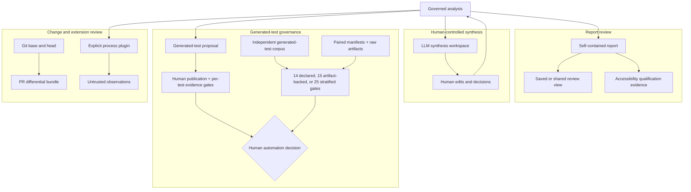

# Advanced review workflows

These workflows extend the governed analysis without changing the central authority model:
static and model-generated results are review leads; named humans own engineering decisions.



## Saved and shareable report views

The Failure modes page can save up to 20 named filter sets in browser storage. Storage is keyed by
the analysis baseline, so views from another scan are not silently mixed. **Copy share link** puts
only bounded filter and sort values in the URL fragment; it does not include the local view name,
analysis records, or repository paths beyond values already entered as filters. Invalid or unknown
filter values fail back to report defaults.

Browser qualification exercises save, reload, and share-link restoration:

```powershell
python scripts/report_browser_gate.py report.html `
  --max-js-heap-bytes 268435456 `
  -o report-browser-quality.json
sfmea report-browser-verify report-browser-quality.json `
  --report report.html -o report-browser-quality-verification.json
```

The report renders the requested section first and materializes every other section exactly once
when opened. Deep links prepare their target, while Print/PDF intentionally prepares the complete
document. The content-addressed format-4 receipt binds the exact report bytes, records initial
readiness and boot timing, reconciles every section's state and render duration, and separates
receipt validity from quality outcome. A failed but intact receipt is valid negative evidence; a malformed,
semantically inconsistent, stale, or report-mismatched receipt is invalid evidence. The standalone
verifier returns zero only when both dimensions pass.

## Accessibility qualification

The browser gate maps deterministic semantic checks to a documented WCAG 2.2 subset. Full
qualification remains separate because DOM automation cannot establish screen-reader usability,
zoom/reflow quality, or meaningful focus order.

```powershell
sfmea accessibility-init report.html -o accessibility.json
# Complete each scenario and record evaluator, environment, evidence references, and results.
sfmea accessibility-seal accessibility.json
sfmea accessibility-verify accessibility.json --report report.html
python scripts/report_browser_gate.py report.html `
  --manual-evidence accessibility.json `
  -o report-browser-quality.json
```

Evidence is bound to the exact report bytes. Required scenarios cover keyboard-only operation,
200% zoom, 400-CSS-pixel reflow, forced colors, reduced motion, NVDA/Firefox, JAWS/Chrome, and
VoiceOver/Safari. A completed receipt is qualification evidence, not an unconditional conformance
or representative-user claim. The report and accessibility receipt must be regular files; final
symbolic links are rejected rather than resolved to another evidence artifact.

## Human-controlled LLM synthesis

Discovery rejects unsupported fields, unknown evidence/citation identifiers, model decisions, and
unbounded output. The synthesis workflow adds deterministic same-component duplicate,
contradiction, and divergent-claim review leads, then provides existing and proposed claims side by
side:

```powershell
sfmea discover sfmea-analysis.json --scope "src/**"
sfmea synthesis-init sfmea-analysis.json -o synthesis.json
# Edit proposed_content and record accept/reject/defer, reviewer, and rationale.
sfmea synthesis-seal synthesis.json
sfmea synthesis-verify synthesis.json --analysis sfmea-analysis.json
sfmea synthesis-apply sfmea-analysis.json synthesis.json `
  --receipt synthesis-apply-receipt.json `
  --source-snapshot synthesis-source-analysis.json
sfmea synthesis-apply-verify synthesis-apply-receipt.json `
  --source-analysis synthesis-source-analysis.json `
  --workspace synthesis.json `
  --result-analysis sfmea-analysis.json `
  -o synthesis-apply-verification.json
```

Decision validation and in-memory application are transactional and require the unchanged analysis
and unchanged original suggestion. The command publishes a content-addressed receipt containing
the source analysis, sealed workspace, and exact persisted resulting-analysis digest; retain it
with the modified analysis. The receipt is staged and validated before coordinated publication.
The workspace is a regular evidence file: sealing and verification reject a final symbolic link
rather than resolving it to an unintended editable artifact.
If either replacement fails, the command preserves the old analysis and restores the prior receipt
where the filesystem permits. A host or process failure between the two filesystem replacements is
still a recoverable reconciliation case, not true multi-file filesystem atomicity, so consumers
must verify the receipt's result binding before relying on the pair. Human edits are audited by
changed field. Acceptance creates an unreviewed worksheet finding; it does not approve risk,
citations, evidence sufficiency, or compliance.

`--source-snapshot` publishes the exact pre-application analysis bytes to a new destination and
refuses to overwrite an existing artifact. `synthesis-apply-verify` then performs complete
source/workspace/result and decision-accounting reconciliation. For receipt transport checks only,
use `--integrity-only`; this deliberately reports `reconciled=false`. If result/receipt publication
fails after the source snapshot is written, the immutable snapshot remains useful recovery evidence
and can be supplied to the verifier after reconciliation.

## Governed LLM test implementation

Generated test code uses a narrower authority path than discovery and synthesis. One accepted,
planning-ready obligation produces one bounded packet and one allowlisted test proposal. Validation
requires an analyzer-derived import-qualified target invocation; a named human must approve atomic
publication before exact registration, restricted execution, stimulus/criteria assessment, and
independent evidence review can satisfy the seven per-test gates.

Automation promotion is a separate decision. An independently labeled corpus must qualify the
exact provider/model/prompt through fourteen population, validity, execution, effectiveness,
reviewer, and unsafe-change gates. The result is content-sealed and replayed against the exact
corpus. Neither lane waives the other, authenticates reviewer identities, or grants the model
publication, evidence, risk, or compliance authority. See the
[operator workflow](WORKFLOW.md#6-turn-accepted-findings-into-hardening-tests) for exact commands
and the [visual guide](VISUAL_GUIDE.md#governed-llm-generated-test-path) for the evidence split.

## Pull-request base/head analysis

```powershell
sfmea pr-analyze C:\path\to\repo `
  --base origin/main `
  --head HEAD `
  -o .artifacts\pr-review
sfmea pr-verify .artifacts\pr-review --json
```

The command resolves full commit IDs, creates bounded `git archive` snapshots, refuses unsafe ZIP
members, and never checks out or modifies the working tree. It does not execute repository code.
The new destination contains base/head analyses, base/head reports, a canonical differential JSON,
and a content-addressed receipt. Configuration changes remain explicit and may explain part of the
delta. `pr-verify` requires the closed six-file bundle, checks every exact-byte digest, regenerates
the differential, verifies both HTML reports against their governed analyses, and reconciles the
commit, configuration-change, and no-code-execution declarations.

## Public plugin SDK

The `pysfmea.sdk` 1.x API is semantically versioned. Minor releases may add optional fields; field
removal or meaning changes require a new major API. Plugins are never auto-discovered or imported.

```powershell
sfmea plugin-verify examples\plugins\reference_plugin.json
sfmea plugin-run examples\plugins\reference_plugin.json `
  sfmea-analysis.json `
  -o plugin-run.json
sfmea plugin-run-verify plugin-run.json `
  --analysis sfmea-analysis.json `
  --manifest examples\plugins\reference_plugin.json `
  --json
```

The host uses an argv list without a shell, a separate process, a temporary working directory, a
reduced environment, bounded request/response/stderr, a timeout, manifest identity checks, and a
strict observation-only response. Process separation is **not** an operating-system sandbox: an
untrusted executable still requires an externally managed container or sandbox with filesystem and
network restrictions. Plugin observations never become reviewer decisions automatically.

All accessibility, synthesis, pull-request, and plugin interchange documents and verification
verdicts are discoverable through `sfmea schema --list` and the complete offline schema bundle.
