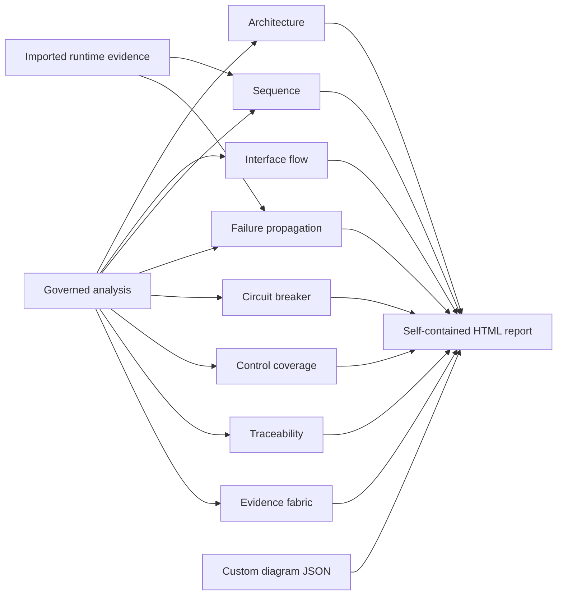

# Canonical diagram model

PySFMEA uses a renderer-neutral JSON model so generated and project-supplied
diagrams can be validated, transported, rendered in the standalone report, and
processed by other tools without depending on Mermaid, Graphviz, or a hosted
service.

For an operator-level view of how these diagrams relate to the complete assurance workflow, see
the [visual guide](VISUAL_GUIDE.md).

## Diagram portfolio at a glance



- Generated diagrams share the exact governed analysis binding.
- Runtime evidence can corroborate relationships without proving failure causality.
- Custom diagrams use the same validated renderer-neutral model.
- Every bounded view reports truncation, omissions, and interpretation limits.

## Generate diagram models

```powershell
sfmea diagram sfmea-analysis.json -o diagrams.json
sfmea diagram sfmea-analysis.json --type failure_propagation -o propagation.json
sfmea diagram sfmea-analysis.json --type circuit_breaker -o circuit-breakers.json
sfmea diagram sfmea-analysis.json --type cross_reference -o evidence-fabric-diagram.json
```

The output is a `pysfmea-diagram-bundle-1` object containing project provenance
and one or more `pysfmea-diagram-1` diagrams. Supported generated categories are:

- `architecture`
- `interface_flow`
- `traceability`
- `guidance_traceability`
- `assurance_traceability`
- `cross_reference`
- `data_flow`
- `sfta`
- `failure_propagation`
- `control_coverage`
- `circuit_breaker`
- `sequence`

The `cross_reference` projection joins the highest-priority finding chains across guidance,
requirements, hazards, SFTA events, components, semantic-exposure profiles, findings,
verification-readiness profiles, test candidates, coverage observations, registered tests,
review-governance profiles, finding-local quality diagnostics, assignments, verification
obligations, executions, evidence artifacts, adapter runs, content-addressed repository source
artifacts, and the resolved configuration input for configuration-derived findings. Semantic nodes retain exact links
to bounded data/alias-flow, concurrency, exception, state, authorization, contract, deployment,
shared-fate, and hierarchy records. Machine-suggestion and machine-summary nodes appear when they
directly cite, summarize, materialize, duplicate, contradict, or diverge from a selected finding;
their generated-claim authority remains visibly distinct. Finding-context claims, exact resolved
context values, digest-bound review events, and recorded lifecycle actors appear for selected
findings when present. Context equality does not imply operational adequacy, and actor labels do
not imply authenticated approval. Versioned guidance-source nodes now connect to exact citation
nodes and selected findings, making document lineage traversable without treating it as
applicability or compliance evidence. The analysis-scope node also connects to one digest-bound
node per top-level analysis output, exposing semantic, provenance-only, empty,
registered-without-projection, and unmapped coverage alongside the selected evidence chains. Its
metadata reports section and nested-record witness coverage, gap counts, and the exact analysis and
complete cross-reference projection digests. Up to 25 unresolved `analysis_record` nodes are shown
with their section containment and available witness edges; complete record populations remain
summarized so they do not overwhelm the review graph. The view is bounded to 40 finding chains and
500 entities; use
`sfmea cross-reference ANALYSIS --format json` for the complete machine-readable relationship
and discrepancy registers. Static agreement is corroboration, runtime presence is a bounded
observation, and configured links retain project-supplied authority. Compound exposure nodes are
model intersections for prioritization, not inferred runtime paths or new failure findings. None is promoted to proof
of completeness, compliance, verification success, or risk acceptance.
Analysis-scope diagnostics remain in the complete JSON fabric rather than being attached to an
arbitrary finding; the bounded diagram selects finding-local diagnostics for its chosen chains.
The source artifact selected for each bounded finding retains its inventory authority and digest;
its presence does not imply that indexed or opaque content received semantic analysis.
Likewise, a machine-assistance edge proves only that the governed record contains the supplied link
or that bounded lexical comparison emitted the relationship; it does not validate the claim.

Generated bundles contain a `binding` record for the baseline, analysis schema, and exact
governed analysis-state SHA-256. Their `integrity` record hashes the complete canonical
bundle content except the integrity record itself. PySFMEA verifies a declaring bundle on
re-import and rejects content changed after publication; older and organization-authored
bundles without an integrity declaration remain supported. Publication uses a temporary
sibling plus atomic replacement, preserving any prior artifact if publication fails.

## Verify a generated bundle

```powershell
sfmea diagram-verify diagrams.json
sfmea diagram-verify diagrams.json --analysis sfmea-analysis.json
sfmea diagram-verify diagrams.json --analysis sfmea-analysis.json --json
```

The verifier captures at most five megabytes from one regular non-link file whose inspected,
opened, and final identities agree. Strict decoding rejects duplicate keys, non-finite or
overflowed numbers, malformed UTF-8, and structures over 100 levels or 250,000 nodes before
canonical content integrity, every embedded diagram, and unique diagram IDs are checked. It can
optionally require the exact analysis schema, baseline, and state digest.
Human output distinguishes a matched binding from one that was not checked; `--json` emits
the complete versioned verification record for automation. JSON remains valid when the
artifact is missing, unsafe, malformed, integrity-invalid, or binding-mismatched. Completed
negative checks, checks that could not run, and diagnostic errors are separate fields. Exit
status is `0` for a valid verdict, `1` when the artifact or binding is rejected, and `2` when
the requested analysis input cannot be loaded.

PySFMEA 0.31 and newer generated bundles declare integrity as required. Removing that record
is treated as a downgrade attempt and rejected during report import. Pre-0.31 or
organization-authored legacy bundles may still be imported without a declaration, but they
cannot pass the explicit `diagram-verify` workflow until regenerated or governed externally.

Generated architecture, propagation, control, and sequence views are explicitly
bounded and record their limits or truncation state in the diagram notice and
metadata.

Sequence diagrams preserve repeated call sites, source lines, lexical branch/loop/exception
context, await status, evaluation order, resolution provenance, and confidence. Internal calls
that match more than one target are marked ambiguous and low confidence. Interface diagrams also
expose configured contracts and confidence-labeled unresolved external-call candidates.
Parameter/variable annotations, unambiguous constructor assignments, and a unique trustworthy
non-null repository-factory return annotation can resolve receiver types. Factory evidence excludes nullable,
decorated, async, generator, method, locally/module-rebound, shadowed, ambiguous, or indeterminate producers and
retains its static-only authority, but this is not whole-program type inference. Static edges are reconciled with imported
runtime relations as corroborated/not-observed, and observed edges as
statically-predicted/runtime-only; timing state and valid durations remain in the canonical
model. These projections describe bounded syntax and observations; they are not path-sensitive
control-flow, reachability, schedule, receiver-type, or causal proofs.
Static sequence and propagation projections keep deferred lambda and generator-expression bodies
on distinct components. Only lambda defaults and a generator expression's outermost iterable are
assigned to the constructing parent; eager comprehension edges follow iterable/filter/element
order. A deferred component is an analysis boundary, not evidence that it is invoked or consumed.
Function-definition edges likewise appear on module initialization or the enclosing callable:
decorator factories and defaults do not appear as calls made by the later function body. Static
sequence views preserve definition-expression and bare-decorator application context, but do not
invent a target for the callable returned by a decorator factory.
Top-level class-construction edges also appear once on module initialization, in decorator/base/
keyword/body/application order; nested classes use their enclosing callable. Declarative model and
exception nodes do not repeat those sequence or propagation edges.

The cross-reference diagram projects each typed exception edge as a shared record node linked to
its callee and caller. The record preserves exception type, selected-handler disposition, match
provenance, bounded handler-outcome certainty, active-binding rethrow identity,
terminal-finalizer override provenance, and whether the original type can continue
propagating. Finalizers are also first-class component-linked semantic nodes. A
suppressed or translated static edge is still a test-selection lead, not evidence that the handler
ran or that its response is safe.

The same cross-reference diagram exposes `static_control_flow_decision` nodes linked to their
owning components. These nodes preserve exact source coordinates, expression, selected and pruned
regions, omitted statement/operand counts, decision basis, and bounded authority for literal
branches, empty iteration, short-circuiting, and proven terminal blocks. They make an absent call
or exception path auditable without drawing discarded code as feasible. Static pruning is not
runtime-path or termination proof; unsupported predicates and loops remain conservative.

Failure-propagation diagrams combine the reviewed local, next-higher, and end-effect
chain with up to three conservative upstream caller paths per component and six caller
levels per path. Findings on the same component converge into one caller-exposure origin,
and breaker methods in the same control scope share timing and containment nodes. Each
finding keeps its own incoming relationship, while shared infrastructure prevents repeated
paths from overwhelming the graph. Static-only exposure is labeled as causally unconfirmed. When the
same caller-to-callee relation exists in imported runtime evidence, the edge is
visually reinforced but still does not prove that the failure effect propagated.
Detected circuit-breaker findings add timing-window and containment-boundary nodes;
the containment node remains explicitly uncredited until assurance evidence is
reviewed as sufficient.
The diagram status bar reports embedded versus total records, unique cascade paths,
runtime-observed links, and the number of repeated record paths represented by shared nodes.
Record selection is component-first: the highest-priority finding for each component is
selected before remaining capacity is filled from the global priority order. Metadata and
the status bar separately report embedded/total components and findings, component coverage,
additional findings selected after the diversity pass, and both truncation conditions.
Cascade projection completeness is independently reported. The model records discovered paths,
embedded paths, paths omitted with components outside the view, paths omitted by the per-component
limit, paths and segments shortened by rendering depth, and components whose scanner path inventory
was already bounded. The HTML notice expands these counts whenever the projection is incomplete;
the resulting percentage is explicitly coverage of scanner-discovered paths rather than a claim of
whole-program call-graph coverage.
In the self-contained report, finding details can open their exact failure-mode node and
diagram nodes sourced from a finding can return to the governed record or its assurance
checklist. Diagram and node selections use stable `#diagrams/<diagram-id>/<node-id>` hashes.
Opening a link restores the selection and inspector state. When the component-diverse bound
excluded the requested failure node, the report keeps the requested trace hash, explains the
omission, filters the diagram to the finding ID, and offers a direct return to the finding rather
than implying that no propagation record exists.

Named active findings can be pinned into the bounded view with repeatable
`--propagation-include-finding FINDING_ID` options. Pins are deduplicated and embedded in
request order before component-diverse and priority filling. Unknown or inactive IDs fail
generation, as does a distinct pin count above the record limit. The request, embedded pin
count, represented pin-component count, and pinned-first selection policy are preserved in
diagram metadata. The standalone report recommends the exact pin command when navigation
reaches a finding outside the current projection.

Every generated propagation diagram declares one of three machine-readable projection
states: `complete_within_discovered_static_inventory`, `bounded_projection`, or
`source_inventory_bounded`. A companion `projection_reason_codes` array identifies the
active bound: finding records, component projection, paths per component, rendered depth,
or scanner source-path inventory. “Complete” is deliberately scoped to the discovered
static inventory and is not a whole-program completeness claim. The HTML status bar and
projection inspector expose this state, effective selection policy, limits, pinned scope,
and conservative node-budget use without requiring inspection of embedded JSON.
The same view displays a one-line `sfmea report` regeneration recipe and can copy it without
network dependencies. The adjacent analysis-state digest makes clear which governed input
the recipe describes; the command still requires the named analysis JSON to be present.

The default 40-finding, three-path, six-level projection is configurable on `sfmea report`,
`sfmea pdf`, and `sfmea diagram` with `--propagation-record-limit`,
`--propagation-path-limit`, and `--propagation-depth`. Record limits range from 1 to 250,
path limits from 0 to 25, and depth from 0 to 12. A conservative preflight estimate includes
finding/effect/control infrastructure and must fit the canonical 2,000-node budget. This makes
large-record or path-rich views possible without allowing an unsafe combination to be built.
The chosen values are preserved under `report.diagram_configuration`, diagram metadata, and
the JSON diagram bundle's `generation.failure_propagation` record, together with requested
finding pins.
When `sfmea diagram` targets a category other than `all` or `failure_propagation`, custom
propagation limits and finding pins are rejected because that output cannot apply them.

Circuit-breaker state diagrams are generated only when bounded AST evidence identifies
a candidate breaker. They visualize inferred CLOSED, OPEN, HALF-OPEN, trip, cooldown,
probe, and degraded-fallback relationships. Extraction does not prove that a transition
is reachable, atomic, correctly timed, isolated, or effective; dedicated assurance
obligations require controlled-clock, concurrency, and dependency fault-injection evidence.
Members of a class-based breaker are correlated by source path and containing class, so a
distributed implementation produces one scope-level diagram while preserving each method's
local findings and evidence.
Solid state nodes represent states observed in AST evidence. Dashed conceptual nodes and the
review-gap node make missing lifecycle evidence explicit without claiming a defect. Transitions
are emitted only when their supporting role is present; for example, a recovery-success edge is
not drawn when no success-reset behavior was observed.

## Include custom diagrams in a report

```powershell
sfmea report sfmea-analysis.json `
  --diagram workflow-states.json `
  --diagram deployment-flow.json `
  -o sfmea-report.html
```

Each file may contain one diagram, an array of diagrams, or a bundle with a
top-level `diagrams` array. Custom diagram IDs must not collide with generated or
other imported diagram IDs. Imports share the verifier's strict exact-byte identity-stable reader,
so path replacement, duplicate JSON keys, non-finite values, malformed UTF-8, or structure
exhaustion cannot silently change a report. Each imported diagram records the accepted source
file's byte count and SHA-256 under `metadata.imported_file`; the report integrity binding covers
that provenance but does not authenticate its author.

## Diagram schema

Export the authoritative structural contracts for external editors, CI, or integration tools:

```powershell
sfmea schema diagram -o pysfmea-diagram.schema.json
sfmea schema diagram-bundle -o pysfmea-diagram-bundle.schema.json
sfmea schema diagram-bundle-verification -o diagram-verdict.schema.json
```

These self-contained JSON Schema Draft 2020-12 documents enforce field types, identifiers,
bounds, required properties, format constants, and closed canonical diagram objects. JSON
Schema cannot establish that IDs are unique, edges reference existing nodes, a digest matches
the bytes, or an analysis binding is current; `sfmea diagram-verify` remains authoritative for
those semantic checks. The complete catalog and compatibility policy are documented in
[SCHEMAS.md](SCHEMAS.md).

```json
{
  "schema_version": "pysfmea-diagram-1",
  "id": "workflow-state-machine",
  "title": "Workflow state machine",
  "type": "state",
  "description": "Execution lifecycle and terminal states.",
  "notice": "Transitions are project-supplied and require review.",
  "nodes": [
    {
      "id": "draft",
      "label": "Draft",
      "kind": "state",
      "group": "Lifecycle",
      "description": "Configuration is editable.",
      "source": "SRS-14",
      "tags": ["non-terminal"],
      "metrics": {"terminal": false},
      "layer": 0,
      "order": 0
    },
    {
      "id": "running",
      "label": "Running",
      "kind": "state",
      "group": "Lifecycle",
      "layer": 1,
      "order": 1
    }
  ],
  "edges": [
    {
      "id": "start",
      "source": "draft",
      "target": "running",
      "label": "start",
      "kind": "transition",
      "evidence": "SRS-14.2",
      "description": "A validated request starts execution.",
      "order": 0,
      "cycle": false
    }
  ],
  "metadata": {
    "owner": "Systems engineering"
  }
}
```

### Diagram fields

| Field | Required | Meaning |
|---|---|---|
| `id` | Yes | Stable identifier unique within the report |
| `title` | Yes | Human-readable diagram title |
| `type` | Yes | Layout and semantic hint |
| `description` | No | Scope and intended interpretation |
| `notice` | No | Limitation, provenance, or truncation statement |
| `nodes` | Yes | Bounded array of typed elements |
| `edges` | Yes | Bounded array of directed relationships |
| `metadata` | No | Scalar or bounded scalar-array provenance |

Supported diagram types are `directed_graph`, `flow`, `sequence`,
`traceability`, `cause_effect`, and `state`. These types select a layout strategy;
node and edge `kind` values remain project-extensible.

### Node fields

`id`, `label`, and `kind` are required. `group`, `description`, `source`, `tags`,
and scalar `metrics` supply evidence and drill-down details. Optional integer
`layer` and `order` values guide deterministic layout. When layers are omitted,
the report derives a bounded directed layout from the edges.

### Edge fields

`source` and `target` must reference existing node IDs. `id`, `kind`, `label`,
`evidence`, `description`, `order`, and `cycle` describe the relationship.
Sequence diagrams use edge order for message placement. Other diagrams use edge
direction for layered layout and propagation.

## Validation and security boundaries

- Diagram IDs are restricted to stable alphanumeric identifiers with dot,
  underscore, colon, and hyphen separators.
- Duplicate nodes, duplicate edges, dangling references, unsupported types,
  malformed metadata, and invalid layer/order values are rejected.
- A diagram can contain at most 2,000 nodes and 5,000 edges.
- At most 50 custom files and 50 custom diagrams are accepted. Each exact identity-stable regular
  non-link input is limited to 5 MB and strict 100-level/250,000-node JSON; accepted input bytes
  are limited to 25 MB per report invocation.
- Imported text is embedded as escaped JSON and rendered using DOM text nodes.
- Diagrams cannot add scripts, styles, HTML, URLs, event handlers, or remote
  resources to the report.

These controls protect the report renderer and keep diagrams reviewable. They do
not establish that an imported relationship is true, complete, approved, or
supported by adequate engineering evidence.
