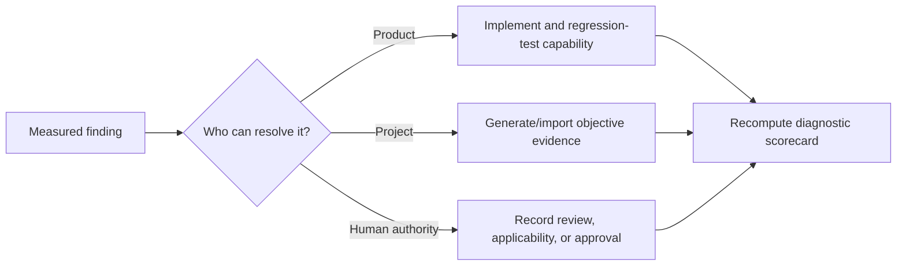

# Product enhancement resolution

This register records how the real-repository findings are resolved. A product capability is
complete when it is deterministic or explicitly heuristic, bounded, provenance-bearing, tested,
and honest about its authority. Project evidence and engineering decisions are never fabricated to
raise a diagnostic score.

## Integrated activation workbench

`sfmea enhance ANALYSIS -o enhancement-workbench.json` accounts for all 56 foundational
enhancements, all 76 real-repository hardening findings, the 82-item post-hardening audit, and the
102-item real-run resolution audit and the E001-E095 outcome backlog through the public
`pysfmea-enhancement-workbench-7` contract. It combines
the existing assurance, diagnostics, runtime, fault-injection, adapter, guidance, SFTA, reporting,
and qualification primitives into one bounded operational projection:

- inert repository-specific test, coverage, trace, dependency, and assurance argv recipes;
- stable root-cause clusters with representative-review safeguards and complete member counts;
- a prioritized verification portfolio grouped by method, rule, hazard, source area, and priority;
- complete architecture-mapping and unmatched-interface disposition queues;
- event, data, security, control-flow, concurrency, resilience, persistence, dependency, dynamic
  wiring, deployment, and local-contract surface candidates;
- explicit product, project-evidence, and human-authority status for every enhancement; and
- qualification evidence requirements and non-negotiable authority guardrails.

The resolution registers are append-only and give every audit item a stable `H01`-`H76`,
`N01`-`N82`, `R001`-`R102`, or `E001`-`E095` identity,
priority, product resolution, acceptance criterion, governing authority, live resolution state,
and report projection. Format 4 also adds:

- an exact analysis-state digest and current/stale/missing status for the run manifest, coverage,
  runtime imports, and assurance executions;
- high-volume rule-calibration risks with empty samples represented as unavailable rather than
  misleading 100 percent rates;
- architecture-proposal and unmatched-interface precision risks; and
- measurable evidence, architecture, cross-stack, guidance, and scan-runtime targets whose
  proposed status is never treated as qualification evidence.
- separate freshness, completeness, and evidence-sufficiency health states;
- a review-only configuration patch for hidden evidence scope and a bounded calibration campaign;
- metric provenance, report-scale projections, and source/test-backed product attestations; and
- `sfmea enhance-verify` for bounded integrity, register, analysis-binding, and exact-regeneration
  verification.
- deterministic assignable review batches and stratified calibration samples;
- evidence-onboarding, precision, architecture, interface, timing/resilience, guidance,
  performance, reporting, LLM-governance, and qualification programs; and
- an `R001`-`R102` register whose product, project-evidence, and human-authority states are
  independently reconciled during exact regeneration.
- Format 5 adds read-only evidence preflight, an outcome scorecard, bounded compact/management
  reporting, and dedicated fidelity, sequence/SFTA, assurance-automation, and
  architecture/interface programs. The E-register records capability closure separately from
  representative evidence and approval.
- Format 6 replaced projection-derived closure with an explicit product maturity model; format 7
  adds state-bound finding-consolidation operations and reporting. Every
  E001-E095 item is `planned`, `partial`, `implemented`, or `validated`; carries implementation and
  test evidence when claimed; discloses its current limitation and next action; and retains project
  evidence and human authority as separate states. Standalone verification exactly reconciles the
  curated register and rejects rehashed maturity overclaims. Internal regression tests support
  `implemented`, but only representative independent evidence can support `validated`.
- The current E-register records all 95 outcomes as implemented, with no outcome partial or
  planned and none promoted to independently validated. E046 and E050 are implemented
  through scaffold format 7: bounded Hypothesis strategies, contract-operation positive/negative
  cases, fail-visible project adapters, complete oracle/criterion accounting, exact synthesized-
  design binding, and public manifest/verdict schemas. Generated designs remain starting points,
  not implemented repository tests or evidence.
- E008-E010 are implemented through the closed golden-corpus evaluator and governed same-corpus
  comparison. Evaluation now produces per-rule precision/recall, empirical precision strata for
  scanner confidence labels, monotonic-order diagnostics, exact detected-control recall and
  precision by kind/role across separately bounded positive and negative component populations,
  and governed exact semantic-output cases with case/claim and per-field/per-rule mismatch metrics.
  Optional corpus governance records an independent cohort assertion,
  repository identities, distinct labeler/approver, and approval date. `sfmea evaluate-compare`
  binds a named rule change to identical before/after corpus digests, applies explicit global and
  control-recall regression gates, and emits a content-addressed review verdict. It never edits a
  rule, authenticates a corpus governance claim, approves a release, or proves runtime control
  effectiveness.
- E091 and E093 are implemented through a published Ubuntu/Windows/macOS × CPython 3.11-3.14 CI
  matrix, exact JUnit-bound `pysfmea-platform-qualification-1` receipts, enforced scanner
  median/peak-traced-allocation budgets, and per-view Chromium JavaScript-heap measurement with a
  report heap gate. Receipts and performance records are retained as workflow artifacts. These
  measurements characterize exact hosted runners and traced/JavaScript allocations; they do not
  establish customer-environment compatibility or total process/GPU/OS memory.
- E095 is implemented as the content-addressed `pysfmea-service-threat-model-1` and
  `sfmea threat-model` export. It consolidates stable threat/residual-risk IDs, trust boundaries,
  mapped controls, verification expectations, operational owners, treatments, change triggers,
  deployment minimums, and explicit acceptance authorities. It does not claim penetration
  testing, formal proof, deployment authorization, enterprise identity, or risk acceptance.
- E001 is implemented through `sfmea evidence-onboard`: plan mode runs the full bounded import path
  against an isolated analysis; apply mode accepts coverage, repeated runtime traces, and
  obligation-bound external execution manifests, then publishes an updated analysis, an exactly
  verified assurance queue, and a source/result-bound receipt. It never executes repository code
  or credits imported evidence without independent review.
- E012 is implemented through the activation workspace's state-bound consolidation queue. Only a
  complete deterministic candidate can receive a named `consolidate` decision; application creates
  a canonical review group while preserving every member finding, disposition, citation, evidence
  reference, and source location. `retain_separate` and `needs_information` remain explicit safe
  outcomes, and the HTML report exposes applied groups without reducing the authoritative count.
- E016 is implemented as a bounded `pysfmea-interprocedural-data-flow-1` analysis. Each resolved
  internal call retains caller/callee component IDs, exact call site, positional/keyword parameter
  bindings, source expressions and name/attribute/container symbols, callee return expressions,
  and the caller result context. Components link back to complete top-level edge records and the
  canonical diagram/report layer renders a truthful bounded value-flow view. The model remains
  path-insensitive and does not claim runtime reachability, taint soundness, or alias completeness.
- E017 is implemented as `pysfmea-alias-object-flow-1`. Order-aware local bindings retain source
  expressions, expanded alias origins, producer-call provenance, attribute/container writes,
  lexical control context, component identity, count reconciliation, and explicit per-component
  and global bounds. Typed receiver aliases now feed internal call resolution. The model remains
  deliberately path-insensitive and does not claim complete heap identity, lifetime, or taint flow.
- E019 is implemented as `pysfmea-concurrency-model-1`. Bounded operations identify task spawn,
  join/wait, cancellation/timeout, synchronization, and awaited completion at exact call sites;
  bounded relations retain lexical order, awaited-completion-before-next-operation, and
  conservative spawn-to-later-join candidates. Counts and component indexes reconcile exactly and
  validation rejects dangling or rewritten relationships. The model is a review aid, not proof of
  runtime task identity, scheduler order, lock ownership, deadlock freedom, race freedom, or a
  complete path-sensitive happens-before graph.
- E020 is implemented as `pysfmea-exception-propagation-1`. Exact raise and handler records retain
  named exception types, chaining, lexical try scope, catch bindings, rethrow/translation,
  suppression/control-flow exit, and logging candidates. A bounded fixed point propagates named
  types through resolved internal calls, distinguishes lexical catches from escaping candidates,
  and reconciles component indexes and omissions under semantic validation. It does not claim
  complete exception inheritance, dynamic alias resolution, runtime reachability, ExceptionGroup
  semantics, or path-sensitive proof.
- E021 is implemented as `pysfmea-state-machine-model-1`. Assignments to state, status, phase, and
  mode variables become stable component-bound transition candidates and target-state nodes;
  lexical `if` and `while` predicates become explicit guards linked to transitions. Counts,
  omissions, target links, guard links, and component indexes reconcile under semantic validation.
  The model does not claim formal reachability, transition exclusivity, liveness, indirect mutation
  coverage, or a complete state machine.
- E022-E027 are implemented through `pysfmea-resilience-semantics-1`, one interoperable bounded
  model rather than unrelated warning rules. It reconstructs lexical transaction
  begin/commit/rollback/savepoint and compensation flows; computes fixed-point direct/transitive
  side-effect summaries and idempotency-control gaps; compares compatible literal timing budgets
  across resolved calls; calculates bounded nested retry amplification with cycle/depth disclosure;
  aggregates class-scoped breaker roles, states, thresholds, cooldowns, synchronization, isolation,
  fallback, and semantic gaps; and inventories explicit bounds versus unresolved queue, pool,
  collection, recursion, and fan-out growth. Exact counts, links, references, and component indexes
  are semantically validated. These remain conservative static candidates—not proof of runtime
  atomicity, exactly-once delivery, latency compliance, breaker effectiveness, or resource
  complexity.
- E029 is implemented as `pysfmea-authorization-scope-flow-1`. It derives identity, tenant,
  role/permission, scope/claim, and credential dimensions from parameter and argument facts;
  preserves their exact underlying data-flow edge; correlates decorator and call-based guards; and
  raises explicit unguarded boundary, tenant-side-effect, and credential-verification candidates.
  Counts and component indexes reconcile under semantic validation. Naming and observed guards do
  not prove dominance, authorization correctness, tenant isolation, least privilege, or token
  validity, so those remain runtime, contract, or formal evidence obligations.
- E031 and E032 are implemented through `pysfmea-contract-semantics-1`. Governed bounded ingestion
  now covers OpenAPI, AsyncAPI, protobuf, GraphQL, JSON Schema, and Avro. It retains operation IDs,
  request parameters/body/media types, declared response and error status families, security and
  deprecation flags, RPC/message shapes, type fields/required sets, and declared versions. HTTP
  operations reconcile to Python route methods, normalized paths, and required parameters;
  duplicate operation/type definitions are compared by semantic digest; and ordered version pairs
  emit explicit field, required-parameter, and response-status change records with breaking-change
  candidates. Exact counts and component links are validated. Runtime serialization, generated-
  client behavior, deployed reachability, and authoritative version policy remain project evidence.
- E033, E034, and E064 are implemented through three connected, bounded analysis contracts.
  `pysfmea-deployment-topology-1` derives provenance-bearing nodes and edges from supported
  Dockerfile, Compose, Terraform, Kubernetes, CI, and reviewed environment declarations, and keeps
  heuristic component placements explicitly review-required. `pysfmea-shared-fate-analysis-1`
  automatically groups multi-component deployment, subsystem, and external-dependency candidates.
  `pysfmea-architecture-hierarchy-1` constructs nested subsystem/source-package structures and
  aggregates only existing requirement, hazard, and interface links upward. Exact counts, edge
  endpoints, artifact hashes, memberships, inheritance, and component indexes are validated and
  the general diagram/report layer exposes all three. None proves deployed state, common-cause
  probability, independence, or architecture approval.

The Python API, CLI JSON/Markdown export, public JSON Schema, adapter descriptor, and bounded HTML
workspace expose the same model. Generating it performs no repository execution. A project-evidence
or human-authority status is deliberate unresolved assurance work, not a missing product output.

`sfmea activate-init` operationalizes the queues as a single editable work package. Its read-only
preflight explains why discovered tests are mapped, ambiguous, unmapped, or unreadable; every
mapping retains its AST/import/symbol/filename basis and limitations. `activate-decide` requires an
exact queued subject, allowed decision, named reviewer, and rationale, then refreshes the workspace
digest atomically. `activate-verify --analysis` refuses stale or tampered workspaces.
`activate-apply` updates only explicit finding records, retains other governance decisions without
turning them into scanner facts, emits a source/workspace/result-bound receipt, and leaves the
source unchanged unless `--in-place` is deliberately requested.

## Product-controlled work

| Enhancement group | Resolution and acceptance evidence |
|---|---|
| Accuracy and repeatability | Content-addressed 75-case golden corpus, atomic retained evaluation output, exact precision/recall and call-resolution evaluation, stable baselines, cold/warm performance benchmarks, cache provenance, and differential rescans. A deterministic medium-scale repository now makes source/component/finding population, traced allocation, process RSS, retained-analysis, and 5,000-record report-generation gates explicit. Governed multi-repository campaigns bind and regenerate retained analyses/corpora/evaluations; a standalone preflight rejects placeholders, missing artifacts, weak segment populations, future dates, and unseparated governance identities before execution. Repository selection, labels, identities, representativeness, and qualification authority remain independent responsibilities. |
| Review scale and calibration | Family/cluster queues, priority reserves, complete machine-readable registers, aggregate diagnostics, per-rule human disposition calibration, and bounded workload projections. Calibration is observational and never changes a rule without a governed product update. |
| Configuration and cache safety | Read-only readiness/diagnostic suggestions, explicit evidence-only scopes, default/hidden-directory pruning, identity-stable configuration ingestion, and repository-relative cache output resolution. |
| Executable evidence | Coverage.py line/branch evidence, simple/OTLP runtime traces, JUnit-bearing sandbox executions, external execution import, mutation/fault-plugin workflows, artifact hashing, freshness checks, independent evidence review, and obligation lifecycle states. Focused mutmut metadata is now converted into retained machine-readable evidence with explicit population, score, survivor, invalid, skipped, and runner-exit ratchets; surviving mutants remain visible debt. |
| Architecture and interfaces | Static architecture/cascade graphs, bounded imported-router table/loop composition, local and mount prefixes, named client base constants, conventional request wrappers, Axios instance/interceptor discovery, deployed/test boundary separation, path-level method reconciliation, runtime edge comparison, and reviewer-only architecture mapping proposals. Runtime diagnostic credit is proportional to mapped component scope and corroborated static edges; runtime-only edges and unresolved call sites remain explicit, and partial imports create an instrumentation-expansion action. |
| Timing and resilience | Deadline/retry/backoff/order/clock program contracts, circuit-breaker state/control candidates, controlled timing/failure-recovery plugins, common-cause records, bounded propagation paths, and SFTA reconciliation. Static controls are never credited as effective without execution evidence. |
| Guidance and citations | Versioned NASA/FAA/NIST/CWE sources, exact locators, typed direct/supporting/contextual mappings, applicability decisions, mapping rationale and governance digests, organizational packs, citation-specificity diagnostics, and complete trace-package projections. |
| Governed LLM assistance | Explicit opt-in, bounded/redacted evidence packets, closed schemas, citation/evidence allowlists, transactional suggestions, separate human review, provider/model/prompt provenance, and claim-weighted discovery-quality cohorts. Generated test code additionally requires one planning-ready obligation, an exact allowlisted file, import-qualified target binding, attributed atomic publication, seven per-test readiness gates, and a separate content-sealed/replayable fourteen-gate subject-qualification corpus. Models cannot approve risk, publication, or evidence. |
| Reporting and interchange | Self-contained searchable HTML, PDF, CSV, JSON, Markdown, diagrams, SARIF, CycloneDX, schema catalog, integrity verification, report diff/navigation, diagnostic scorecard, action queue, review calibration, bounded full-register links, and an LLM-generated test governance card that exposes five analysis-resident evidence gates without claiming access to external proposal/publication receipts. |
| Qualification and security | Requirements traceability, tool SFMEA, strict complete-package typing with automatic new-module inclusion, branch/coverage ratchets, a frozen-large-module and top-five-concentration ratchet, property/mutation/security/dependency gates, adversarial bounded ingestion, signed packages, SBOMs, schema/version compatibility, and release checklists. |

## Project-controlled closure

The scanner supplies workflows and gates for these items, but the analyzed repository must provide
the underlying evidence:

- executed coverage and test-result artifacts bound to the analyzed revision;
- runtime traces with declared instrumentation scope;
- implemented fault-injection, timing, overload, recovery, concurrency, and negative tests;
- approved component, subsystem, interface, requirement, hazard, and fault-tree mappings;
- evidence freshness, sufficiency, independence, and conflict adjudication;
- representative external validation repositories and labeled expected results.

## Human-authority closure

Only named project authorities can establish system boundary and criticality, approve guidance
applicability, confirm worst credible effects and causal relationships, assign final severity,
accept residual risk, approve waivers, qualify the tool, or claim regulatory compliance. PySFMEA
keeps each missing decision visible and blocks handoff where configured; replacing those decisions
with generated text would be a product defect, not an enhancement.

## Real-repository outcome

The 2026-08-08 workflow-repository exercise exposed local-route and client-wrapper blind spots.
After the bounded composition refinements, static discovery moved from 99 uncomposed server routes,
7 client candidates, no matches, and no cross-stack sequences to 189 effective routes, dozens of
matched deployed-client candidates, and generated cross-stack sequences. Remaining evidence,
mapping, guidance-applicability, SFTA, and review gaps are retained as actionable project or human
work rather than silently marked complete. SFTA gaps now have a dedicated closed loop: one bounded
entry per hazard, explicit
retain/defer/replace intent, named approval and rationale, semantic gate/cycle/reference checks,
exact-analysis sealing, transactional application, regenerated reconciliation, and visible report
history. Exact definition-digest approval enables bounded qualitative minimal cut-set calculation
with superset absorption and fail-closed complexity/logic handling. This deliberately does not
infer or approve fault-tree causality, independence, probability, or risk acceptance.

Guidance-specificity, architecture-mapping, and unmatched-interface decisions now have a second
closed loop. A configuration-authoring draft is bound to the exact analysis and source TOML;
approved proposals publish to a new validated sibling configuration and become durable inputs to
the next scan. The source file is never overwritten, relative evidence paths retain their meaning,
and project review is never promoted to independent approval or runtime compatibility evidence.
