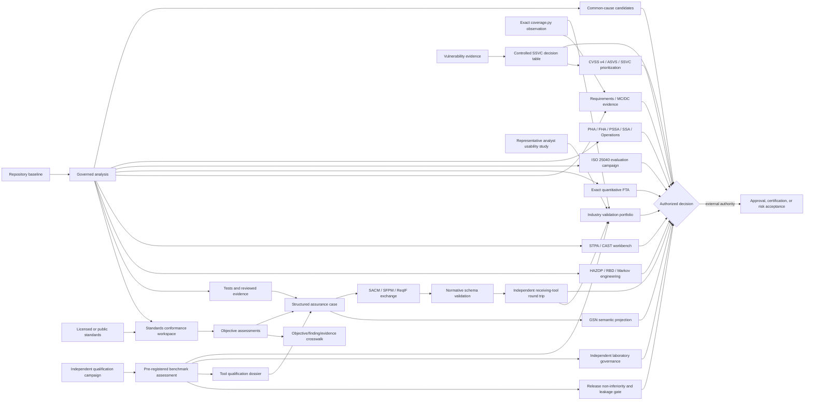
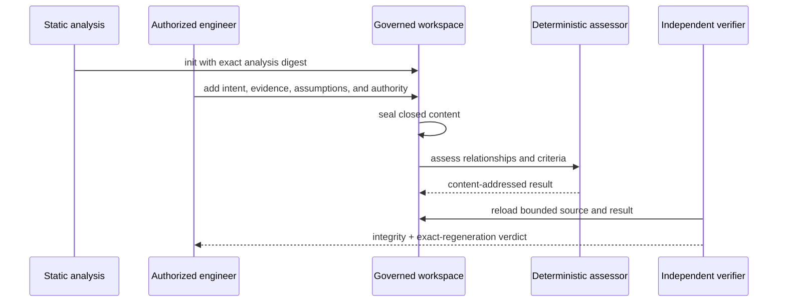
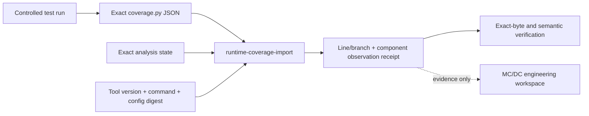
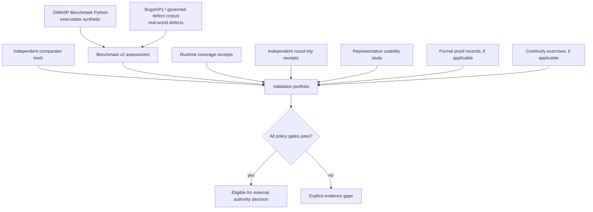
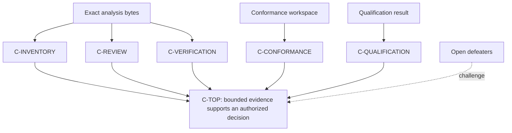
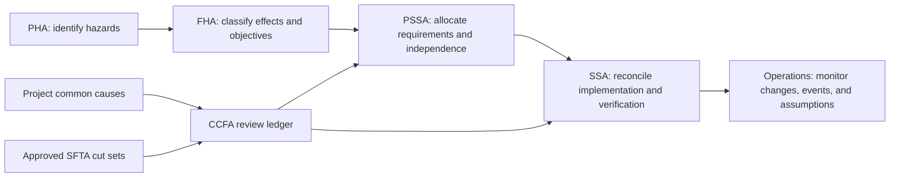
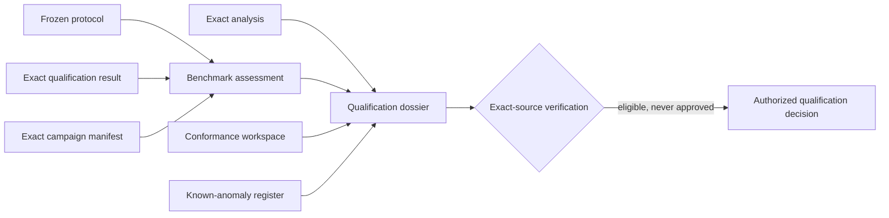

# Industry assurance profiles

PySFMEA separates five questions that are often blurred together:

1. Did the scanner create a bounded and reproducible candidate analysis?
2. Did authorized engineers review the findings and verification evidence?
3. Were the objectives of the project-selected standards addressed?
4. Has the tool evidence been independently benchmarked and assembled for qualification review?
5. Does an authorized certification, regulatory, or risk authority accept the result?

The tool can organize evidence for the first four. It cannot answer the fifth.



## Governed standards catalog

```powershell
sfmea standards-catalog
sfmea standards-catalog --json
sfmea standards-catalog -o standards-catalog.json
```

The content-addressed catalog provides 71 selectable profiles. Select only profiles made
applicable by the system, market, contract, and approved assurance plan.

| Profile | Intended use | Normative text |
|---|---|---|
| `iec-60812-2018` | General FMEA/FMECA planning, execution, treatment, and maintenance | Licensed |
| `sae-j1739-202605` | DFMEA, FMEA-MSR, and PFMEA process | Licensed; proprietary rating/AP material is not bundled |
| `faa-airborne-do178c-do330` | Airborne software lifecycle and tool qualification | FAA AC is public; RTCA/EUROCAE material is licensed |
| `iec-61508-3-2010` | Functional-safety software lifecycle | Licensed |
| `iso-26262-6-2018` | Automotive software safety lifecycle | Licensed |
| `nist-ssdf-1.1` | Secure software development | Public |
| `iso-25010-29119` | Product-quality model and governed testing | Licensed |
| `nist-ai-600-1-llm` | LLM-assisted analysis and generated-test governance | Public |
| `iso-15026-2-2022` | Structured assurance-case content and lifecycle governance | Licensed |
| `iso-5338-2023` | AI system lifecycle integration | Licensed |
| `iso-42005-2025` | AI impact-assessment process | Licensed |
| `iso-pas-8800-2024` | Road-vehicle safety and AI assurance | Licensed |
| `ul-4600-edition-3` | Safety-case evaluation for autonomous products | Licensed |
| `aiag-vda-fmea-2019` | Seven-step automotive FMEA method | Licensed; proprietary rating/AP material is not bundled |
| `sae-arp4754b-arp4761a` | Aircraft/system development and safety assessment | Licensed |
| `iso-12207-2026` | Current software lifecycle processes | Licensed |
| `iso-330xx-process-assessment` | Governed process assessment and capability evidence | Licensed |
| `openssf-osps-2026-02-19` | Open-source project security baseline | Public |
| `iso-42001-23894-ai-governance` | AI management and risk governance | Licensed |
| `nist-ssdf-800-218a-genai` | Generative-AI secure-development profile | Public |
| `iso-21434-21448-automotive` | Automotive cybersecurity and SOTIF | Licensed |
| `medical-14971-62304-81001` | Medical risk, software lifecycle, and health-software security | Licensed |
| `en-50716-2023-rail` | Railway software lifecycle | Licensed |
| `iec-62443-4-1-2018` | Industrial secure product development | Licensed |
| `iec-61511-process-safety` | Process-industry functional safety | Licensed |
| `iso-29148-2018` | Requirements engineering and bidirectional traceability | Licensed |
| `iso-42010-2022` | Architecture descriptions, viewpoints, views, and correspondences | Licensed |
| `iso-15288-2023` / `iso-15289-2019` | System lifecycle processes and controlled information items | Licensed |
| `iso-16085-2021` / `iso-31000-2018` / `iec-31010-2019` | Lifecycle and organizational risk management and technique selection | Licensed |
| `iec-61025-2006` / `iec-62502-2010` / `iec-62740-2015` | Fault tree, event tree, and root-cause analysis | Licensed |
| `omg-sysml-2-2025` / `oasis-oslc-lifecycle-2022` | System-model and lifecycle interoperability | Public specifications |
| `iec-61882-2016` / `iec-61078-2016` / `iec-61165-2006` | HAZOP, reliability block diagrams, and Markov techniques | Licensed |
| `iso-5055-25023-quality-measurement` / `ieee-1012-2024` | Automated source-quality measures and independent V&V | Licensed |
| `oasis-csaf-2-0` | Machine-readable security advisories | Public specification |
| `slsa-1-2` | Build and Source track provenance and supply-chain hardening | Public specification |
| `iec-62443-4-2-2019` / `cisa-ssvc` | Component security and stakeholder-specific vulnerability decisions | Licensed / public guidance |
| `iso-5259-data-quality` / `iso-25059-ai-quality` / `iso-tr-5469-2024` | AI data quality, system quality, and functional-safety considerations | Licensed |
| `iso-25040-2024` / `ieee-1633-2016` | Quality evaluation and software reliability programs | Licensed |
| `owasp-asvs-5-0` / `first-cvss-4-0` | Application-security verification and vulnerability severity | Public |
| `iso-27034-1-2011` | Application-security governance and lifecycle controls | Licensed |
| `nist-ai-rmf-1-0` / `iso-24029-robustness` | AI risk management and neural-network robustness | Public / licensed |
| `automotive-spice-4-0` / `faa-do-326a-ed-202a` | Automotive process assessment and aircraft cybersecurity | Mixed |
| `iec-82304-1-2016` / `iso-17025-2017` | Health-software product safety and laboratory competence | Licensed |
| `mit-stpa-cast` | STPA hazard analysis and CAST incident learning | Public |
| `nist-csf-2-0` / `iso-27001-27002-27005` | Organizational cybersecurity governance, controls, and risk management | Public / licensed |
| `iso-27701-2025` / `iso-29147-30111` | Privacy management and coordinated vulnerability lifecycle | Licensed |
| `iso-15408-18045-2026` | Common Criteria product-security evaluation and evaluator methodology | Licensed |
| `iso-9241-210-171` / `iec-62366-1` | Human-centred design, software accessibility, and medical usability engineering | Licensed |
| `iso-22301-2019` | Business continuity, recovery objectives, and exercises | Licensed |
| `iso-42006-2025` | AI management-system certification-body competence and impartiality | Licensed |
| `faa-do-333-formal-methods` | FAA-recognized airborne formal-method verification | Public FAA guidance; licensed supplement |

Catalog objectives are original summaries and navigation aids. A project using a licensed
standard must consult its controlled normative copy and record the adopted edition, tailoring,
customer-specific requirements, and interpretation authority.

## Advanced method workbenches

All six workbenches use the same controlled lifecycle. `init` creates a conservative template,
`seal` validates edited evidence and updates its digest, `assess` derives results, and `verify`
checks integrity and can exactly regenerate the assessment from its source. Analysis-bound methods
require the same analysis file for seal and assessment.



```powershell
sfmea stpa-cast-init analysis.json --authority "Safety lead" -o stpa.json
sfmea structural-coverage-init analysis.json --authority "Verification lead" -o coverage.json
sfmea quantitative-fta-init analysis.json --authority "Reliability lead" -o qfta.json
sfmea quality-evaluation-init analysis.json --authority "Quality lead" -o quality.json

sfmea structural-coverage-seal analysis.json coverage.json -o coverage.sealed.json
sfmea structural-coverage-assess analysis.json coverage.sealed.json -o coverage.assessment.json
sfmea structural-coverage-verify coverage.assessment.json --analysis analysis.json --source coverage.sealed.json

sfmea security-prioritization-init --authority "Security lead" -o security.json
sfmea laboratory-governance-init --authority "Laboratory manager" --subject-sha256 <digest> -o lab.json
```

- MC/DC credit is derived only when two supplied Boolean test vectors differ solely in the named
  condition and the decision outcome changes. Execution still requires coverage-tool evidence.
- Quantitative FTA uses exact Boolean enumeration for at most 20 basic events, preserving shared
  events. Larger or dynamic models require an independently qualified external solver.
- CVSS values are observations from a named calculator. The workbench validates canonical vectors,
  score ranges, severity labels, ASVS evidence links, and SSVC decisions; it does not substitute
  severity for treatment priority.
- Laboratory governance records competence and independence evidence but cannot grant ISO/IEC
  17025 accreditation. Likewise, method completeness is not certification or risk acceptance.

## Observed structural coverage

The MC/DC workbench validates requirement links, Boolean vectors, and unique-cause independence
pairs. Runtime observation is a separate evidence channel because `coverage.py` line and branch
data cannot establish decision or MC/DC coverage.



```powershell
sfmea runtime-coverage-import analysis.json coverage.json `
  --authority "Verification lead" `
  --command "coverage json -o coverage.json" `
  --configuration-sha256 <sha256> `
  --environment "Python 3.13, controlled CI image" `
  --test-run-ref "evidence://ci/run-42" `
  --evidence-ref "evidence://ci/run-42/log" `
  --minimum-statement-rate 0.95 `
  --minimum-branch-rate 0.90 `
  --require-all-components `
  -o runtime-coverage.json

sfmea runtime-coverage-verify runtime-coverage.json `
  --analysis analysis.json --coverage-json coverage.json --json
```

The importer never executes repository code. It consumes bounded strict JSON, binds the exact
artifact bytes, maps unique normalized paths and component line ranges, derives its own counts,
lists unmapped files and components, rejects contradictory line/branch observations, and rejects
rehashed false summaries. Object-code correlation remains an explicit project policy.

## Composite industry-validation portfolio

The portfolio is the final evidence-integration gate. It requires a benchmark-v2 assessment with
a `benchmark_suite` stratum and checks that each repository belongs to exactly one declared,
content-addressed external suite. The default policy requires both executable synthetic and
real-world defect suites, two distinct comparator tools, runtime coverage, and representative
analyst usability evidence. Selected interoperability formats must have passing independent
receiving-tool receipts. Formal-method and continuity gates become mandatory when their policy
flags are enabled; supplied optional evidence must still pass.

A defensible baseline can pair [OWASP Benchmark Python](https://github.com/OWASP-Benchmark/BenchmarkPython)
for executable security cases with [BugsInPy](https://github.com/soarsmu/BugsInPy) for reproducible
real-world Python defects. Pin the exact source revision and digest in the portfolio; names and
URLs alone are not provenance. [NIST SARD](https://samate.nist.gov/SARD/) can add an independent
cross-language control corpus, but it does not replace representative Python evidence.



```powershell
sfmea validation-portfolio-init --authority "Qualification lead" -o portfolio.json
# Edit the closed workspace and add exact relative evidence paths.
sfmea validation-portfolio-seal portfolio.json -o portfolio.sealed.json
sfmea validation-portfolio-assess portfolio.sealed.json -o portfolio.assessment.json
sfmea validation-portfolio-verify portfolio.assessment.json `
  --source portfolio.sealed.json --json
sfmea validation-portfolio-report portfolio.assessment.json -o portfolio.html
sfmea validation-portfolio-report-verify portfolio.html `
  --assessment portfolio.assessment.json --json
```

Relative evidence paths cannot escape the portfolio directory. Assessment binds every referenced
machine artifact by byte count, SHA-256, and content digest; the standalone verifier recomputes all
decision gates so a rehashed false summary remains invalid. The responsive HTML report embeds the
exact assessment and independently protects both payload and normalized document bytes.

## Objective-by-objective assessment

Create a workspace bound to the exact analysis state:

```powershell
sfmea conformance-init .artifacts\RUN\sfmea-analysis.json `
  --profile iec-60812-2018 `
  --profile nist-ai-600-1-llm `
  --system "Payments control service" `
  --phase verification `
  --basis "Approved software assurance plan SAP-17" `
  --authority "Software Assurance Board" `
  -o .artifacts\RUN\conformance.json
```

Every objective begins `undetermined` and `unassessed`. Record applicability and assessment
one objective at a time:

```powershell
sfmea conformance-assess .artifacts\RUN\conformance.json IEC60812-SCOPE `
  --applicability applicable `
  --status satisfied `
  --rationale "Scope and assumptions approved at review SRR-42." `
  --reviewer "assurance-board@example.org" `
  --evidence-ref "reqif://SAP-17/SFMEA-SCOPE"

sfmea conformance-verify .artifacts\RUN\conformance.json `
  --analysis .artifacts\RUN\sfmea-analysis.json --json
```

The assessment model is deliberately fail-visible:

- `satisfied` requires at least one evidence reference.
- Every assessed decision requires a rationale, reviewer, and timestamp.
- `not_applicable` is distinct from `unassessed` and requires an authorized rationale.
- Undetermined applicability and every applicable status other than `satisfied` remain blockers.
- Catalog, profile, objective, summary, and analysis-state changes invalidate verification.
- A fully satisfied workspace says only that the selected objective assessments support the
  declared position. It does not issue certification or regulatory approval.

## Objective-to-finding crosswalk

Create an authority-attributed mapping from applicable standards objectives to exact findings,
verification obligations, and controlled evidence. Unknown or inactive identifiers are rejected:

```powershell
Copy-Item examples\standards-crosswalk-mapping.json crosswalk-mapping.json
# Replace every template identifier and assertion with reviewed project data.
sfmea standards-crosswalk sfmea-analysis.json conformance.json `
  crosswalk-mapping.json -o standards-crosswalk.json
sfmea standards-crosswalk-verify standards-crosswalk.json `
  --analysis sfmea-analysis.json --conformance conformance.json `
  --mapping crosswalk-mapping.json --json
```

The artifact retains exact byte and canonical identities for all three sources, reports unlinked
applicable objectives and unmapped active findings, and can be exactly regenerated. A link is an
attributed engineering assertion; it is not proof that a finding is true or an objective is met.

## Structured assurance case

Generate a machine-readable claims–arguments–evidence artifact:

```powershell
sfmea assurance-case .artifacts\RUN\sfmea-analysis.json `
  --conformance .artifacts\RUN\conformance.json `
  --qualification qualification-result.json `
  -o .artifacts\RUN\assurance-case.json

sfmea assurance-case-verify .artifacts\RUN\assurance-case.json `
  --analysis .artifacts\RUN\sfmea-analysis.json --json
```



The JSON structure aligns with ISO/IEC/IEEE 15026 assurance-case concepts and OMG SACM claim,
argument, artifact, and asserted-relationship semantics. Each unsupported or partial subclaim produces an explicit defeater and keeps
the top claim from becoming decision-ready.

Project the same exact case into closed GSN Version 3 semantic nodes for notation-oriented review:

```powershell
sfmea gsn-project assurance-case.json -o assurance-case-gsn.json
sfmea gsn-verify assurance-case-gsn.json --case assurance-case.json --json
```

Goals, strategies, solutions, assumptions, and open defeaters remain distinct. This PySFMEA JSON
is a semantic projection for review and visualization; it is not represented as a normative GSN
exchange serialization or proof of ISO/IEC/IEEE 15026 conformity.

Export bounded standards-oriented projections and independently reconcile them to their exact
source populations:

```powershell
sfmea industry-exchange sacm assurance-case.json -o assurance-case.sacm.xmi
sfmea industry-exchange sfpm sfmea-analysis.json -o findings.sfpm.xmi
sfmea industry-exchange reqif sfmea-analysis.json -o assurance.reqif
sfmea industry-exchange spdx sfmea-analysis.json -o inventory.spdx.json
sfmea industry-exchange-verify reqif assurance.reqif sfmea-analysis.json --json
```

The SACM 2.3 and SFPM 1.0 XMI files use official OMG namespace identities and declare the exact
PySFMEA subset represented. ReqIF 1.2 carries findings, obligations, and `verifies` relations.
SPDX 3.0.1 JSON-LD carries a Core+Software declared inventory. Verification covers structure,
source identity, and population reconciliation—not every feature of the receiving metamodel.

## Normative validation and independent round trips

Install the optional interoperability validators, then validate exact exchange bytes against the
controlled schema acquired for the adopted edition:

```powershell
pip install "pysfmea[interop]"
sfmea industry-schema-validate assurance.reqif reqif.xsd `
  --schema-kind xml-schema --standard "OMG ReqIF" --edition "1.2" `
  --schema-uri "controlled://standards/reqif/1.2/reqif.xsd" `
  --schema-sha256 EXPECTED_PUBLISHER_DIGEST -o reqif-schema-receipt.json
sfmea industry-schema-verify reqif-schema-receipt.json `
  --artifact assurance.reqif --schema reqif.xsd --json
```

PySFMEA records the exact artifact and schema identities, validator implementation, publisher
digest comparison, and validation errors. It does not download or substitute normative schemas.
JSON Schema uses `jsonschema`; XML Schema uses `lxml`.

After a separate tool and operator import and re-export the artifact, capture their observation
record and seal it with the validation receipt:

```powershell
sfmea industry-roundtrip-seal reqif-schema-receipt.json receiver-observation.json `
  -o reqif-roundtrip.json
sfmea industry-roundtrip-verify reqif-roundtrip.json `
  --validation-receipt reqif-schema-receipt.json `
  --observation receiver-observation.json --reexport receiver-export.reqif --json
```

The evidence distinguishes PySFMEA self-reconciliation, normative schema validity, and an
independently attributable receiving-tool round trip. The receiving-tool identity, version,
operator, independence basis, differences, and exact re-export bytes remain reviewable.

## Requirements and system-model lifecycle bridge

Normalize controlled snapshots without fuzzy linkage:

```powershell
sfmea lifecycle-import reqif requirements.reqif --analysis sfmea-analysis.json `
  -o lifecycle-model.json
sfmea lifecycle-import sysml2-json system-model.json --analysis sfmea-analysis.json `
  -o lifecycle-model.json
sfmea lifecycle-import oslc-jsonld lifecycle-snapshot.json -o lifecycle-model.json
sfmea lifecycle-import-verify lifecycle-model.json `
  --source system-model.json --analysis sfmea-analysis.json --json
```

The bridge preserves source IDs, types, titles, explicit relationships, and exact input digests.
Code links are created only from explicit PySFMEA component identifiers; ambiguous name similarity
never earns traceability credit. Unsupported metamodel content remains outside the declared subset.

## PHA, FHA, PSSA, SSA, operations, and CCFA

The safety lifecycle workspace carries each declared hazard through objectives, allocation,
verification, and an authority-attributed residual-risk disposition. It also builds Common Cause
Failure Analysis scope from project-defined shared causes and qualitative cut sets from approved
software fault trees:

```powershell
sfmea safety-lifecycle-init sfmea-analysis.json --authority "System safety lead" `
  -o safety-lifecycle-authoring.json
# Complete the five stage records, hazard records, and CCFA reviews under configuration control.
sfmea safety-lifecycle-seal sfmea-analysis.json safety-lifecycle-authoring.json `
  -o safety-lifecycle-authoring.json
sfmea safety-lifecycle-assess sfmea-analysis.json safety-lifecycle-authoring.json `
  -o safety-lifecycle-assessment.json
sfmea safety-lifecycle-verify safety-lifecycle-assessment.json `
  --analysis sfmea-analysis.json --authoring safety-lifecycle-authoring.json --json
```



The operations record adds a FRACAS/CAPA-style periodic review and optional incident records with
affected hazards/findings/components, containment, root-cause evidence, corrective actions,
ownership, due date, effectiveness verification, and attributed closure. An approved lifecycle
status means the named reviewer supplied rationale and evidence; it does not mean PySFMEA approved
a design. Unapproved fault-tree logic receives no cut-set or CCFA credit.

## HAZOP, RBD, and Markov dependability analysis

Static discovery creates review scope; an authorized engineer supplies design intent, deviation
causes/effects, safeguards, success logic, reliability values, state-transition rates, assumptions,
uncertainty, and evidence:

```powershell
sfmea dependability-init sfmea-analysis.json --authority "Dependability lead" `
  -o dependability-authoring.json
# Edit the controlled authoring artifact.
sfmea dependability-seal sfmea-analysis.json dependability-authoring.json `
  -o dependability-authoring.json
sfmea dependability-assess sfmea-analysis.json dependability-authoring.json `
  -o dependability-assessment.json
sfmea dependability-verify dependability-assessment.json `
  --analysis sfmea-analysis.json --authoring dependability-authoring.json --json
```

HAZOP completeness is checked across every declared node/parameter/guideword pair. RBD results use
only explicit series, parallel, or k-out-of-n gates. Blocks may use direct reliability or an
evidence-backed constant failure rate, optional repair rate, and reliability interval. Multi-input
gates require explicit independence evidence and may apply a declared beta-factor common-cause
sensitivity adjustment; call graphs never imply statistical independence. Bounded homogeneous continuous-time Markov models are solved by uniformization and
must conserve probability. These calculations support engineering review; they do not choose
rates, prove independence, or accept risk.

## Independent benchmark assessment

PySFMEA's built-in corpus is a regression gate. Industry qualification should additionally use:

- Independently selected and labeled Python repositories
- Representative frameworks and application domains
- Positive and negative populations
- Precision, recall, false-positive rate, localization, semantic, and control metrics
- Confidence calibration and uncertainty intervals where statistically meaningful
- Conservative confidence bounds for every metric inside every represented stratum
- Unique retained repository source references to prevent duplicate holdout credit
- Cold/warm runtime, peak RSS, artifact size, and browser usability budgets
- Independent approval of labels, selection rationale, thresholds, anomalies, and deviations

Use `qualification-build`, `qualification-verify`, and `qualification-report` for the retained
campaign. Then assess it against a protocol frozen before scanner execution:

```powershell
Copy-Item examples\independent-benchmark-protocol.json benchmark-protocol.json
# Replace every placeholder and reviewer count with controlled project evidence.
sfmea benchmark-assess benchmark-protocol.json qualification-result.json `
  qualification-campaign.json -o benchmark-assessment.json
sfmea benchmark-verify benchmark-assessment.json `
  --protocol benchmark-protocol.json `
  --qualification-result qualification-result.json `
  --qualification-manifest qualification-campaign.json --json
```

For the advanced format-2 campaign, publish an accessible self-contained report whose embedded
assessment and complete HTML document are independently integrity-bound:

```powershell
sfmea benchmark-report-v2 benchmark-v2-assessment.json -o benchmark-v2-report.html
sfmea benchmark-report-verify-v2 benchmark-v2-report.html `
  --assessment benchmark-v2-assessment.json --json
```

The assessment calculates two-sided Wilson intervals for finding, call, control, and semantic
recall/precision; calculates Cohen's kappa from the retained reviewer matrix; gates the lower
confidence bound rather than the point estimate; binds exact protocol, campaign, and result bytes;
and requires a closed requalification-trigger set. Missing metric populations fail visibly.
The verifier can exactly regenerate the artifact from all three retained sources.

Passing means only `eligible_for_authorized_tool_qualification_review`. PySFMEA cannot establish
that repositories are representative, labels are true, authorities are independent, or the
selected thresholds are sufficient.

For heterogeneous repositories and LLM-generated-test qualification, format 2 adds
repository-cluster bootstrap intervals, per-stratum minimum populations, prediction calibration,
Krippendorff nominal alpha, predeclared power evidence, and a broader change-trigger set:

```powershell
# Edit controlled protocol and observation templates, then reseal them.
Copy-Item examples\independent-benchmark-protocol-v2.json benchmark-protocol-v2.json
Copy-Item examples\independent-benchmark-observations-v2.json benchmark-observations-v2.json
sfmea benchmark-seal-v2 benchmark-protocol-v2.json -o benchmark-protocol-v2.json
sfmea benchmark-seal-v2 benchmark-observations-v2.json `
  --protocol benchmark-protocol-v2.json -o benchmark-observations-v2.json
sfmea benchmark-assess-v2 benchmark-protocol-v2.json benchmark-observations-v2.json `
  -o benchmark-assessment-v2.json
sfmea benchmark-verify-v2 benchmark-assessment-v2.json `
  --protocol benchmark-protocol-v2.json --observations benchmark-observations-v2.json --json
```

The tool-qualification dossier accepts either benchmark generation. Sealing establishes content
integrity only; external governance must prove pre-registration, independence, representative
sampling, label truth, power assumptions, and threshold sufficiency.

## Tool qualification dossier

Apply the release gate before a candidate enters tool-qualification or release approval:

```powershell
sfmea release-qualification-init --authority "Protocol owner" -o release-source.json
# Populate distinct authorities, temporal corpus records, content/history/lineage identities,
# every candidate/reference similarity pair, metric margins, resource observations, and evidence.
sfmea release-qualification-seal release-source.json -o release-source.json
sfmea release-qualification-assess release-source.json candidate-assessment.json `
  baseline-assessment.json -o release-assessment.json
sfmea release-qualification-verify release-assessment.json --source release-source.json `
  --candidate candidate-assessment.json --baseline baseline-assessment.json --json
```

Passing requires both format-2 benchmarks to pass, post-cutoff candidate and pre-cutoff reference
corpora, disjoint repository IDs/content/history roots/lineage, exhaustive below-threshold
similarity evidence, conservative recall/precision lower-bound non-inferiority, and duration,
peak-RSS, and artifact-size budgets. This proves policy accounting over supplied evidence; it
cannot authenticate the declared authorities or establish corpus independence.

The dossier is a controlled evidence index, not a qualification certificate:

```powershell
sfmea tool-qualification-bases
sfmea tool-qualification-bases -o qualification-bases.json
```

The three governed navigation packs cover DO-330/ED-215, ISO 26262-8, and IEC 61508-3. Each maps
all nine generic dossier objectives to lifecycle evidence categories and exposes classification
questions and tailoring boundaries without reproducing licensed normative requirements.

```powershell
sfmea tool-qualification-init sfmea-analysis.json `
  --benchmark benchmark-assessment.json --conformance conformance.json `
  --anomalies examples\known-anomalies.json `
  --intended-use "Screen Python repositories and retain review candidates" `
  --reliance "No lifecycle objective is eliminated solely by scanner output" `
  --basis "Project-approved DO-330-aligned process" `
  --classification "Classification pending authority decision" `
  --environment "Controlled CPython and dependency baseline" `
  --authority "Tool qualification authority" -o tool-qualification.json

sfmea tool-qualification-assess tool-qualification.json TQ-CLASSIFY `
  --applicability applicable --status satisfied `
  --rationale "Approved classification decision TQA-17" `
  --reviewer "independent-reviewer-id" --evidence-ref "record://TQA-17"

sfmea tool-qualification-verify tool-qualification.json `
  --analysis sfmea-analysis.json --benchmark benchmark-assessment.json `
  --conformance conformance.json --anomalies examples\known-anomalies.json --json
```

Nine immutable objectives cover classification, operational requirements, qualification and
verification plans, verification results, configuration, known anomalies, accomplishment, and
requalification. Exact-source verification reconciles the analysis, benchmark, conformance
workspace, anomaly register, and derived input gates. Every applicable objective needs attributed
evidence; open anomalies and undecided classification block readiness. Only an authorized authority
can choose DO-330 TQL, ISO 26262 tool-confidence, IEC 61508 tool-class, or another qualification
basis and approve its required lifecycle data.



## Supply-chain exchange

For governed vulnerability prioritization, use a project-approved complete SSVC-style decision
table. PySFMEA intentionally does not embed a mutable or guessed CISA decision tree:

```powershell
sfmea ssvc-policy-init --authority "Product security authority" -o ssvc-policy.json
# Populate the controlled model version and complete, non-overlapping decision table.
sfmea ssvc-seal ssvc-policy.json -o ssvc-policy.json
sfmea ssvc-observations-init --policy-digest POLICY_CONTENT_SHA256 `
  --authority "Vulnerability review board" -o ssvc-observations.json
# Populate attributable decision-point evidence and next-review dates.
sfmea ssvc-seal ssvc-observations.json --policy ssvc-policy.json `
  -o ssvc-observations.json
sfmea ssvc-assess ssvc-policy.json ssvc-observations.json -o ssvc-assessment.json
sfmea ssvc-verify ssvc-assessment.json --policy ssvc-policy.json `
  --observations ssvc-observations.json --json
```

Track, Track*, Attend, or Act is a deterministic application of the controlled local policy to
supplied evidence—not a CISA decision or an assertion that the evidence is true.

`sfmea sbom` emits CycloneDX 1.7. It declares the `discovery` lifecycle and explicitly marks the
project assembly and dependency graph `incomplete`, because static manifest inventory does not
resolve all installed or transitive components. SARIF findings remain labeled screening
candidates. Neither export implies vulnerability, dependency, or system-safety completeness.

Publish VEX only from an explicit product-security decision file; PySFMEA never infers an
exploitability state from static inventory:

```powershell
Copy-Item examples\vex-decisions.json vex-decisions.json
# Replace all template fields with authority-attributed decisions and evidence.
sfmea vex sfmea-analysis.json vex-decisions.json -o product.vex.cdx.json
sfmea vex-verify product.vex.cdx.json sfmea-analysis.json vex-decisions.json --json
sfmea csaf sfmea-analysis.json vex-decisions.json -o product.csaf.json
sfmea csaf-verify product.csaf.json sfmea-analysis.json vex-decisions.json --json
```

The CycloneDX 1.7 VEX exporter accepts the standard analysis states, justifications, and responses,
requires evidence for every entry, requires recognized justification for `not_affected`, rejects
unknown BOM references, and verifies exact regeneration from both controlled sources.
The CSAF 2.0 projection reuses those governed states and never derives product status from a scan.
Before operational publication, validate it with the official OASIS CSAF schema using
`industry-schema-validate` and retain the schema receipt beside the advisory.

Generate and verify SLSA Provenance v1 for the exact retained analysis:

```powershell
sfmea provenance .artifacts\RUN\sfmea-analysis.json `
  -o .artifacts\RUN\sfmea-analysis.intoto.json
sfmea provenance-verify .artifacts\RUN\sfmea-analysis.intoto.json `
  --analysis .artifacts\RUN\sfmea-analysis.json --json
```

The statement records the exact subject digest, analysis-state identity, safe scanner parameters,
builder/version, run identity and timestamps, source/configuration/guidance/adapter/dependency/
contract/inventory/context materials, and repository revision when available. Local structural
verification does not authenticate the builder. Sign and transparently publish the statement in
the release workflow when the organizational assurance plan requires authenticated provenance.

Apply a deny-by-default SLSA 1.2 policy after an external tool has verified the signature:

```powershell
sfmea slsa-policy-init --authority "Supply-chain authority" -o slsa-policy.json
sfmea slsa-observation-init --verifier "Independent verifier" -o slsa-observation.json
# Populate approved identities/constraints and the external verification receipt, then seal both.
sfmea slsa-policy-seal slsa-policy.json -o slsa-policy.json
sfmea slsa-observation-seal slsa-observation.json -o slsa-observation.json
sfmea slsa-policy-assess sfmea-analysis.intoto.json slsa-policy.json `
  slsa-observation.json -o slsa-assessment.json
sfmea slsa-policy-verify slsa-assessment.json --provenance sfmea-analysis.intoto.json `
  --policy slsa-policy.json --observation slsa-observation.json --json
```

Build and Source track levels are independent. The current format can establish Source L2 but
deliberately withholds Source L3 until its stronger administrator and technical enforcement
controls have a closed, independently verifiable evidence contract.

The repository also runs the official, immutable-SHA-pinned OpenSSF Scorecard action on `main`
and weekly. Results are retained as SARIF and sent to GitHub code scanning with read-only default
permissions and only the job-level `security-events` and OIDC permissions required for publishing.
