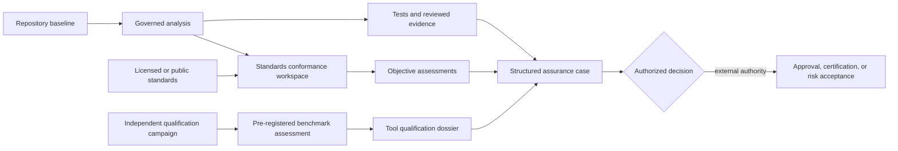
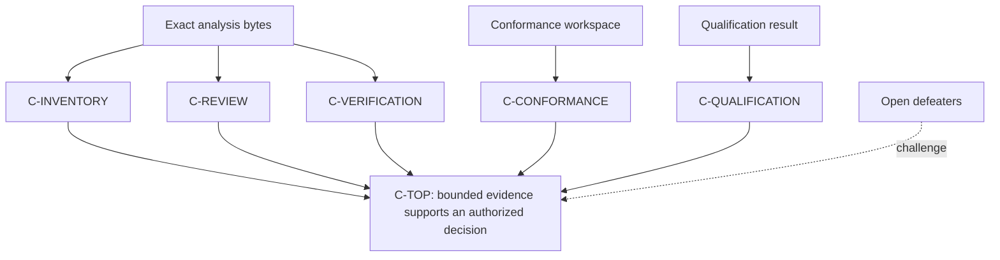
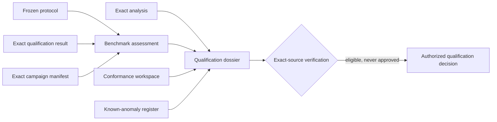

# Industry assurance profiles

PySFMEA separates five questions that are often blurred together:

1. Did the scanner create a bounded and reproducible candidate analysis?
2. Did authorized engineers review the findings and verification evidence?
3. Were the objectives of the project-selected standards addressed?
4. Has the tool evidence been independently benchmarked and assembled for qualification review?
5. Does an authorized certification, regulatory, or risk authority accept the result?

The tool can organize evidence for the first four. It cannot answer the fifth.



## Governed standards catalog

```powershell
sfmea standards-catalog
sfmea standards-catalog --json
sfmea standards-catalog -o standards-catalog.json
```

The content-addressed catalog provides 20 selectable profiles. Select only profiles made
applicable by the system, market, contract, and approved assurance plan.

| Profile | Intended use | Normative text |
|---|---|---|
| `iec-60812-2018` | General FMEA/FMECA planning, execution, treatment, and maintenance | Licensed |
| `sae-j1739-202605` | DFMEA, FMEA-MSR, and PFMEA process | Licensed; proprietary rating/AP material is not bundled |
| `faa-airborne-do178c-do330` | Airborne software lifecycle and tool qualification | FAA AC is public; RTCA/EUROCAE material is licensed |
| `iec-61508-3-2010` | Functional-safety software lifecycle | Licensed |
| `iso-26262-6-2018` | Automotive software safety lifecycle | Licensed |
| `nist-ssdf-1.1` | Secure software development | Public |
| `iso-25010-29119` | Product-quality model and governed testing | Licensed |
| `nist-ai-600-1-llm` | LLM-assisted analysis and generated-test governance | Public |
| `aiag-vda-fmea-2019` | Seven-step automotive FMEA method | Licensed; proprietary rating/AP material is not bundled |
| `sae-arp4754b-arp4761a` | Aircraft/system development and safety assessment | Licensed |
| `iso-12207-2026` | Current software lifecycle processes | Licensed |
| `iso-330xx-process-assessment` | Governed process assessment and capability evidence | Licensed |
| `openssf-osps-2026-02-19` | Open-source project security baseline | Public |
| `iso-42001-23894-ai-governance` | AI management and risk governance | Licensed |
| `nist-ssdf-800-218a-genai` | Generative-AI secure-development profile | Public |
| `iso-21434-21448-automotive` | Automotive cybersecurity and SOTIF | Licensed |
| `medical-14971-62304-81001` | Medical risk, software lifecycle, and health-software security | Licensed |
| `en-50716-2023-rail` | Railway software lifecycle | Licensed |
| `iec-62443-4-1-2018` | Industrial secure product development | Licensed |
| `iec-61511-process-safety` | Process-industry functional safety | Licensed |

Catalog objectives are original summaries and navigation aids. A project using a licensed
standard must consult its controlled normative copy and record the adopted edition, tailoring,
customer-specific requirements, and interpretation authority.

## Objective-by-objective assessment

Create a workspace bound to the exact analysis state:

```powershell
sfmea conformance-init .artifacts\RUN\sfmea-analysis.json `
  --profile iec-60812-2018 `
  --profile nist-ai-600-1-llm `
  --system "Payments control service" `
  --phase verification `
  --basis "Approved software assurance plan SAP-17" `
  --authority "Software Assurance Board" `
  -o .artifacts\RUN\conformance.json
```

Every objective begins `undetermined` and `unassessed`. Record applicability and assessment
one objective at a time:

```powershell
sfmea conformance-assess .artifacts\RUN\conformance.json IEC60812-SCOPE `
  --applicability applicable `
  --status satisfied `
  --rationale "Scope and assumptions approved at review SRR-42." `
  --reviewer "assurance-board@example.org" `
  --evidence-ref "reqif://SAP-17/SFMEA-SCOPE"

sfmea conformance-verify .artifacts\RUN\conformance.json `
  --analysis .artifacts\RUN\sfmea-analysis.json --json
```

The assessment model is deliberately fail-visible:

- `satisfied` requires at least one evidence reference.
- Every assessed decision requires a rationale, reviewer, and timestamp.
- `not_applicable` is distinct from `unassessed` and requires an authorized rationale.
- Undetermined applicability and every applicable status other than `satisfied` remain blockers.
- Catalog, profile, objective, summary, and analysis-state changes invalidate verification.
- A fully satisfied workspace says only that the selected objective assessments support the
  declared position. It does not issue certification or regulatory approval.

## Structured assurance case

Generate a machine-readable claims–arguments–evidence artifact:

```powershell
sfmea assurance-case .artifacts\RUN\sfmea-analysis.json `
  --conformance .artifacts\RUN\conformance.json `
  --qualification qualification-result.json `
  -o .artifacts\RUN\assurance-case.json

sfmea assurance-case-verify .artifacts\RUN\assurance-case.json `
  --analysis .artifacts\RUN\sfmea-analysis.json --json
```



The JSON structure aligns with ISO/IEC/IEEE 15026 assurance-case concepts and OMG SACM claim,
argument, artifact, and asserted-relationship semantics. It is intentionally not advertised as
normative SACM XMI. Each unsupported or partial subclaim produces an explicit defeater and keeps
the top claim from becoming decision-ready.

## Independent benchmark assessment

PySFMEA's built-in corpus is a regression gate. Industry qualification should additionally use:

- Independently selected and labeled Python repositories
- Representative frameworks and application domains
- Positive and negative populations
- Precision, recall, false-positive rate, localization, semantic, and control metrics
- Confidence calibration and uncertainty intervals where statistically meaningful
- Cold/warm runtime, peak RSS, artifact size, and browser usability budgets
- Independent approval of labels, selection rationale, thresholds, anomalies, and deviations

Use `qualification-build`, `qualification-verify`, and `qualification-report` for the retained
campaign. Then assess it against a protocol frozen before scanner execution:

```powershell
Copy-Item examples\independent-benchmark-protocol.json benchmark-protocol.json
# Replace every placeholder and reviewer count with controlled project evidence.
sfmea benchmark-assess benchmark-protocol.json qualification-result.json `
  qualification-campaign.json -o benchmark-assessment.json
sfmea benchmark-verify benchmark-assessment.json `
  --protocol benchmark-protocol.json `
  --qualification-result qualification-result.json `
  --qualification-manifest qualification-campaign.json --json
```

The assessment calculates two-sided Wilson intervals for finding, call, control, and semantic
recall/precision; calculates Cohen's kappa from the retained reviewer matrix; gates the lower
confidence bound rather than the point estimate; binds exact protocol, campaign, and result bytes;
and requires a closed requalification-trigger set. Missing metric populations fail visibly.
The verifier can exactly regenerate the artifact from all three retained sources.

Passing means only `eligible_for_authorized_tool_qualification_review`. PySFMEA cannot establish
that repositories are representative, labels are true, authorities are independent, or the
selected thresholds are sufficient.

## Tool qualification dossier

The dossier is a controlled evidence index, not a qualification certificate:

```powershell
sfmea tool-qualification-init sfmea-analysis.json `
  --benchmark benchmark-assessment.json --conformance conformance.json `
  --anomalies examples\known-anomalies.json `
  --intended-use "Screen Python repositories and retain review candidates" `
  --reliance "No lifecycle objective is eliminated solely by scanner output" `
  --basis "Project-approved DO-330-aligned process" `
  --classification "Classification pending authority decision" `
  --environment "Controlled CPython and dependency baseline" `
  --authority "Tool qualification authority" -o tool-qualification.json

sfmea tool-qualification-assess tool-qualification.json TQ-CLASSIFY `
  --applicability applicable --status satisfied `
  --rationale "Approved classification decision TQA-17" `
  --reviewer "independent-reviewer-id" --evidence-ref "record://TQA-17"

sfmea tool-qualification-verify tool-qualification.json `
  --analysis sfmea-analysis.json --benchmark benchmark-assessment.json `
  --conformance conformance.json --anomalies examples\known-anomalies.json --json
```

Nine immutable objectives cover classification, operational requirements, qualification and
verification plans, verification results, configuration, known anomalies, accomplishment, and
requalification. Exact-source verification reconciles the analysis, benchmark, conformance
workspace, anomaly register, and derived input gates. Every applicable objective needs attributed
evidence; open anomalies and undecided classification block readiness. Only an authorized authority
can choose DO-330 TQL, ISO 26262 tool-confidence, IEC 61508 tool-class, or another qualification
basis and approve its required lifecycle data.



## Supply-chain exchange

`sfmea sbom` emits CycloneDX 1.7. It declares the `discovery` lifecycle and explicitly marks the
project assembly and dependency graph `incomplete`, because static manifest inventory does not
resolve all installed or transitive components. SARIF findings remain labeled screening
candidates. Neither export implies vulnerability, dependency, or system-safety completeness.

Generate and verify SLSA Provenance v1 for the exact retained analysis:

```powershell
sfmea provenance .artifacts\RUN\sfmea-analysis.json `
  -o .artifacts\RUN\sfmea-analysis.intoto.json
sfmea provenance-verify .artifacts\RUN\sfmea-analysis.intoto.json `
  --analysis .artifacts\RUN\sfmea-analysis.json --json
```

The statement records the exact subject digest, analysis-state identity, safe scanner parameters,
builder/version, run identity and timestamps, source/configuration/guidance/adapter/dependency/
contract/inventory/context materials, and repository revision when available. Local structural
verification does not authenticate the builder. Sign and transparently publish the statement in
the release workflow when the organizational assurance plan requires authenticated provenance.

The repository also runs the official, immutable-SHA-pinned OpenSSF Scorecard action on `main`
and weekly. Results are retained as SARIF and sent to GitHub code scanning with read-only default
permissions and only the job-level `security-events` and OIDC permissions required for publishing.
