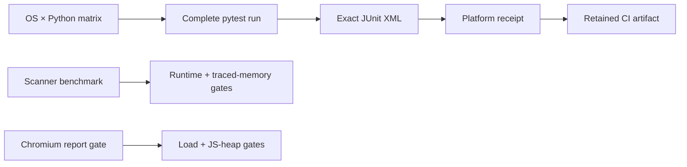

# Platform support and qualification evidence

PySFMEA supports CPython 3.11-3.14 on the current GitHub-hosted Ubuntu, Windows, and macOS
runners. Support means the complete automated suite passed for that exact runner image and Python
version; it does not qualify a customer deployment, older operating-system release, alternative
interpreter, network filesystem, container runtime, or security policy.

| Operating-system family | Python 3.11 | 3.12 | 3.13 | 3.14 | Evidence |
|---|---:|---:|---:|---:|---|
| Ubuntu (`ubuntu-latest`) | CI | CI | CI | CI | JUnit plus `pysfmea-platform-qualification-1` receipt |
| Windows (`windows-latest`) | CI | CI | CI | CI | JUnit plus `pysfmea-platform-qualification-1` receipt |
| macOS (`macos-latest`) | CI | CI | CI | CI | JUnit plus `pysfmea-platform-qualification-1` receipt |

Each matrix run uploads its exact JUnit XML and a content-addressed receipt containing the OS,
machine architecture, Python implementation/version, test/failure/error/skip counts, and JUnit
SHA-256. Skips stay visible. A skipped platform-specific test requires a passing receipt from a
compatible runner before that behavior is claimed.

The separate performance job publishes scanner phase timing and peak traced-Python-allocation
evidence with enforced budgets. The browser-report job publishes load, navigation, responsive,
accessibility-smoke, console, and per-view JavaScript heap evidence with enforced report-size,
load-time, and heap budgets.

Release reviewers should download and retain the matrix, performance, and browser artifacts for
the release commit. GitHub artifact retention is not permanent archival; organizations needing a
longer evidence lifetime must copy the receipts into their governed evidence store.
