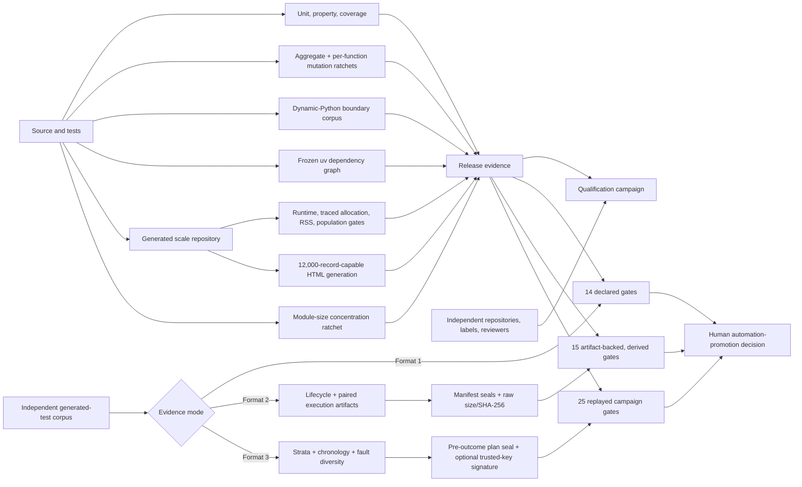

# Product confidence gates

PySFMEA separates product-controlled regression gates from evidence that only an independent
campaign can supply. A green CI run means the checked contracts did not regress; it is not a
tool-qualification, certification, or real-world completeness claim.



## Enforced controls

| Control | What fails CI | Important boundary |
|---|---|---|
| Focused mutation quality | Fewer than 1,464 selected mutants, aggregate score below 0.697404, more than 443 survivors, any invalid/skipped result, or any of eight independently partitioned function groups crossing its exact population, score, or survivor limit | The 443 measured survivors remain explicit test-oracle debt and the eight selected functions are not whole-product mutation coverage. Per-function groups prevent a strong function from masking regression in a weak one. The run and every test are time-bounded. |
| Scale performance | Median/traced-allocation/RSS budget failure or a run below 81 source files, 640 components, or 320 findings | The generated repository is deterministic load evidence, not representative accuracy evidence. RSS is a process high-water mark. |
| Scale reporting | Failure to retain the governed scale analysis, meet 1,400-component/11,000-failure-mode population floors, generate a self-contained report with a 12,000-record cap, load it in Chromium, exercise its navigation, or verify the browser evidence | The 180-module deterministic fixture exercises more than 11,000 actual failure-mode records inside the bounded analysis contract; the cap remains distinct from representative analyst usability. |
| Dynamic-Python boundary behavior | Failure to resolve the direct-call control, retain registry/reflection/runtime-import/monkey-patch call sites, or conservatively avoid a fabricated unique target | This fixture validates stated static-analysis boundaries; it is not evidence that every metaprogramming pattern is detected. |
| Dependency reproducibility | `uv lock --check` fails or any CI installation cannot be resolved through exact `uv.lock` constraints | The lock makes CI dependency selection reproducible. It does not make dependencies vulnerability-free; `pip-audit` remains a separate gate. |
| Runtime corroboration | Diagnostics score mapped component scope and observed static edges; partial imports produce an instrumentation-expansion action instead of 100% runtime credit | Runtime traces remain scenario- and instrumentation-bounded observations, not path completeness or causal proof. |
| Module concentration | Growth in a frozen large module, a new unlisted module above 3,000 lines, top-five concentration above 46%, or loss of the current module population | This prevents renewed concentration while subsystem extraction proceeds; it does not grade architecture quality. |
| LLM quality evidence | Current conversion grants independent-review credit only to format-3 corpora with an exact subject and bound review-governance declaration. A separate pre-outcome plan can be content sealed, reconciled to the completed corpus, and authenticated to a trusted Ed25519 key. | A signature authenticates exact bytes to a supplied key. PySFMEA cannot establish key ownership, authorization, timestamp authority, reviewer competence, independence, or representativeness. |
| Generated-test governance | One accepted obligation, exact source/contract binding, secret screening, explicit source egress, closed one-test allowlist, at most three attempts, named atomic publication review, exact LLM-origin registration, restricted execution, observed stimulus, complete criteria, and independent evidence review | Static validation cannot establish the semantic strength of an oracle. Provider qualification and each test's as-run evidence remain separate mandatory gates. |
| Generated-test model qualification | Exact provider/model/prompt, independent label/review identities, balanced expected and actual proposal/refusal populations, decision accuracy, valid proposal and exact target binding, restricted execution, observed stimulus, complete criteria, seeded-fault detection, reviewer acceptance, zero-or-bounded unsafe-change attempts, and content-sealed exact-corpus replay. Format 2 derives claims from digest-bound lifecycle artifacts and adds an artifact-evidence gate. Format 3 retains those checks and gates pre-outcome selection, repository/framework/domain populations and floors, decision balance, concentration, and bound fault-category diversity for 25 total gates. | Passing applies only to the retained sample and declared policy; exact bytes and declared strata do not authenticate actors, prove fault adequacy or representativeness, and this is not general model, tool, safety, or certification approval. |
| New assurance-control coverage | Branch-aware coverage below 95% for the extracted schema builders, 85% for runtime instrumentation, or 75% for evidence signing or campaign-plan semantics | These are non-regression floors for executable control paths, not proof that every misuse, key-management failure, or instrumentation environment is represented. |
| Qualification readiness | Missing artifacts, placeholder governance, inadequate repository/framework/domain populations, non-independent identities, or a future approval date | A passing preflight means the campaign can execute. Only an external authority can approve qualification. |

## Local commands

```powershell
python scripts/check_module_size_ratchets.py
uv lock --check
python scripts/generate_scale_corpus.py .tmp-scale --modules 80 --functions-per-module 8
python scripts/benchmark_scan.py .tmp-scale --repeats 2 --reuse-facts `
  --max-median-seconds 60 --max-peak-bytes 536870912 --max-rss-bytes 1073741824 `
  --min-source-files 81 --min-components 640 --min-candidates 320 `
  --analysis-output scale-analysis.json.gz -o scale-performance.json
sfmea report scale-analysis.json.gz --max-records 12000 -o scale-report.html
python scripts/report_browser_gate.py scale-report.html `
  --analysis scale-analysis.json.gz --max-bytes 104857600 `
  --min-components 1400 --min-failure-modes 11000 `
  --max-load-seconds 20 --max-js-heap-bytes 536870912 `
  -o scale-browser-quality.json
python scripts/qualification_readiness.py qualification-campaign.json --require-ready
```

Mutmut 3 writes native metadata under `mutants/`. After the focused run, enforce the checked-in
baseline and retain the JSON result:

```powershell
python scripts/check_mutation_ratchet.py mutants `
  --policy quality/mutation-ratchet.json --runner-exit-code 0 `
  -o mutation-quality.json
```

The retained `benchmarks/dynamic_python_corpus` fixture tests conservative behavior at selected
reflection and runtime-dispatch boundaries. The five-repository qualification manifest is a
campaign-shaped template only; its placeholder identities and missing artifacts intentionally fail
readiness until a real campaign supplies them.

Lower mutation survivor and module-size ceilings as tests and subsystem extractions land. Never
raise a ceiling merely to make a regression pass; document and independently review any deliberate
baseline change.
