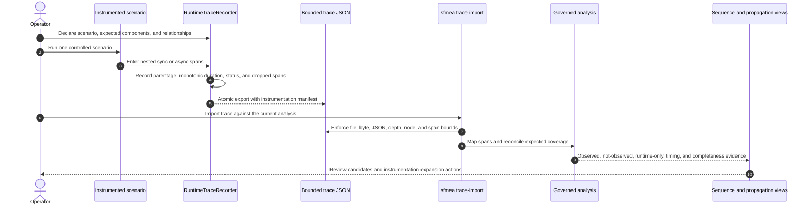

# Runtime evidence workflow

PySFMEA can compare conservative static call relationships with observed Python execution. Use
runtime evidence to prioritize review and expose instrumentation gaps; do not treat a trace as proof
that a failure propagated, a path is complete, or a timing requirement is satisfied.

## Capture-to-review flow



The recorder is opt-in application instrumentation. It does not monkey-patch the target, launch the
repository, upload traces, or mutate application control flow. Exceptions are recorded as errors
and re-raised.

## Instrument a controlled scenario

```python
import asyncio

from pysfmea.runtime_instrumentation import RuntimeTraceRecorder

trace = RuntimeTraceRecorder(
    scenario_id="checkout-timeout",
    producer="pytest integration suite",
    expected_components=["checkout", "charge"],
    expected_relationships=[("checkout", "charge")],
    sampling_policy="always_on",
)


@trace.trace("charge")
async def charge() -> None:
    ...


async def scenario() -> None:
    async with trace.async_span("checkout", callsite_line=42):
        await charge()


asyncio.run(scenario())

trace.export(".artifacts/runtime/checkout-timeout.json")
```

Context managers are useful at explicit integration boundaries; decorators are convenient for
repeatedly exercised callables. Nesting determines parent-child relationships. Supply
`callsite_line` on a child invocation boundary when a runtime-only relation should be correlated to
an unresolved static call site.

The manifest records:

- scenario and producer identities;
- sampling policy and clock domain;
- expected components and source-to-target relationships;
- captured and dropped-span accounting; and
- the producer's `declared_complete` value.

`declared_complete=True` is a claim about the supplied scenario, not independently established
coverage. Use `False` when collection ended early or the expected scope was not attempted.

## Import and inspect

```powershell
$analysis = '.artifacts/sfmea-analysis.json'
$trace = '.artifacts/runtime/checkout-timeout.json'

sfmea trace-import $analysis $trace --label 'checkout timeout integration test'
sfmea sequence $analysis --entrypoint 'src/checkout.py:checkout' `
  -o '.artifacts/checkout-sequence.mmd'
sfmea diagram $analysis --type failure_propagation `
  -o '.artifacts/checkout-propagation.json'
sfmea report $analysis -o '.artifacts/sfmea-report.html'
```

`trace-import` updates the governed analysis in place only after the complete import validates. Keep
the original trace beside the analysis and record the scenario configuration, repository revision,
test command, and execution environment in the external evidence record.

## Interpret reconciliation states

| State | Meaning | Required review |
|---|---|---|
| `runtime_corroborated` | A mapped parent-child span agrees with a static relationship. | Confirm the scenario and mapping are relevant; agreement is not failure causality. |
| `not_observed` | A static relationship was absent from this trace. | Check sampling and exercised scope before treating it as a coverage gap. |
| `statically_predicted` | The sequence view contains only static evidence for the relationship. | Add a targeted scenario if runtime confirmation matters. |
| `runtime_only` | A mapped observed relationship has no resolved static edge. | Review dynamic dispatch, dependency injection, monkey-patching, or unresolved call-site evidence. |
| `unmapped` | A span could not be assigned unambiguously to a component. | Add `sfmea.component`, code-file/function attributes, or a more specific span name. |

Timing uses a process-monotonic clock and supports ordering and duration comparison within the
captured process. It does not establish cross-host clock alignment, deadline compliance,
schedulability, or production latency. Circuit-breaker and fallback nodes remain uncredited until
controlled fault evidence demonstrates the reviewed containment behavior.

## Bounds and operating checklist

- [ ] Use one stable scenario ID per controlled stimulus and environment.
- [ ] Declare the components and relationships that the scenario is intended to cover.
- [ ] Keep instrumentation component names aligned with scanner component identities.
- [ ] Review dropped spans and incomplete declarations before interpreting absence.
- [ ] Retain the exact trace bytes and import audit event.
- [ ] Exercise nominal, off-nominal, timeout, retry, recovery, and breaker-transition scenarios as
      applicable.
- [ ] Re-run after source, configuration, topology, timing, or instrumentation changes.
- [ ] Require independent evidence review when the assurance policy calls for it.

Import accepts a regular non-symbolic-link JSON file up to 100 MB, 100 levels, 2,000,000 nodes, and
50,000 spans. These are safety bounds, not recommended target sizes. Split unrelated scenarios so
their stimulus, expected scope, timing, and completeness remain interpretable.
