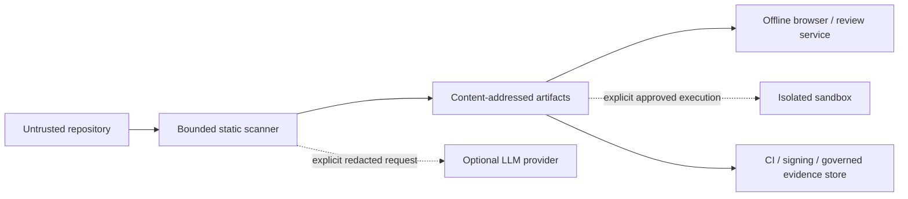

# Service threat model

The maintained source of truth is the versioned `pysfmea-service-threat-model-1` model in
`pysfmea.security`. Export the complete threat and residual-risk registers without scanning or
executing a repository:

```powershell
sfmea threat-model --output .artifacts/service-threat-model.json
sfmea threat-model --format markdown --output .artifacts/service-threat-model.md
```

The scope covers the static scanner, repository and publication filesystems, offline artifacts,
optional browser/review service, optional model-provider boundary, optional execution sandbox,
CI, and signing environment. It inventories source, findings/decisions, guidance/evidence,
credentials/provider data, and signed review artifacts as protected assets.



The register covers evidence substitution, traversal/publication tampering, unintended code
execution, parser resource exhaustion, prompt injection/exfiltration, unauthorized review or risk
decisions, artifact tampering, unsafe sandbox execution, exposed review services, and scale denial
of service. Every threat has mapped controls, verification expectations, and an explicit
mitigated-with-residual-risk state.

Residual risks have stable IDs, named operational owners, treatments, review triggers, and the
organizational authority required to accept them. Important remaining boundaries include native
parser/dependency vulnerabilities, imperfect redaction, networked service/sandbox attack surface,
and the inability of local names or unsigned artifacts to establish enterprise identity and
non-repudiation.

This artifact is not a penetration test, formal proof, deployment authorization, identity-provider
integration, or automatic risk acceptance. Review it at least annually and whenever a parser,
dependency, provider, data classification, sandbox, non-loopback deployment, signing, or identity
policy changes.
