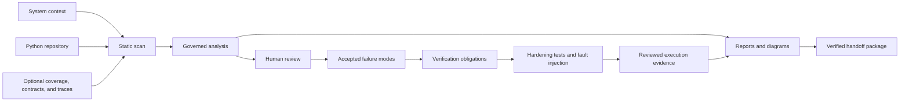
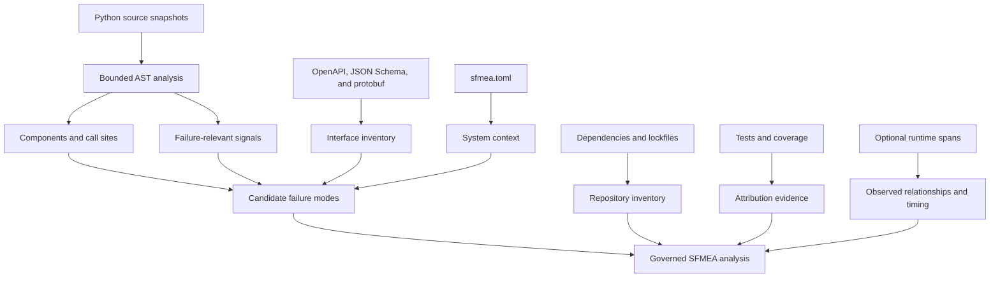
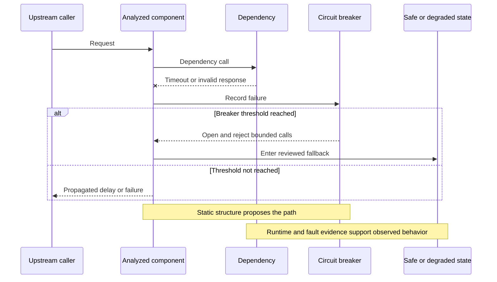
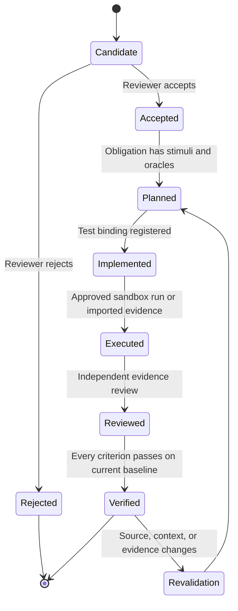
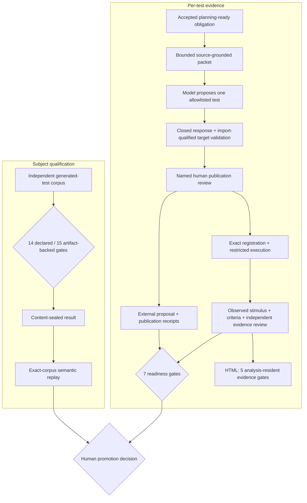
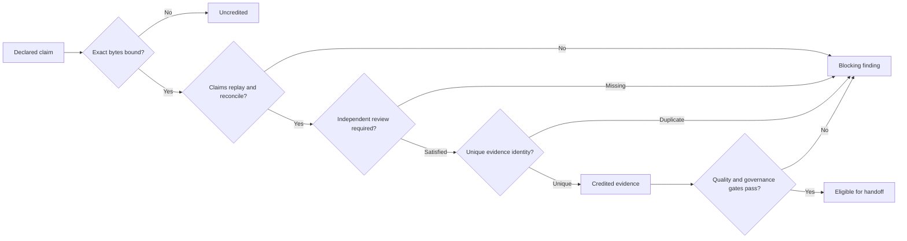
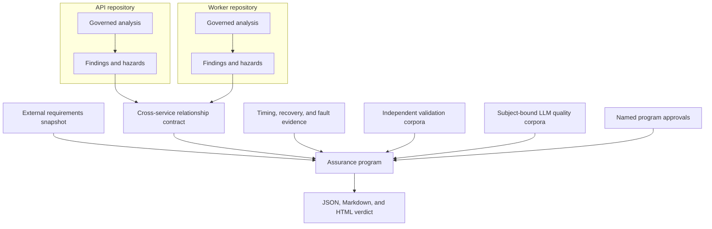

# Visual guide

This guide shows how PySFMEA turns static repository evidence into a reviewed, testable assurance
record. Use it for orientation; use the [operator workflow](WORKFLOW.md) for exact commands and the
[methodology](METHODOLOGY.md) for claim boundaries.

## End-to-end workflow



The governing rules are simple:

- `sfmea-analysis.json` is the source of truth.
- Reports, diagrams, work queues, and packages are derived views.
- Scanner results and LLM suggestions are candidates until a named reviewer decides.
- Passing tests are evidence, not automatic risk acceptance.
- Every integrity or completeness limitation remains visible.

## What the scanner discovers



Static analysis identifies evidence and prompts. It cannot determine the credible end effect,
severity, control effectiveness, or acceptability of residual risk without engineering review.

## Failure cascade and containment



The propagation view keeps four meanings separate:

| Visual evidence | Meaning | It does not prove |
|---|---|---|
| Static caller edge | A bounded syntactic exposure path exists. | Runtime reachability or causality. |
| Runtime-corroborated edge | The relationship was observed in an imported scenario. | That the failure effect propagated. |
| `not_observed` edge | The static relation was absent from the supplied trace. | Unreachability. |
| Containment boundary | A breaker or fallback candidate was detected. | Effective containment without reviewed fault evidence. |

## Finding-to-test lifecycle



An obligation should answer all of these questions:

- What failure is injected or stimulated?
- Under which mode, state, timing, and resource conditions?
- What local, system, safe-state, and recovery behavior is expected?
- Which oracle decides pass or fail?
- Which artifacts prove the exact test and execution?
- Who independently reviewed the evidence?

## Governed LLM-generated test path



The lanes are deliberately independent. A qualified provider/model/prompt does not make one test
ready, and one ready test does not qualify the model generally. The HTML report projects only the
five gates available in the governed analysis—registration, passing restricted execution,
observed stimulus, complete criteria, and independent evidence review. The exact proposal and
publication receipt remain separately verified artifacts, so seven-gate readiness must be checked
with `sfmea assurance-test-readiness`. Model qualification uses
`sfmea assurance-test-quality-evaluate` and `sfmea assurance-test-quality-verify`.

## Evidence trust ladder



For validation and LLM evidence, the program reports:

- declared records;
- uniquely credited records;
- duplicate corpus declarations;
- count-backed and artifact-verified records;
- macro and population-weighted micro metrics;
- subject-bound LLM evaluations and claim-weighted unsupported-claim rate.

A copied validation corpus or semantically repackaged LLM corpus cannot increase repository
coverage, cases, samples, claims, or quality metrics. LLM identity ignores descriptive metadata,
JSON formatting, and sample order while retaining corpus format, subject, IDs, and decisions.

## Multi-repository assurance



The program binds analyses; it does not merge them. Repository-qualified IDs preserve ownership,
and explicit relationship contracts carry deadline, timeout, retry, ordering, clock, and
circuit-breaker expectations.

## Output map

| Need | Best output | Command | Primary reviewer |
|---|---|---|---|
| Navigate the complete analysis | Self-contained HTML | `sfmea report` | Cross-functional review team |
| Exchange diagram data | Canonical diagram JSON | `sfmea diagram` | Architecture and tooling teams |
| Triage incomplete work | Workflow status and queue | `sfmea status`, `sfmea queue` | Analysis owner |
| Plan hardening tests | Assurance register/work queue | `sfmea assurance` | Verification team |
| Inspect generated-test evidence | HTML LLM-generated test governance card plus external proposal/receipt | `sfmea report`, `sfmea assurance-test-readiness` | Verification and independent evidence reviewers |
| Qualify generated-test automation | Content-sealed generated-test quality result bound to its exact corpus | `sfmea assurance-test-quality-evaluate`, `sfmea assurance-test-quality-verify` | Independent model-evaluation authority |
| Review source coverage | Inventory and coverage views | `sfmea inventory`, `sfmea coverage` | Tool and software assurance |
| Audit NASA/FAA relationships | Citation trace | `sfmea citations` | Safety and compliance reviewers |
| Transfer a frozen review set | Verified ZIP package | `sfmea package`, `sfmea verify-package` | Independent recipient |
| Review system-level evidence | Program HTML/JSON/Markdown plus exact report receipt | `sfmea program-verify`, `sfmea program-report-verify` | System assurance authority |

## Diagram portfolio

| Diagram | Question answered | Important qualification |
|---|---|---|
| Architecture | Which components depend on which components? | Bounded static structure. |
| Interface flow | Where are internal, external, and unresolved calls? | Receiver resolution is confidence-labeled. |
| Data flow | Which bounded value/alias relationships cross components? | Static flow is not runtime information-flow proof. |
| Sequence | In what lexical/evaluation order do calls occur? | Not path-sensitive execution proof. |
| Failure propagation | Where could an effect be exposed upstream? | Exposure is not causal sufficiency. |
| Circuit breaker | Which state roles and transitions were detected? | Conceptual states and review gaps remain explicit. |
| Control coverage | Which findings have prevention, detection, and evidence? | Presence does not establish effectiveness. |
| Traceability | How do requirements, hazards, findings, and components connect? | A relationship is not verification evidence. |
| Guidance traceability | Which guidance locators and mappings support findings? | A citation is rationale, not compliance approval. |
| Assurance traceability | How do findings connect to obligations, tests, executions, and evidence? | Registration or execution alone is not readiness. |
| SFTA | How are reviewed top events, gates, and basic events structured? | Generated structure is not quantitative risk proof. |
| Evidence fabric | Which cross-domain records and discrepancies connect? | Correlation and lineage do not establish causality or authority. |

Generate and verify the complete portfolio:

```powershell
sfmea diagram sfmea-analysis.json -o diagrams.json
sfmea diagram-verify diagrams.json --analysis sfmea-analysis.json
sfmea report sfmea-analysis.json -o sfmea-report.html --json
sfmea report-verify sfmea-report.html --analysis sfmea-analysis.json
```

## Review order

1. Confirm system context and repository accounting.
2. Review critical components, interfaces, and unresolved calls.
3. Confirm failure modes, causes, and all three effect levels.
4. Inspect propagation, sequence, timing, and containment assumptions.
5. Validate guidance applicability and citation relationship strength.
6. Accept or reject candidates; assign owners and actions.
7. If generated-test automation is used, qualify the exact provider/model/prompt independently and
   retain the replayable result.
8. Implement obligations and collect controlled evidence; apply every per-test readiness gate.
9. Reconcile all blockers, verify outputs, and package the exact analysis state.

## Authority boundary

PySFMEA can verify structure, provenance, content binding, metric reconciliation, and configured
workflow gates. It cannot provide:

- system safety judgment or risk acceptance;
- reviewer identity authentication or authorization;
- proof of causal completeness or schedulability;
- proof that a corpus is representative;
- regulatory approval, certification, or tool qualification.
