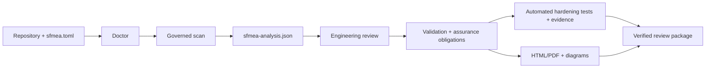

# Operator workflow

This guide is the shortest repeatable path from a Python repository to a reviewed,
evidence-backed SFMEA handoff. The governed analysis JSON is the source of truth. HTML, diagrams,
coverage views, assurance queues, and review packages are projections of that state rather than
independent analyses.



## 1. Create an isolated artifact directory

Keep generated evidence out of source directories and retain each run separately. From the target
repository in PowerShell:

```powershell
$run = Get-Date -Format "yyyyMMdd-HHmmss"
$artifacts = Join-Path (Get-Location) ".artifacts\$run"
New-Item -ItemType Directory -Path $artifacts | Out-Null
```

Do not commit generated analyses or assurance evidence unless the repository has an explicit
policy for doing so. Analyses can contain machine-local paths and engineering review content.

## 2. Define the system before scanning

Create the configuration once, replace every generated example, and run the read-only preflight:

```powershell
sfmea init .
sfmea doctor .
sfmea doctor . --json
```

At minimum, review the mission, system boundary, operating modes and states, hazards, critical
functions, safe/degraded behavior, humans, timing/resource constraints, assumptions, exclusions,
and rating policy in `sfmea.toml`. `doctor` deliberately rejects an untouched template. A scan can
still be useful with incomplete context, but the missing context remains an explicit limitation
and can block a governed handoff.

## 3. Capture optional test coverage and scan

Coverage is useful attribution evidence, but it is not proof of test adequacy or control
effectiveness.

```powershell
coverage run -m pytest
coverage json -o (Join-Path $artifacts "coverage.json")

sfmea scan . `
  --coverage-json (Join-Path $artifacts "coverage.json") `
  -o (Join-Path $artifacts "sfmea-analysis.json")
```

Without coverage:

```powershell
sfmea scan . -o (Join-Path $artifacts "sfmea-analysis.json")
```

Scanning parses repository evidence without importing or executing repository code. Treat
`sfmea-analysis.json` as governed state: preserve it, review changes to it, and pass the same file
to every downstream command.

## 4. Triage and perform engineering review

Start with the workflow cockpit and concise projections:

```powershell
$analysis = Join-Path $artifacts "sfmea-analysis.json"

sfmea status . --analysis $analysis
sfmea summary $analysis
sfmea validate $analysis
sfmea queue $analysis --limit 25
sfmea review $analysis
```

The local reviewer is the primary place to confirm or revise functions, failure modes, causes,
local/next-higher/end effects, controls, ratings, dispositions, owners, actions, and evidence.
Scanner findings and model suggestions are candidates until a qualified reviewer records a
decision. Use `sfmea validate --strict` and `sfmea status --require-handoff-ready` as automation
gates only when the project intends to enforce the complete workflow.

After a rescan, review changed functions and revalidation flags before relying on previous
decisions. Stable IDs preserve applicable reviewer work and keep removed-source history visible.

## 5. Generate the review views

Create human and machine-readable views from the same analysis:

```powershell
sfmea inventory $analysis -o (Join-Path $artifacts "repository-inventory.md")
sfmea coverage $analysis --format markdown -o (Join-Path $artifacts "sfmea-coverage.md")
sfmea coverage $analysis --format json -o (Join-Path $artifacts "sfmea-coverage.json")
sfmea citations $analysis --format json -o (Join-Path $artifacts "guidance-citations.json")
sfmea diagram $analysis -o (Join-Path $artifacts "diagrams.json")
sfmea report $analysis -o (Join-Path $artifacts "sfmea-report.html") --json
sfmea report-verify (Join-Path $artifacts "sfmea-report.html") --analysis $analysis
```

The self-contained HTML report is the best navigation surface for most reviewers. It contains
searchable findings, evidence, repository accounting, assurance obligations, architecture,
interfaces, propagation, sequences, traceability, circuit-breaker models, and stable record links.
The canonical diagram bundle is renderer-neutral JSON for other tools; the report renders the same
general model without a hosted service.

### Repository accounting states

Inventory, coverage, summary, and HTML outputs use the same record-derived projection:

| State | Meaning | Operator action |
|---|---|---|
| `reconciled` | Stored totals agree with the complete bounded entry and region records. | Continue review. |
| `recomputed` | Stored totals were stale or inconsistent; safe counts were recalculated from records. | Use the view for diagnosis, then rescan before handoff. |
| `unavailable` | Complete records were unavailable, so totals would be misleading. | Restore evidence or perform a current scan. |

Semantic artifact coverage describes how much of the bounded repository inventory received a
meaningful accounting status. It is not statement coverage, behavioral coverage, fault-injection
coverage, or evidence that a safety control works.

## 6. Turn accepted findings into hardening tests

Export the verification-obligation register, review its planning decisions, and generate a
deliberately failing pytest scaffold for accepted pending obligations:

```powershell
sfmea assurance $analysis --format markdown -o (Join-Path $artifacts "assurance-register.md")
sfmea assurance $analysis --format work-json -o (Join-Path $artifacts "assurance-work.json")
sfmea assurance-work-verify (Join-Path $artifacts "assurance-work.json") --analysis $analysis

$tests = Join-Path $artifacts "assurance-tests"
sfmea assurance-scaffold $analysis -o $tests --limit 25
sfmea assurance-scaffold-verify $analysis $tests
```

Each obligation carries stimuli, operating context, expected safe/degraded/recovery behavior,
oracles, acceptance criteria, and required evidence. Replace the generated failing bodies with
meaningful repository-specific tests. A scaffold name, textual test reference, or passing status
alone does not satisfy an obligation. Record implemented test bindings and independently review
as-run evidence where the assurance policy requires it.

Use guarded refresh only for an intact scaffold whose generated starting files remain untouched:

```powershell
sfmea assurance-scaffold-refresh $analysis $tests
```

If implementation work exists, create a new queue or reconcile it manually; the guarded command
will not overwrite that work.

## 7. Build and verify the handoff package

Create a portable checksum-manifested ZIP only after the analysis, reports, and assurance state
are current:

```powershell
$package = Join-Path $artifacts "sfmea-review-package.zip"
sfmea package $analysis --portable -o $package --json
sfmea verify-package $package
sfmea verify-package $package --json
sfmea status . --analysis $analysis --require-handoff-ready
```

Current packages include the governed analysis, human review views, diagram and traceability
projections, assurance registers and work queues, provenance, verification results, and the public
schemas needed for offline validation. Package integrity proves that checked bytes have not
changed; it does not prove authorship, approval, risk acceptance, or engineering correctness.
Use optional detached signing when the handoff also requires authenticity.

## 8. Federate multiple repositories when the system crosses service boundaries

Keep each repository analysis independently governed, then bind them into a separate assurance
program. The initializer captures the exact baseline and complete governed-analysis digest for
every input:

```powershell
$program = Join-Path $artifacts "system-assurance-program.json"
sfmea program-init `
  --analysis api=C:\path\to\api\.artifacts\sfmea-analysis.json `
  --analysis worker=C:\path\to\worker\.artifacts\sfmea-analysis.json `
  -o $program
```

Add cross-repository component relationships, temporal and circuit-breaker contracts, externally
sourced requirements, content-addressed test evidence, independently produced and reviewed
validation cohorts, model-quality evaluations, and named approvals. Use
`REPOSITORY_ID:RECORD_ID` for finding and hazard references. The generated file is intentionally
not handoff-ready; its default quality policy exposes missing external validation and governance.

After intentional edits, refresh the program digest and generate both machine and human views:

```powershell
sfmea program-seal $program
sfmea program-verify $program
sfmea program-verify $program --format json -o (Join-Path $artifacts "program-verification.json")
sfmea program-verify $program --format markdown -o (Join-Path $artifacts "program-verification.md")
sfmea program-verify $program --format html -o (Join-Path $artifacts "program-report.html")
```

The verifier consumes the program and completed evidence artifacts through bounded regular-file,
non-link, identity-stable reads. Only digest-verified completed evidence can support timing or
resilience. Failed evidence blocks readiness; inconclusive and unrun records remain visible but
uncredited. It verifies analysis and artifact digests, relationship endpoints, qualified
requirement/finding/hazard references, deadlines and observed maxima, circuit-breaker opening and
recovery, cohort and LLM thresholds, distinct evaluation producer/reviewer identities, known
approval subjects, program-level required roles, and evidence-review independence. The HTML view
adds a bounded repository topology and searchable timing/resilience findings. It does not make an
enterprise identity claim: SSO, RBAC, certificate policy, record retention, and legally controlled
signatures remain external organizational controls.

## 9. Repeat after repository or context changes

Run `doctor`, scan back into the governed analysis path, review changed/revalidation records,
refresh derived views, execute applicable hardening tests, review new evidence, and publish a new
package. Never make an old report or package appear current by copying it or changing timestamps;
the verifiers bind artifacts to the exact governed analysis state.

## Evidence and automation boundaries

- Static caller paths describe potential exposure, not proven causal propagation.
- Runtime traces strengthen observed relationships but do not prove that a failure effect occurred.
- Circuit-breaker timing, state, isolation, fallback, and containment remain uncredited until
  controlled fault-injection and recovery evidence is reviewed.
- NASA, FAA, and organizational citations explain why a rule or obligation is relevant; they do
  not declare compliance or nonconformance automatically.
- LLM discovery and summaries are optional, provider-neutral suggestions grounded in supplied
  evidence. They cannot silently accept findings, change risk, or approve evidence.
- Repository truncation, opaque artifacts, unresolved context, and checks that did not run must
  remain visible through review and handoff.

For deeper behavior and claim boundaries, see [Methodology](METHODOLOGY.md),
[Canonical diagram model](DIAGRAMS.md), [Public schemas](SCHEMAS.md), and the
[NASA/FAA guidance coverage audit](GAP_AUDIT.md).
