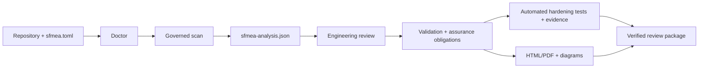
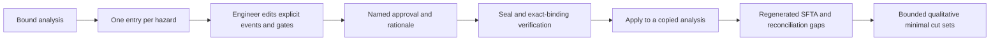
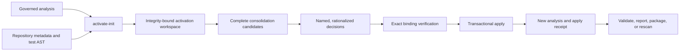

# Operator workflow

This guide is the shortest repeatable path from a Python repository to a reviewed,
evidence-backed SFMEA handoff. The governed analysis JSON is the source of truth. HTML, diagrams,
coverage views, assurance queues, and review packages are projections of that state rather than
independent analyses.

For a diagram-led overview of scanning, failure cascades, evidence credit, finding lifecycle, and
multi-repository assurance, see the [visual guide](VISUAL_GUIDE.md).
For saved report views, accessibility qualification, governed LLM synthesis, exact-commit PR
analysis, and process plugins, see [advanced review workflows](ADVANCED_REVIEW.md).



## 1. Create an isolated artifact directory

Keep generated evidence out of source directories and retain each run separately. From the target
repository in PowerShell:

```powershell
$run = Get-Date -Format "yyyyMMdd-HHmmss"
$artifacts = Join-Path (Get-Location) ".artifacts\$run"
New-Item -ItemType Directory -Path $artifacts | Out-Null
```

Do not commit generated analyses or assurance evidence unless the repository has an explicit
policy for doing so. Analyses can contain machine-local paths and engineering review content.
`sfmea status .` automatically selects the most recently modified regular analysis in a direct
timestamped run when no repository-root or direct `.artifacts` analysis exists. Its console output
discloses that selection; pass `--analysis $analysis` whenever you want to inspect a specific
retained run. This one-level convenience lookup never recursively searches the repository or
follows linked run directories. If its 1,000-candidate bound is reached, it labels the result as
a bounded selection rather than claiming it is the newest retained run; pass `--analysis` to make
the selection explicit.

The cockpit also auto-discovers conventional nearby report, PDF, and review-package names. When
your retention policy uses an intentional custom name, select it exactly instead of renaming it:

```powershell
sfmea status . --analysis $analysis `
  --report (Join-Path $artifacts 'report.html') `
  --pdf-report (Join-Path $artifacts 'review.pdf') `
  --package (Join-Path $artifacts 'handoff.zip')
```

Explicit artifact paths disable filename-pattern discovery for that artifact only. This makes the
reported integrity, binding, freshness, and generated refresh command refer to the chosen bytes.

## 2. Define the system before scanning

Create the configuration once, replace every generated example, and run the read-only preflight:

```powershell
sfmea init .
sfmea doctor .
sfmea doctor . --json
```

At minimum, review the mission, system boundary, operating modes and states, hazards, critical
functions, safe/degraded behavior, humans, timing/resource constraints, assumptions, exclusions,
and rating policy in `sfmea.toml`. `doctor` deliberately rejects an untouched template. A scan can
still be useful with incomplete context, but the missing context remains an explicit limitation
and can block a governed handoff.
The JSON response includes `suggested_actions` for missing or unconfigured coverage and
test evidence. A public scan without `sfmea.toml` is refused unless the operator explicitly
selects discovery-only mode with `--allow-ungoverned`.

## 3. Capture optional test coverage and scan

Coverage is useful attribution evidence, but it is not proof of test adequacy or control
effectiveness.

```powershell
coverage run -m pytest
coverage json -o (Join-Path $artifacts "coverage.json")

sfmea scan . `
  --coverage-json (Join-Path $artifacts "coverage.json") `
  --graphify `
  --review-depth focused `
  -o (Join-Path $artifacts "sfmea-analysis.json")
```

Without coverage:

```powershell
sfmea scan . -o (Join-Path $artifacts "sfmea-analysis.json")
```

Scanning parses repository evidence without importing or executing repository code. Treat
`sfmea-analysis.json` as governed state: preserve it, review changes to it, and pass the same file
to every downstream command.
CLI scans use compact JSON to reduce governed-artifact size; add `--pretty-analysis` only for
manual JSON inspection. Review depth changes the family-grouped human queue, not the complete
candidate register. Use `sfmea queue ... --all-records` when exhaustive item-by-item triage is
required.

The configured persistent fact cache makes unchanged Python parsing reusable across CLI
processes. It is content-addressed and performance-only; source, configuration, dependency,
contract, coverage, and repository snapshots remain authoritative. Use `--no-cache` when capturing
a cold performance baseline. Use `.json.gz` for the governed analysis when artifact transfer or
retention size matters; every downstream loader accepts the bounded deterministic gzip form.

For an immutable checkout, publish everything outside the repository and add `--read-only`:

```powershell
$repository = 'C:\path\to\python-repo'
$artifacts = 'C:\assurance-artifacts\python-repo\20260809-120000'
sfmea scan $repository --read-only -o (Join-Path $artifacts 'sfmea-analysis.json.gz')
```

Read-only mode rejects an output under `$repository`, disables a configured/default in-repository
fact cache, permits an explicitly external cache, and records the mutation policy in the analysis.

### Optional Graphify cross-check

`--graphify` adds an external, code-only Graphify AST pass before PySFMEA publishes the analysis.
The output is stored under the analysis artifact directory by default and is imported through a
strict bounded JSON boundary. PySFMEA reconciles only nodes that map to an existing component by
source path/line. Mapped `calls` edges that agree with the native AST graph are labeled
`corroborated`; mapped Graphify-only calls are retained as review leads. Neither is runtime
evidence, an automatically approved architecture relationship, nor a new failure mode. Use
`--graphify-json PATH` to consume a separately produced graph without invoking Graphify.

The default focused queue admits at most three ordinary families per component and 1,000 total
records per projection. Revalidation, manual, and hazard-linked records remain eligible despite
the per-component cap. Configure `review_queue_max_per_component` and
`review_queue_max_total`, or use `--all-records` for an uncapped exhaustive projection. Within the
configured priority floor, the CLI reserves bounded representation for each present priority band;
blocking validation errors, revalidation, manual decisions, and hazard links remain protected.

## 4. Triage and perform engineering review

Start with the workflow cockpit and concise projections:

```powershell
$analysis = Join-Path $artifacts "sfmea-analysis.json"

sfmea status . --analysis $analysis
sfmea summary $analysis
sfmea diagnostics $analysis
$diagnostics = Join-Path $artifacts "sfmea-diagnostics.json"
sfmea diagnostics $analysis --json | Out-File -Encoding utf8 $diagnostics
$enhancements = Join-Path $artifacts "enhancement-workbench.json"
sfmea enhance $analysis -o $enhancements
$scopePreview = Join-Path $artifacts "enhancement-scope-preview.json"
sfmea enhance-scope-preview $analysis . -o $scopePreview
$evidencePreflight = Join-Path $artifacts "evidence-preflight.json"
sfmea enhance-evidence-preflight $analysis . -o $evidencePreflight
$onboardingPlan = Join-Path $artifacts "evidence-onboarding-plan.json"
sfmea evidence-onboard $analysis . --receipt $onboardingPlan
$evidenceAnalysis = Join-Path $artifacts "sfmea-analysis-with-evidence.json"
sfmea evidence-onboard $analysis . `
  --coverage-json (Join-Path $artifacts "coverage.json") `
  --runtime-trace (Join-Path $artifacts "runtime-trace.json") `
  --apply -o $evidenceAnalysis `
  --receipt (Join-Path $artifacts "evidence-onboarding-receipt.json") `
  --work-queue (Join-Path $artifacts "assurance-work.json")
sfmea evidence-onboard-verify (Join-Path $artifacts "evidence-onboarding-receipt.json") `
  --analysis $evidenceAnalysis `
  -o (Join-Path $artifacts "evidence-onboarding-verification.json")
$enhancementVerification = Join-Path $artifacts "enhancement-workbench-verification.json"
sfmea enhance-verify $enhancements --analysis $analysis -o $enhancementVerification
sfmea activate-init $analysis . -o (Join-Path $artifacts "activation.json")
sfmea activate-verify (Join-Path $artifacts "activation.json") --analysis $analysis
sfmea sfta-authoring-init $analysis -o (Join-Path $artifacts "sfta-authoring-draft.json")
sfmea validate $analysis
sfmea queue $analysis --limit 25
sfmea review $analysis
```

Evidence onboarding is non-executing in both modes. The default plan performs full bounded import
validation on an isolated analysis and reports prospective changes. `--apply` is required to
publish an updated analysis. External CI evidence is selected with repeatable
`--execution-manifest OBLIGATION_ID=PATH` arguments and also requires `--initiated-by`; imported
artifacts remain uncredited until independent criterion-by-criterion evidence review.

Diagnostics are a prioritized improvement plan: P0 repairs provenance, missing governing context,
unmanageable warning repetition, or priority starvation; P1 closes test, runtime, mapping,
assurance-planning, cross-stack, or evidence-scope gaps; P2 improves guidance specificity and
failure-path tests. `validation.aggregates` retains counts and bounded samples while the governed
analysis/SFTA registers remain complete. Adapter-accounting errors should trigger a current rescan
before review.

For hazards that need explicit top-down logic, edit the generated SFTA draft, choose `replace`
only for completed definitions, and record an `approved` review with a named reviewer and
rationale. Then seal, verify, and apply it:

```powershell
$draft = Join-Path $artifacts "sfta-authoring-draft.json"
$sealed = Join-Path $artifacts "sfta-authoring.json"
$updated = Join-Path $artifacts "sfmea-analysis-with-sfta.json"
sfmea sfta-authoring-seal $draft --analysis $analysis -o $sealed
sfmea sfta-authoring-verify $sealed --analysis $analysis
sfmea sfta-authoring-apply $analysis $sealed -o $updated `
  --receipt (Join-Path $artifacts "sfta-authoring-receipt.json")
```



`retain` preserves an existing definition exactly; `defer` leaves the hazard undeveloped;
`replace` is the only action that changes the analysis. The applied review binds the exact tree
definition digest; only that exact approved Boolean structure is eligible for qualitative minimal
cut sets. A later edit invalidates eligibility. The workflow does not infer causal logic, calculate
probability, approve independence, or accept residual risk.

Turn approved guidance, architecture, and interface proposals into reusable scan inputs through a
separate configuration transaction:

```powershell
$configDraft = Join-Path $artifacts "configuration-authoring-draft.json"
$configSealed = Join-Path $artifacts "configuration-authoring.json"
$refinedConfig = Join-Path (Split-Path $config -Parent) "sfmea-refined.toml"
sfmea config-authoring-init $analysis --config $config -o $configDraft
sfmea config-authoring-seal $configDraft --analysis $analysis --config $config -o $configSealed
sfmea config-authoring-verify $configSealed --analysis $analysis --config $config
sfmea config-authoring-apply $analysis $configSealed --config $config -o $refinedConfig
sfmea scan . --config $refinedConfig -o (Join-Path $artifacts "sfmea-analysis-refined.json.gz")
```

The output is always a new sibling TOML file so existing comments and relative paths retain their
meaning and the governed source is not overwritten. Rescan and validate before relying on the new
relationships.

The rescan also refreshes the architecture triad. Review `deployment_topology` first for declared
infrastructure and unplaced components, then `shared_fate_analysis` for common-resource isolation
questions, and finally `architecture_hierarchy` for nested subsystem coverage and inherited trace.
The HTML Architecture page summarizes each model and opens its canonical offline diagram. Treat
component placements and shared-fate membership as review candidates; supplement them with
observed deployment evidence before making availability or independence claims.
The enhancement workbench then converts those diagnostics into bounded evidence-acquisition argv
recipes, root-cause clusters, representative-review aids, a prioritized verification portfolio,
mapping and interface disposition queues, static system-surface candidates, and qualification
evidence requirements. Its hardening registers account for the 76 real-repository and 82
post-hardening audit items plus the 102 real-run recommendations and the E001-E095 outcome
register. Format 7 adds governed finding consolidation; format 6 added evidence-backed product
maturity and prevents a planning projection from
being reported as an implemented analyzer. Format 5 added integrity
verification, separate freshness/completeness/
sufficiency health, review-only evidence-scope patches, bounded calibration campaigns, metric
provenance, report-scale planning, product attestations, and measurable acceptance targets.
It also emits assignable review batches, evidence-onboarding state, precision specialization,
architecture/interface activation, timing/resilience fault campaigns, guidance closure,
phase-level performance ratchets, delivery modes, and LLM/qualification governance.
Generate `--profile compact` or `--profile management` reports when a complete engineering record
projection would exceed the delivery budget; the governed JSON remains the complete source.
Null calibration rates mean no human sample exists; they are not zero or 100 percent. It is
planning output, not authorization to execute the repository or to
approve mappings, findings, evidence, waivers, risk, or compliance.

For product rule tuning, retain JSON results from `sfmea evaluate` before and after the proposed
change against one exact governed corpus, then run `sfmea evaluate-compare`. The comparison blocks
corpus drift, missing changed-rule metrics, precision regression, excessive finding recall
regression, and excessive detected-control recall regression. Its eligible verdict advances the
change to review only; a distinct release/qualification decision remains required.

For tool-level qualification evidence, retain the analysis, corpus, and complete evaluation JSON
for each preselected representative repository. List those files in a
`pysfmea-qualification-campaign-manifest-1` and run:

For every control-bearing corpus, declare an exhaustive `control_scope` that includes both
positive and deliberately selected negative components. Positive-only control cases can measure
recall but cannot substantiate false-positive-aware precision. Review the disclosed evaluated,
positive, and negative component counts before accepting the metric, and configure
`minimum_control_negative_components_per_repository` so positive-only cohorts fail eligibility.

```powershell
sfmea qualification-build qualification-campaign.json -o qualification-result.json
sfmea qualification-verify qualification-result.json `
  --manifest qualification-campaign.json -o qualification-verification.json
sfmea qualification-report qualification-result.json `
  --manifest qualification-campaign.json -o qualification-report.html
sfmea qualification-report-verify qualification-report.html `
  --result qualification-result.json -o qualification-report-verification.json
```

Review every repository/rule/framework/domain segment and each false or null gate. Use
`--require-eligible` in CI only after an independent authority approves the population,
thresholds, and governance process. Integrity-only verification proves transport consistency;
complete verification proves exact retained-input regeneration. Neither proves that the sample is
representative or grants qualification. Global finding metrics and the repository/framework/domain
minimums must all pass; repository populations with call/control labels are gated separately, and
duplicate analysis or corpus content cannot earn repeated credit.

To start a federated assurance program without manually transcribing cohort metrics:

```powershell
sfmea program-init --analysis service-a=service-a/analysis.json `
  --qualification-result qualification-result.json `
  --qualification-manifest qualification-campaign.json `
  -o assurance-program.json
```

Both qualification arguments are mandatory as a pair. Import requires complete campaign
reconciliation and independently governed per-repository corpora, then writes exact
program-relative evaluation references and count-backed cohort records. `program-verify` reopens
those evaluation files before any validation credit is calculated.

Use the HTML report for review meetings and handoff. It places blockers before passing and
not-applicable gates; exposes repository, rule, framework, and domain populations; and retains
artifact digests and authority limits. The embedded JSON remains complete while large rule tables
are rendered in bounded pages. Report publication rechecks campaign reconciliation against the
retained manifest and verifies the private stage before replacing the destination.

### Close the loop with an activation workspace



Use `activate-assign` to establish ownership and an optional due date, then `activate-decide` once
per exact queued subject. A cluster representative never disposes its
members. `activate-apply` defaults to a new `*-activated.json` analysis; use `--in-place` only when
the source is intentionally being advanced. Any source-analysis change invalidates the workspace,
so regenerate it instead of carrying decisions across an unverified baseline.
For a large team campaign, `activate-batch-export` creates a small public-schema-backed JSON
template. Fill its `assignments` and `decisions`, then use `activate-batch-import`. The import is
all-or-nothing, rejects duplicate or unknown subjects, validates dates and closed decisions, and
refuses a template bound to an earlier workspace revision.

Multi-member root-cause clusters are also projected as `consolidation` candidates only when the
entire membership fits the governed workspace. A named reviewer chooses `consolidate`,
`retain_separate`, or `needs_information`. `consolidate` creates one canonical review group and
annotates each member with its role, but preserves every individual finding, source location,
review disposition, citation, and evidence reference. Candidate tampering or analysis drift is
rejected by exact regeneration before application.

The focused queue groups candidates by component/failure class, adds path/failure-class clusters,
and round-robins components within each risk tier before repeating a component. This keeps a busy
module or module-initialization component from monopolizing a bounded review batch. Each queued
record includes the family, cluster, diversity round, and selection reason used to admit it.

The local reviewer is the primary place to confirm or revise functions, failure modes, causes,
local/next-higher/end effects, controls, ratings, dispositions, owners, actions, and evidence.
Scanner findings and model suggestions are candidates until a qualified reviewer records a
decision. Use `sfmea validate --strict` and `sfmea status --require-handoff-ready` as automation
gates only when the project intends to enforce the complete workflow.

Validation includes standalone run-manifest digest and cross-binding checks. A manifest whose hash
was recomputed after changing its timestamp, baseline, or resolved-input claims remains an error;
regenerate the analysis from the intended source and configuration instead of editing provenance.

After a rescan, review changed functions and revalidation flags before relying on previous
decisions. Stable IDs preserve applicable reviewer work and keep removed-source history visible.

## 5. Generate the review views

Create human and machine-readable views from the same analysis:

```powershell
sfmea inventory $analysis -o (Join-Path $artifacts "repository-inventory.md")
sfmea coverage $analysis --format markdown -o (Join-Path $artifacts "sfmea-coverage.md")
sfmea coverage $analysis --format json -o (Join-Path $artifacts "sfmea-coverage.json")
sfmea citations $analysis --format json -o (Join-Path $artifacts "guidance-citations.json")
sfmea diagram $analysis -o (Join-Path $artifacts "diagrams.json")
sfmea cross-reference $analysis -o (Join-Path $artifacts "cross-reference.json")
sfmea cross-reference-verify (Join-Path $artifacts "cross-reference.json") `
  --analysis $analysis --json
sfmea report $analysis -o (Join-Path $artifacts "sfmea-report.html") `
  --max-output-bytes 52428800 --json
sfmea report-verify (Join-Path $artifacts "sfmea-report.html") --analysis $analysis
```

The self-contained HTML report is the best navigation surface for most reviewers. It contains
searchable findings, evidence, repository accounting, assurance obligations, architecture,
interfaces, propagation, sequences, traceability, circuit-breaker models, and stable record links.
The canonical diagram bundle is renderer-neutral JSON for other tools; the report renders the same
general model without a hosted service.
The cross-reference fabric joins native AST, optional Graphify, runtime observations, findings,
guidance, SFTA, assurance obligations, executions, and evidence into typed relations. Its verifier
checks internal consistency and exact regeneration; agreement between channels remains review
leverage rather than proof of completeness or compliance.
Finding chains also reference bounded upstream caller paths and the scanner's timing-budget,
retry-amplification, transaction/effect/resource, and circuit-breaker models. These links make the
existing cascade and resilience analyses navigable together without upgrading static candidates
to observed causality, latency, or control effectiveness.
Every finding chain includes a verification-readiness profile. The profile connects discovered
test references, imported coverage, registered implementations, executions, independent reviews,
evidence artifacts, and owner/reviewer assignments to the exact finding and obligation. Its
lifecycle state and next action come from the accepted-finding assurance work queue; unreviewed,
historical, revalidation-required, and out-of-scope findings remain explicit. Treat candidate
tests and coverage as planning signals only, not verification evidence.
The same chain carries a review-governance profile derived from quality validation, source-change
classification, revalidation, disposition, and assurance state. Finding-local blocking diagnostics
take precedence over ordinary review and assurance actions; global analysis diagnostics stay in a
separate analysis-scope projection. Use the profile's next action for workflow routing, while
retaining the original diagnostic rule and message for review. A passing quality gate means the
configured workflow is complete and consistent, not that the code is safe or correct.
The fabric also binds the run manifest, adapter ledger, repository inventory, resolved project
configuration, dependency and contract declarations, and exact component/finding sources. Review
`unlinked_adapter_contributions`, `opaque_repository_artifacts`, and
`unaccounted_*_ids` before relying on coverage. A content digest proves identity of the inventoried
snapshot; it does not prove semantic coverage, dependency safety, or analyzer qualification.
Machine suggestions and generated summaries enter the same fabric without gaining engineering
authority. The projection links each claim to its component, allowlisted evidence, proposed
guidance citations, and any human-materialized unreviewed finding. It also imports the bounded
deterministic suggestion comparison as duplicate, contradiction, and divergence relationships.
Review `proposed_machine_suggestions`, `machine_claim_*`, stale-summary, and unresolved-reference
leads before using generated text; the verifier reconciles those records even without the source
analysis, while `--analysis` additionally requires exact regeneration.

`guidance_provenance` closes the gap between the citation export and the comprehensive fabric. It
links the recorded methodology to selected versioned documents, each document to its exact locator
records, and each locator to citing findings. Review `guidance_lineage_status` and
`unresolved_guidance_source_references` before relying on source traceability. A complete chain is
not a determination that the source applies or that a finding is noncompliant.

`analysis_projection_coverage` is the fabric's self-audit. It creates one digest-bound
`analysis_section` entity and one analysis-scope relationship for every top-level analysis field,
then reconciles the declared entity kinds and relationship channels for that output. Review these
states before treating the fabric as integrated:

- `semantically_projected`: at least one declared entity or relationship is present.
- `provenance_only`: the section is intentionally identity-bound rather than domain-modeled.
- `empty`: no projectable source records were present.
- `registered_without_projection`: candidate source records exist, but the declared semantic
  surface produced no material link; confirm intentional filtering or extend the model.
- `unmapped`: no declaration exists; this is a high-priority integration lead.

The declared coverage percentage excludes unknown outputs; the material coverage percentage also
excludes registered outputs that produced no usable link. The separate record coverage percentage
uses every declared `record_path`, removes explicitly structural shells, and requires each remaining
record to have at least one identity-correlated entity or relationship witness. Each record profile
retains its JSON locator, canonical digest, bounded identity-token set, complete target-set digests,
samples, and navigable witness links. Review `unresolved_analysis_record_projections` whenever the
percentage is below 100%; bound omissions count as unresolved rather than disappearing.

Standalone verification recomputes target sets and witness shapes from the fabric. Use exact
`cross-reference-verify --analysis` regeneration to additionally bind section and record digests,
locators, and identity tokens back to the governed analysis. A witness proves deterministic identity
correlation only; it does not prove that the source record is correct, complete, reachable at runtime,
or adequate for compliance or risk acceptance.

The same fabric exposes two previously separate review surfaces:

- `system_context_provenance` models the resolved context, its fields and values, and each explicit
  finding mode/state/safe-state/degraded/recovery claim. Only declared field mappings and exact
  case-folded, whitespace-normalized values are joined. An unmatched claim is a reconciliation
  lead, not proof that the finding or configuration is wrong.
- `lifecycle_provenance` models ordered analysis history and per-finding review history as
  digest-bound events. Exact typed identifiers link events to current findings, obligations,
  executions, machine suggestions/summaries, or adapter runs; unresolved references remain review
  leads. Reviewer names are recorded labels, not authenticated identity or independence proof.

The HTML chain cards and canonical cross-reference diagram expose both projections. Use the JSON
fabric and its standalone verifier when complete identities and relationship sets are required.
Each scanned component also has a verified semantic-exposure profile that joins exact records from
data and alias flow, concurrency, exception propagation, state machines, authorization scope,
contracts, deployment topology, shared fate, and architecture hierarchy. Finding chains surface
compound intersections such as authorization-plus-data-flow and concurrency-plus-state. Use these
as bounded review and test-selection leads; co-location does not prove runtime reachability,
causality, vulnerability, or failure.
Use `sfmea diagram $analysis --kind data_flow` for the bounded interprocedural view. Its edges map
caller expressions to callee parameters and callee returns to caller sinks; ambiguity, omissions,
and the path-insensitive/static authority boundary remain embedded in the model.
The analysis also carries `concurrency_model`, a machine-readable inventory of task spawn,
join/wait, cancellation/timeout, synchronization, and awaited operations with conservative lexical
relations. Use these records to choose runtime schedules and stress tests; they do not establish
task identity, scheduler order, or race/deadlock freedom.
`exception_propagation` similarly records explicit raise, lexical handler, and terminal-finalizer
facts, then projects
named exception types through resolved internal calls. Selection follows Python's nearest-`try`,
first-compatible-handler order. Match provenance distinguishes exact types, built-in subclasses,
statically declared project subclasses, the `BaseException` catch-all, and indeterminate dynamic
types. Handler outcomes preserve sequential reachability and merge bounded `if`, `match`, loop,
`with`, and nested-`try` alternatives. Their certainty is `uniform`, `conditional`, or
`indeterminate`; statements after a direct terminal exit are excluded. Dispositions distinguish
`may_propagate`, indeterminate matches, suppression, continuation, conditional/unconditional
control-flow exits, conditional/unconditional rethrow, explicit new raise, translation, mixed
handler outcomes, suppression by a
terminal `finally` control exit, and replacement by a terminal `finally` raise. The bounded
finalizer rule applies only when the last top-level statement is a bare/literal `return`, explicit
or bare `raise`, `break`, or `continue`, with no earlier explicit competing exit; outer terminal
finalizers take precedence because they execute last. Every
affected edge retains the finalizer ID, terminal kind, and replacement type; a bare terminal
`raise` is recorded as a rethrow rather than a replacement. Within a handler, both bare `raise` and
`raise <active catch binding>` propagate the original object; other explicit raises are separate
outgoing exceptions and do not falsely credit the original as propagating. Component and
finding projections retain exact edge IDs, type/disposition counts, and bounded exception-injection
test guidance. These records do not prove path feasibility; evaluated returns, conditional or
nested finalizer outcomes, dynamic aliases, `ExceptionGroup` splitting, callbacks, native behavior, and undeclared
third-party inheritance remain review boundaries.
`static_control_flow_model` explains paths excluded before calls, exceptions, sequences, and
failure-mode candidates are composed. Decisions cover safe literal truth/comparisons, boolean
short-circuiting, `while False`, conditional expressions, imported `TYPE_CHECKING` guards, empty
literal `for` loops, bounded literal/singleton/OR/sequence/mapping/capture `match` patterns and
static case guards, constant-true loop reachability, direct exits, statically selected terminal blocks,
impossible `try` `else` clauses, terminal `finally` blocks, and exhaustive `if/else`, `match`, or
`try` constructs whose alternatives all terminate. Function, class-construction, and module-initialization tails
use the same block traversal. Each record retains component, exact source coordinates, expression,
selected/pruned region, omitted statement/operand counts, basis, and authority. Dynamic and
unsupported predicates retain conservative alternatives. Predicate and iterator expressions are
always visited, so effects needed to evaluate them are not discarded. This is bounded static
pruning, not proof that a selected path runs, completes, or satisfies its contract.
`state_machine_model` projects assignments to conventional state/status/phase/mode variables into
stable state and guarded-transition records. Treat missing transitions and invariants as review
questions: the static projection does not prove reachability, liveness, or completeness.
`resilience_semantics` composes transaction, side-effect/idempotency, timing-budget, retry,
circuit-breaker, and resource-bound evidence using the same resolved component graph. Prioritize
`consistency_risks`, `unprotected_retry_side_effect`, `callee_budget_exceeds_caller`, retry paths
with high amplification or cycles, breaker `semantic_gaps`, and `unbounded_growth_candidates` when
designing assurance tests. These are review leads until exercised with representative runtime
evidence.
`authorization_scope_flow` overlays identity, tenant, role/permission, scope/claim, and credential
dimensions on exact interprocedural argument edges and lists observed decorator/call guards. Review
every reported risk against middleware, infrastructure, and runtime evidence; a recognized guard
is not proof that it dominates or correctly enforces every path.
`contract_semantics` is the cross-language review surface. Filter compatibility records for missing
routes, parameters, success responses, or error responses; review conflicting operation/type
digests; and inspect evolution records for required additions, removals, and response changes.
Declared version ordering is a deterministic comparison aid, not the project's compatibility
policy or proof that generated/runtime clients conform.

The coverage workspace keeps repository accounting, Python semantic coverage, web-boundary
coverage, and execution coverage visibly distinct. Its cross-stack section lists unmatched client
endpoint candidates first and exact Python-route matches second, with source path, normalized path,
method, and confidence. Router prefixes, proxies, generated clients, and runtime configuration
remain explicit limitations and require contract or runtime corroboration.

For release candidates, exercise every report view in a real headless browser and retain the
machine-readable receipt:

```powershell
pip install -e .[browser]
playwright install chromium
python scripts/report_browser_gate.py (Join-Path $artifacts "sfmea-report.html") `
  --analysis $analysis `
  -o (Join-Path $artifacts "report-browser-quality.json")
sfmea report-browser-verify (Join-Path $artifacts "report-browser-quality.json") `
  --report (Join-Path $artifacts "sfmea-report.html") `
  -o (Join-Path $artifacts "report-browser-quality-verification.json")
```

The supported defaults enforce 50 MiB report size, 10-second load time, and 256 MiB measured
Chromium JavaScript heap. They are product guardrails rather than universal acceptance criteria;
replace them with reviewed repository-specific `--max-*` budgets when available.
The standalone verifier checks the receipt's canonical content digest, exact report bytes, closed
quality checks, and size/load semantics. It returns success only when the receipt is both valid and
passing; a schema-valid failed gate remains preserved as trustworthy negative evidence.

Sequence views reconcile bounded static and imported runtime relations. Treat
`runtime_corroborated` as supporting execution evidence, `not_observed` as an instrumentation or
test-selection question rather than proof of unreachability, and `runtime_only` as a prompt to
review dynamic dispatch, mapping, and static bounds. Guidance governance metrics similarly
distinguish maintainer curation from independent project or regulatory approval.

### Repository accounting states

Inventory, coverage, summary, and HTML outputs use the same record-derived projection:

| State | Meaning | Operator action |
|---|---|---|
| `reconciled` | Stored totals agree with the complete bounded entry and region records. | Continue review. |
| `recomputed` | Stored totals were stale or inconsistent; safe counts were recalculated from records. | Use the view for diagnosis, then rescan before handoff. |
| `unavailable` | Complete records were unavailable, so totals would be misleading. | Restore evidence or perform a current scan. |

Semantic artifact coverage describes how much of the bounded repository inventory received a
meaningful accounting status. It is not statement coverage, behavioral coverage, fault-injection
coverage, or evidence that a safety control works.

## 6. Turn accepted findings into hardening tests

Export the verification-obligation register, review its planning decisions, and generate a
deliberately failing pytest scaffold for accepted pending obligations:

```powershell
sfmea assurance $analysis --format markdown -o (Join-Path $artifacts "assurance-register.md")
sfmea assurance $analysis --format work-json -o (Join-Path $artifacts "assurance-work.json")
sfmea assurance-work-verify (Join-Path $artifacts "assurance-work.json") --analysis $analysis

$tests = Join-Path $artifacts "assurance-tests"
sfmea assurance-scaffold $analysis -o $tests --limit 25
sfmea assurance-scaffold-verify $analysis $tests
```

Each obligation carries stimuli, operating context, expected safe/degraded/recovery behavior,
oracles, acceptance criteria, and required evidence. Property obligations receive bounded,
deterministic Hypothesis strategies derived from retained signature annotations and conservative
name heuristics. Contract obligations receive positive and negative producer/consumer cases tied
to candidate contract digests; an unresolved association becomes a failing
`establish_contract_binding` case instead of a guessed mapping.

Implement `exercise_property` and `exercise_contract` in
`sfmea_assurance_adapters.py`, plus the remaining method-specific failing placeholders. Every
adapter observation must prove stimulus activation, assess every oracle and criterion, and retain
non-empty evidence references. A scaffold name, generated strategy, textual test reference, or
passing status alone does not satisfy an obligation. Record implemented test bindings and
independently review as-run evidence where the assurance policy requires it.

For a high-value dependency or resilience obligation, generate and verify an explicit
fault-injection plan before implementing the corresponding test:

```powershell
sfmea assurance-fault-plugins
sfmea assurance-fault-plan $analysis VO-... `
  --plugin builtin.sequence.v1 `
  -o (Join-Path $tests "fault-plan.json")
sfmea assurance-fault-complete (Join-Path $tests "fault-plan.json") `
  (Join-Path $tests "fault-case.json") --analysis $analysis `
  -o (Join-Path $tests "fault-plan.ready.json")
sfmea assurance-fault-verify (Join-Path $tests "fault-plan.ready.json") `
  --analysis $analysis --json
sfmea assurance-fault-scaffold (Join-Path $tests "fault-plan.ready.json") `
  --analysis $analysis -o (Join-Path $tests "test_bound_fault.py")
```

The initial verification must report `binding_required`. Put the exact subject, dependency patch
target, fault sequence, expected results, and optional duration bounds in `fault-case.json`.
Completion refuses an unsafe policy or stale/missing obligation binding. Register the generated
pytest bridge and execute it through `sfmea assurance-run`; the execution API refuses an environment
without the runner's approved-sandbox marker. That marker prevents accidental host execution but is
not an authentication credential or a substitute for the container boundary.

Use guarded refresh only for an intact scaffold whose generated starting files remain untouched:

```powershell
sfmea assurance-scaffold-refresh $analysis $tests
```

If implementation work exists, create a new queue or reconcile it manually; the guarded command
will not overwrite that work.

## 7. Build and verify the handoff package

Create a portable checksum-manifested ZIP only after the analysis, reports, and assurance state
are current:

```powershell
$package = Join-Path $artifacts "sfmea-review-package.zip"
sfmea package $analysis --portable -o $package --json
sfmea verify-package $package
sfmea verify-package $package --json
sfmea status . --analysis $analysis --require-handoff-ready
```

Current packages include the governed analysis, human review views, diagram, traceability, and
cross-reference projections, assurance registers and work queues, provenance, verification results, and the public
schemas needed for offline validation. Package integrity proves that checked bytes have not
changed; it does not prove authorship, approval, risk acceptance, or engineering correctness.
The verifier exactly regenerates the packaged evidence fabric from `analysis.json`; updating both
the fabric digest and manifest checksum after a semantic edit does not make that edit valid.
Verification accepts only a regular ZIP or directory root and rejects final or contained symbolic
links rather than following them into an unrelated artifact tree.
Use optional detached signing when the handoff also requires authenticity.

## 8. Federate multiple repositories when the system crosses service boundaries

Keep each repository analysis independently governed, then bind them into a separate assurance
program. The initializer captures the exact baseline and complete governed-analysis digest for
every input:

```powershell
$program = Join-Path $artifacts "system-assurance-program.json"
sfmea program-init `
  --analysis api=C:\path\to\api\.artifacts\sfmea-analysis.json `
  --analysis worker=C:\path\to\worker\.artifacts\sfmea-analysis.json `
  -o $program
```

Add cross-repository component relationships, temporal and circuit-breaker contracts, externally
sourced requirements, content-addressed test evidence, independently produced and reviewed
validation cohorts, model-quality evaluations, and named approvals. Use
`REPOSITORY_ID:RECORD_ID` for finding and hazard references. The generated file is intentionally
not handoff-ready; its default quality policy exposes missing external validation and governance.

Convert governed evaluation evidence into the program's closed record shapes:

```powershell
python scripts/evaluation_to_cohort.py evaluation.json `
  --id VAL-API-1 --repository api --framework FastAPI `
  --producer "Benchmark team" --reviewer "Independent assurance team" `
  --artifact-path evidence/evaluation.json `
  -o validation-cohort.json
python scripts/llm_quality_record.py llm-quality-corpus.json `
  --id LLM-API-1 --provider approved-provider --model approved-model `
  --prompt-version pysfmea-discovery-v1 `
  --producer "Model evaluation team" --reviewer "Independent assurance team" `
  --artifact-path evidence/llm-quality-corpus.json `
  -o llm-evaluation.json
```

Insert the resulting records into `validation_cohorts` and `llm_evaluations`. The converters
enforce structural and metric consistency plus named separation, while organizational identity and
authority remain outside PySFMEA. A validation record binds the exact evaluation-result digest and
verifier version and preserves expected-side and actual-side match counts. Enabled call evaluation
additionally carries `call_case_count`, `call_matched_count`, `call_actual_matched_count`, and
`call_actual_count`. Imperfect evaluations are retained when their counts and missing/unexpected
records reconcile. Configure
`require_count_backed_validation`, `require_evaluation_result_artifacts`, `min_micro_recall`,
`min_micro_precision`, the corresponding `min_micro_call_resolution_*` gates, and the
`min_semantic_output_*` / `min_micro_semantic_output_*` gates to require cohort-macro and
recomputable population-weighted metrics for failure-mode, call-resolution, and exact
semantic-output behavior. Legacy
records without counts remain readable only when those new gates are disabled.

`--artifact-path` is interpreted relative to the assurance-program file after inserting the
record. Preserve that exact evaluation JSON at the declared location. The verifier uses strict,
bounded, identity-stable non-link ingestion; checks the raw artifact and canonical result digests;
and reconciles the evaluator, corpus, failure-mode/call/semantic rates and counts, and
missing/unexpected/semantic-diagnostic records. A digest string
without an available matching artifact receives no credit under the default policy.

LLM records carry grounded/citation-correct sample counts and total/unsupported claim counts plus
an exact-byte `corpus_artifact`. Enable `require_llm_count_backing` and
`require_llm_corpus_artifacts` (the template defaults) to require sample-level replay. Use
`pysfmea-llm-quality-corpus-2` and include a closed `subject` object matching the converter's
provider, model, and prompt version. `require_llm_subject_binding` rejects substituted or legacy
subjects. The program
aggregates grounding and citation decisions over samples and unsupported claims over total claims;
legacy records remain readable with an explicit `legacy-sample-weighted` aggregation label only
when those gates are disabled.

Corpus credit is unique across the complete program. Validation uses `corpus_sha256`; replayed LLM
evidence uses a canonical `evidence_fingerprint_sha256` over format, subject, and normalized
sample records, so metadata, whitespace, or sample reordering cannot create a second population.
A repeated or semantically equivalent corpus is retained as a declared record for audit visibility
but produces a blocking
`validation.duplicate_corpus_evidence` or `llm.duplicate_corpus_evidence` finding. It receives no
second credit toward repositories, cases, samples, claims, independence totals, artifacts, or
quality metrics. Review `credited_cohorts`, `credited_evaluations`, `duplicate_evidence`, and
`semantic_fingerprinted_evaluations` in the machine verdict, or the corresponding Markdown/HTML
metrics, before accepting population claims.

After intentional edits, refresh the program digest and generate both machine and human views:

```powershell
sfmea program-seal $program
sfmea program-verify $program
sfmea program-verify $program --format json -o (Join-Path $artifacts "program-verification.json")
sfmea program-verify $program --format markdown -o (Join-Path $artifacts "program-verification.md")
sfmea program-verify $program --format html -o (Join-Path $artifacts "program-report.html")
$publicationReceipt = sfmea program-verify $program --format html `
  -o (Join-Path $artifacts "program-report.html") --publication-json | ConvertFrom-Json
sfmea program-report-verify (Join-Path $artifacts "program-report.html") `
  --expect-sha256 $publicationReceipt.artifact_sha256 --program $program `
  -o (Join-Path $artifacts "program-report-verification.json")
```

The verifier consumes the program and completed evidence artifacts through bounded regular-file,
non-link, identity-stable reads. Only digest-verified completed evidence can support timing or
resilience claims. Program HTML is privately staged, self-verified, identity/digest rechecked,
and atomically published only while the destination retains its inspected state.
Use the publication receipt in automation: exit `0` is verified and assurance-ready, exit `1` is
verified but not ready, and exit `2` is a publication/integrity failure. A rejected pre-replace
operation reports whether the prior report was preserved. The report path cannot be the source
program path. Retain `artifact_sha256` with the report to bind downstream review or archival to
the exact published HTML bytes.
Use `--expect-sha256` when consuming a copied, downloaded, or restored report. The verdict keeps
artifact binding separate from exact program regeneration so automation can distinguish transport
drift, stale program semantics, and an unreadable artifact.
Use `--output` for durable JSON receipts. It performs bounded UTF-8 atomic publication, refuses a
destination equal to the report or program source, and detects a concurrent receipt replacement.
Use `--json` only when the pipeline intentionally consumes stdout; the two modes are mutually
exclusive. Durable receipt staging is strictly parsed and canonically compared with the exact
verdict before its identity, size, and bytes are rechecked for atomic replacement. The verdict is
also closed-contract validated before staging, so contradictory status, checks, binding, or
publication claims cannot be persisted through the library exporter.
Failed evidence blocks readiness; inconclusive and unrun records remain visible but
uncredited. It verifies analysis and artifact digests, relationship endpoints, qualified
requirement/finding/hazard references, deadlines and observed maxima, circuit-breaker opening and
recovery, cohort and LLM thresholds, distinct evaluation producer/reviewer identities, known
approval subjects, program-level required roles, and evidence-review independence. The HTML view
adds a bounded repository topology and searchable timing/resilience findings. It does not make an
enterprise identity claim: SSO, RBAC, certificate policy, record retention, and legally controlled
signatures remain external organizational controls.

## 9. Repeat after repository or context changes

Run `doctor`, scan back into the governed analysis path, review changed/revalidation records,
refresh derived views, execute applicable hardening tests, review new evidence, and publish a new
package. Never make an old report or package appear current by copying it or changing timestamps;
the verifiers bind artifacts to the exact governed analysis state.

## Evidence and automation boundaries

- Static caller paths describe potential exposure, not proven causal propagation.
- Runtime traces strengthen observed relationships but do not prove that a failure effect occurred.
- Circuit-breaker timing, state, isolation, fallback, and containment remain uncredited until
  controlled fault-injection and recovery evidence is reviewed.
- NASA, FAA, and organizational citations explain why a rule or obligation is relevant; they do
  not declare compliance or nonconformance automatically.
- LLM discovery and summaries are optional, provider-neutral suggestions grounded in supplied
  evidence. They cannot silently accept findings, change risk, or approve evidence.
- Repository truncation, opaque artifacts, unresolved context, and checks that did not run must
  remain visible through review and handoff.

For deeper behavior and claim boundaries, see [Methodology](METHODOLOGY.md),
[Canonical diagram model](DIAGRAMS.md), [Public schemas](SCHEMAS.md), and the
[NASA/FAA guidance coverage audit](GAP_AUDIT.md).
